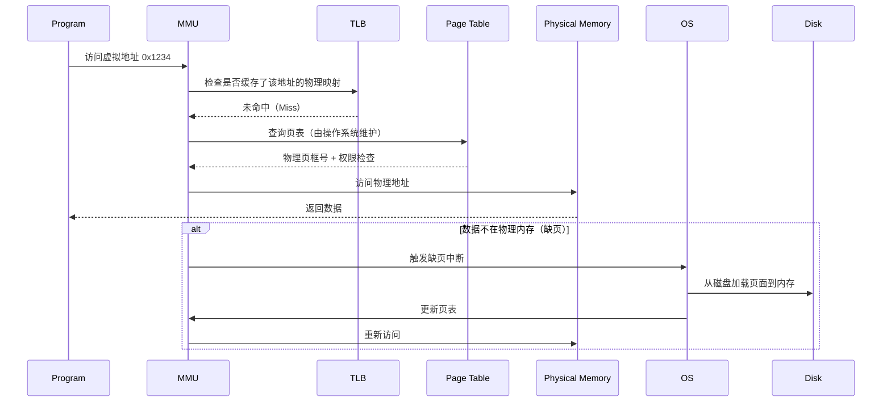

# 1. 计算机架构

在典型的冯·诺伊曼架构中，计算机的主要构成部分主要是 CPU、存储、总线以及 I/O 设备。

这里所说的存储，一般指主存 Main Memory，也就是 RAM，是程序和数据的存储位置。CPU 与主存之间的通信是通过两个寄存器：内存地址寄存器 MAR 和内存缓冲寄存器 MBR 来实现的。当 CPU 需要读取某个字节的时候，CPU 会将字节对应的地址存在 MAR 并向主存发送信号。随后主存会将 MAR 中地址对应的字节存入 MBR 并与 CPU 握手。

这里有个概念：元位 Meta bit。元位是与地址相关的，用于标示的额外的位。例如用于缓存命中测试的标志位 tag bits，用于标示缓存有效性的 valid bits，或者用来表示偏移量 offset 的状态的 flag bits。典型的 32bits 地址设计如下，

## 1.1. 存储体 Memory bank

存储体是对存储的一个划分，一个存储可能含有多个存储体。存储体的地址有两种常用的设计方式：高阶交织和低阶交织。

### 1.1.1. 高阶交织 High order interleave

![[高阶交织.png]]

每个体有 K 个地址，这种就相当于将连续地址的一大块存储分成 N 个体。地址格式为：`<bank><addr>`，即先确定体后才能确定地址。

高阶交织的好处是，如果 CPU 和 I/O 设备使用的是不同的存储体，那通过高阶交织就能实现多端口同时访问，提高了整体的速度性能。

### 1.1.2. 低阶交织 Low order interleave

![[低阶交织.png]]

低阶交织就相当于将一整块地址的前 N 个地址逐个分给 N 个体，然后再接着逐个分。其地址表示为：`<addr><bank>`，即先确定地址后才能确定选择的体。

低阶交错的好处就是利用硬件级的并行性隐藏内存延迟，类似流水线，使得硬件可以并行处理多个请求，从而避免存储拖慢 CPU 的处理速度。

> [! example] 举个🌰
> CPU 的周期为 5ns，存储访问时间为 50ns，将存储按照低阶交织的方式分成 10 个体，那么当流水线跑起来后就相当于每 5ns 存储体就能向 CPU 发送一条数据（虽然考虑到延迟仍会有 50 ns）。

# 2. 存储层次结构 Memory hierarchy

## 2.1. 内存管理单元 MMU

内存管理单元 MMU 是集成在 CPU 中的硬件模块，负责将处理器产生的虚拟地址转换成访问主存的物理地址，并驱动和检查存取许可位。

## 2.2. 存储层次

CPU 在进行数据的访问的时候，是按照从上到下，从快到慢的方式进行访问的。

![[存储层次.png]]

## 2.3. 存储器系统性能分析 ✨

这里就涉及一个命中率 HR、缺失率 MR、平均存储器访问时间、访问效率的问题。缺失率和命中率的计算方式如下：
![[命中率定义式]]
![[缺失率定义式]]

平均存储器访问时间 ATAM 是处理器必须等待存储器的每条装入和存储指令的平均时间。下面用一个缓存、主存、虚拟存储的三级存储举例子。
$$
\text{ATAM}= t_{\text{cache}}+\text{MR}_{\text{cache}}(t_{\text{MM}}+\text{MR}_{\text{MM}}t_{\text{VM}})
$$
讲解一下这个公式。就像前文所述，CPU 对存储的访问是严格按照层级来的，在访问下一个层级前必须要访问当前层级。在命中缺失的情况下，才会去访问下一级。

然后我们再来讲 PPT 上的公式。我们定义访问一个字的平均系统时间为 $t_{A}$，访问主存 $\text{M}_{1}$ 的平均时间为 $t_{A_{1}}$，访问辅存 $\text{M}_{2}$ 的平均时间为 $t_{A_{2}}$。设命中率为 $H$，则有，
$$
t_{A}=H\cdot t_{A_{1}}+(1-H)t_{A_{2}}
$$
同时我们有 $t_{m_{1}}$ 用来描述主存的单个字访问时间，$t_{m_{2}}$ 用来描述辅存的单个字访问时间。于是有，$t_{A_{1}}=t_{m_{1}}$，$t_{A_{2}}=t_{B}+t_{M_{1}}$，这里 $t_{B}$ 是从 $\text{M}_{2}$ 读取数据并传输到 $\text{M}_{1}$ 的块传输时间，$t_{B}=b_{s}\times t_{M_{2}}$，$b_{s}$ 为块大小，假设为 1。代入这些内容后，就能得到，
$$
t_{A}=t_{m_{1}}+(1-H)t_{m_{2}}
$$

访问效率的定义为：
$$
e =\dfrac{t_{A_{1}}}{t_{A}}=\dfrac{1}{H+(1-H) \dfrac{t_{A_{2}}}{t_{A_{1}}}}
$$
> [! note]
> 做题的时候可以先把所有数据按照题目给的条件列出来。对于同一个主存，在计算主存+缓存结构或者主存+辅存结构的时间是完全不同的，需要灵活处理。
> 另外，一定要区分访问存储的平均时间和单个字的访问时间。

# 3. 相联存储器 Associative memory

相联存储器，或者叫内容可寻址存储器 Content Addressable Memory (CAM)，指一类可以通过内容而非地址来识别并访问的存储器。例如缓存通过标签（tag）来实现命中测试。

# 4. 虚拟内存 Virtual memory

虚拟内存是一种核心管理技术，通过 MMU 和操作系统的协同工作，为程序提供了一个独立、连续且容量更大的虚拟内存空间，而实际的物理内存（RAM）可能分散存储，甚至部分数据被临时交换到磁盘中。

> [!note] 一些术语
> 虚拟地址：也称逻辑地址，由操作系统和硬件（如MMU）映射到物理内存或磁盘。程序通过虚拟地址访问内存，无需关心数据实际存储在物理内存还是磁盘中；
> 地址空间：地址空间是操作系统为进程分配的**虚拟地址范围**，包含进程可访问的所有内存区域（如代码段、数据段、堆、栈、共享库等）。它是进程对内存资源的“逻辑视图”
> 物理地址：物理内存中的地址，也称为实际地址；
> 内存空间：主存地址空间。

## 4.1. 地址映射

### 4.1.1. 直接映射

程序的地址空间被划分为多个较小的地址空间, 每个地址空间的大小均不超过主存容量。直接映射要求虚拟地址与物理地址一一对应，导致物理内存必须连续分配，无法高效利用碎片化内存。

![[直接映射.png|300]]

### 4.1.2. 页面到块映射

块 Block: 物理内存被划分为大小相等的内存空间, 称为块。  
页 Page: 虚拟地址空间可以被划分为更小的、大小相等的地址空间, 称为页。程序从辅助存储器移动到主存储器时, 每次移动的记录大小与一个页的大小相同。通常, 页的大小等于块的大小。内存中的每个块被称为页框 page fram。

![[页到块的映射.png|300]]

#### 4.1.2.1. 通过页表进行映射

![[页表示例.png|400]]

页表很好理解，就是一个用于地址映射的表格。首先看最上面的地址设计，这个是一个 13 位的地址，前 3 位为页地址，后 10 位为行地址。页地址会被直接用于页表的地址索引，3 位意味着页表有 8 行，每行由一个存储表缓冲和有效位构成。存储表缓冲和行地址共同组成了主存地址的映射。

总结一下就是，将 2 位物理地址稀疏地映射到了 3 位虚拟地址上，从而使得在程序看来地址空间变大了。

#### 4.1.2.2. 使用关联页表进行映射

![[关联页表示例.png|400]]

1. Argument Register（参数寄存器）。存储当前需要转换的虚拟地址的页号（VPN） ，作为相联存储器查找的输入关键字（Key）。
2. Key Register（键寄存器）存储在相联存储器的每个条目中，是其一个关键字段，保存虚拟页号（VPN） ，用于与argument register中的VPN进行匹配。
3. Associative Memory（相联存储器）。相联存储器（通常是硬件实现的全关联查找表）用于并行搜索所有条目，快速匹配虚拟页号（VPN）对应的物理页框号（PFN）。

## 4.2. 分页 Paging

### 4.2.1. 页置换

当被引用的页不在主内存中时, 称为缺页错误。如果主存已满, 当发生缺页时, 必须从内存块中移除一个页面以便为新页面腾出空间。主存中内存块的页面替换由替换策略决定。替换策略旨在尝试移除主存中那些在近期内不太可能被引用的页面 (内存块)。

#### 4.2.1.1. 替换算法 Replacement algorithms

- 先进先出 ( FIFO ) :  它选择内存中驻留时间最长的页面进行替换。 
- LRU (时间最近最少使用) :  它选择时间上最近最少使用的页面进行替换。其依据是该页面不在当前工作集中的概率最高。
- LFU (频率最低最少使用) :  它选择替换最近一段时间被引用次数最少的页面。
- OPT (最优替换策略):  这是一种最优替换策略，将被替换的页面是那个具有最长缺页间隔（未来最长时间不会被访问的页面）的页面。这相当于在时间 T 确定下一次对同一页面的引用发生的时间 $T_{j}$。具有最大 $T_{j}$ 的页面将被替换。 OPT 算法在执行前需要预先获取页面地址流。因此, 实现 OPT 需要两次遍历程序: 第一次是模拟运行以确定页面地址序列, 第二次才是实际执行运行。由于模拟运行的成本较高, 且页面地址流可能非常长, 加之在某些情况下 (如实时系统中), 页面流可能依赖于外部事件, OPT 在实际中并不可行。

还有一种策略被称为堆栈算法，其需要满足以下性质：
$$
\begin{array} {l l} {{\mathsf{B}_{t} ( {\mathsf{n}} ) \, \subset\mathsf{B}_{t} ( {\mathsf{n}}+1 )}} & {{\qquad\mathrm{i f ~ n ~ < ~ L_{t} ~}}} \\ {{\mathsf{B}_{t} ( {\mathsf{n}} ) \,=\mathsf{B}_{t} ( {\mathsf{n}}+1 )}} & {{\qquad\mathrm{i f ~ n ~ \geq~ L_{t} ~}}} \end{array}
$$
$B_{t}(n)$ 表示在时间 t 时堆栈 (内存) 中的页面集合； $n$ 表示内存 (堆栈) 容量；$L_{t}$ 表示到时间 t 为止已遇到的不同页面数量。

> [!note]
> 堆栈算法就是不断做超集，只要容量足够就包含遇到过的所有页。

### 4.2.2. 内存利用率与页大小的关系

通常, 段大小 ( $S_{s}$ ) >> 页大小 ( $S_{p}$ )。平均而言, 一个段的最后一页会浪费 $\dfrac{S_{p}}{2}$ 个字。假设页表中的每个条目占用一个字, 那么表中将有 $\dfrac{S_{s}}{S_{p}}$ 个字, 这是对内存的开销。

因此，与每个段相关联的内存开销 $W$ 为，
$$
W = \dfrac{S_{p}}{2}+\dfrac{S_{S}}{S_{p}}
$$
当 $S_{p}=\sqrt{ 2S_{s} }$ 时，$W$ 有最小值。

### 4.2.3. 物理空间利用率 $U$

物理空间利用率 $U$ 定义为，
$$
U= \dfrac{S_{s}}{S_{s}+W}
$$
代入 $W$ 和 $S_{p}=\sqrt{ 2S_{s} }$，得到，
$$
U=\dfrac{1}{1+\sqrt{ \dfrac{2}{S_{s}} }}
$$
### 4.2.4. 页面大小对命中率的影响

设逻辑地址序列为 $A_{0},A_{1},\dots,A_{L-1}$。设 $A_{i}$ 为某一时刻引用的逻辑地址。设 $A_{i+d}$ 为下一个参考点, 其中 $d$ 表示引用和下一个参考点之间的距离。

1. 当 $d$ 相对于 $S_{p}$ 较小时, 使得 $A_{i}$ 和 $A_{i+1}$ 位于同一页面内, P (这一情况为真的概率) 随页面大小的增加而增大。 
2. 当 $d$ 相对于 $S_{p}$ 较大时, 但 $A_{i+d}$ 关联着一组被频繁引用的字, 我们希望 $A_{i+d}$ 能位于某个同样在主内存内但是 $P'\neq P$ 的页。这一情况成立的概率会随着主内存能存储的页面数量增加而提高; 因此, 它往往会随着页面大小的增大而降低。

> [!question]
> 这一块不太懂

## 4.3. 分段 Segmentation

在服务于多用户的大型计算机系统中, 以下功能由内存管理单元 ( MMU ) 提供:  
- 一种供不同用户共享存储在内存中的公共程序的手段
- 一种用于动态存储重定位的设施, 可将逻辑内存映射地址转换为真实内存地址
- 一种保护信息免受未经授权访问的机制用户间的访问控制以及防止用户更改操作功能

分段 Segmentation 就是便于程序和数椐在主存与磁盘存储器中的重定位, 并提供防止未经授权访问 / 执行的保护。

分段就是将程序和数据的各个部分划分称为段（Segments） 的逻辑单元，每个段是一组可变长度的、逻辑上相关的指令或数据元素, 并与给定的名称相关联 (例如子程序、数据数组等)。

逻辑地址：是由分段程序生成的地址。它与虚拟地址类似, 不同之处在于地址空间关联的是可变长度的段, 而非固定长度的页。

逻辑地址的映射有两种方式：1. 分段页映射和 2. 使用段寄存器映射。

## 4.4. 分段页映射

![[分段页映射.png|700]]

分段页映射形式上相当于页表的一个嵌套。用 `<segment>` 的数据映射为分段表的地址；在将分段表地址对应的数据和 `<page>` 生成一个一个新数据，用于页表地址；在从页表地址对应的数据 block和 `<word>` 生成物理地址。

> [!note]
> 感觉就是指向指针的指针的指针的指针。

如图 (a) 所示, 需要两个映射表, 且每次内存引用需进行三次内存访问:  
1. 分段表 (用于页基址) 
2. 页表 (用于物理块地址) 
3.  物理内存 (用于引用字)

但是这样会拖慢系统。一些解决方案：为系统配备一个快速关联存储器, 用于存储最近引用的表条目 (包括段号和页号), 如图 (b) 所示。在这种情况下, 映射过程首先尝试通过给定段号和页号进行关联搜索。若成功, 则映射延迟仅为快速的关联存储器访问时间; 若失败, 则转而使用较慢的双表映射流程, 并将结果存入关联存储器以供后续引用。

![[分段映射的例子.png]]

### 4.4.1. 段寄存器映射

使用段寄存器同样可以实现逻辑地址到物理地址的转换。PDP‐11 计算机便采用了此类地址转换方法。

示例: 虚拟地址 = 15 位 ( 32K ) 物理地址 = 18 位 ( 256K ) ；需要将 15 位地址空间转换到 18 位内存空间。

![[段寄存器示例.png]]

段寄存器相当于替代了分段表和页表的功能，从段寄存器中取出的基址和 `<page>` 相加得到 `<block>` 后，再加上 `<word>` 就得到了物理地址。

### 4.4.2. 分段的优点

1. 由于各段长度可变, 这简化了对正在增长或收缩的数据结构的处理。 
2. 每个过程 (程序或子程序) 占据一个独立的段, 其起始地址为 0。这样,  单独编译的过程之间的链接被极大简化。对段 n 中过程的调用将使用简单的两部分地址 (n, 0) 来寻址该段中的字 0 (即入口点)。如果段 n 中的过程被修改并重新编译, 其他过程无需任何更改, 因为即使新版本比旧版本更大, 起始地址也未被修改。
3. 它促进了多个处理器 (用户) 之间共享程序或数据, 例如共享一个公共数据库 (如软件库)。 
4. 保护方案可以轻松实施。

## 4.5. 四种不同的段页式内存配置

1. 未分段且未分页的内存。它适用于不需要虚拟内存支持的简单应用场景。例如, 一个高性能控制器,  其主内存为独占且仅包含单一程序。  
2. 未分段与分页内存。它受到某些操作系统的青睐, 尤其是伯克利版本的 UNIX, 其中所有的虚拟内存管理仅基于分页机制。 
3. 分段与无分页内存。当可交换单元远小于正常页大小时, 这样做是有优势的。例如, 在这种情况下, 可以创建一个受保护的单个字节信息。
4. 分段与分页内存。它提供了一个非常灵活的多用户内存管理环境, 这是当今多用户系统中最流行的内存管理方案。例如, AT&T 的 System V 版本 UNIX 就采用了这一方案。

## 4.6. 内存保护

通用方式：
- 保护可分配给物理地址或逻辑地址。 
- 保护位可用于指示物理地址中的访问权限。

分段式存储：
通过将保护信息包含在段表或段寄存器中, 逻辑地址被赋予保护属性。描述符 (即段表或段寄存器中每个条目的内容) 除了基址字段外, 还包含一个或两个用于保护目的的字段。

![[分段式存储示例.png]]

将长度字段与逻辑地址中的页码进行比较。
保护字段指定了访问权限：
- 读取或写入
- 只读 (用于写保护)
- 仅执行 (程序保护)
- 仅系统 (操作系统保护)

# 5. 高速缓存 Cache memory

缓存是一种小型高速存储器, 用于存储程序中最频繁使用的部分及数据。

其利用了局部性原理: 典型程序往往表现出这样的倾向在任何给定的时间间隔内, 对内存的引用往往局限于内存中的几个局部区域。（时间局部性和空间局部性）

虚拟与缓存的总体目标在于在速度与成本之间取得尽可能高的平均访问效率, 即在保证整个存储系统总成本最低的同时, 实现最短的平均访问时间。

一些术语：
- 命中：当 CPU 访问内存并在缓存中找到该字时, 即发生缓存命中。 
- 缺失：当引用词在缓存中找不到时, 就会发生缓存未命中。
- 命中率: 命中次数与CPU 对内存的引用总次数的比值。当命中率接近 1 时，系统访问时间接近于缓存。

![[典型缓存结构.png|400]]

## 5.1. 平均存储成本

定义：
- $C_{s}$ 为主存和缓存每位的平均成本；
- $C_{m}$ 为主存每位的平均成本；
- $C_{c}$ 为缓存每位的平均成本；
- $S_{c}$ 为缓存大小；
- $S_{m}$ 为主存大小；

有平均存储成本定义如下，
$$
C_{s}=\dfrac{C_{m}\cdot S_{m}+C_{s}\cdot S_{s}}{S_{m}+S_{c}}
$$

## 5.2. 缓存性能

定义：
- $T_{s}$ 为平均系统访问时间；
- $T_{c}$ 为缓存访问时间（读取一个字的缓存周期）；
- $T_{m}$ 为主存访问时间（读取一个字的存储周期）；
- $H$ 为缓存命中率 ；

平均系统访问时间为，
$$
T_{s} = H\cdot T_{c}+(1-H)\cdot T_{s}
$$
访问效率为，
$$
e=\dfrac{T_{c}}{T_{s}}=\dfrac{1}{H+(1-H) \dfrac{T_{m}}{T_{c}}}
$$
效率 $e\to 1$ 最好。

由于缓存产生的加速比为，
$$
S_{c}=\dfrac{T_{m}}{T_{s}}=\dfrac{1}{1-H(1-\dfrac{T_{c}}{T_{m}})}
$$
加速比 $S_{c}\to \dfrac{T_{m}}{T_{c}}$ 最好。

一般来说 $\dfrac{T_{m}}{T_{c}}$ 在 $5\sim 10$ 的范围内，H 在 0.75 左右。加速比则是随着 H 增加，从 $1\sim \dfrac{T_{m}}{T_{c}}$。

## 5.3. 其他缓存配置

例如二级缓存，
![[二级缓存.png]]

多级缓存，
![[多级缓存.png]]

在当今大多数微处理器设计中,片内一级缓存 ( L1 缓存) 被划分为指令缓存与数据缓存。而片外二级统一缓存 ( L2 缓存) 则作为数据和指令共用的常规缓存存在。

其他缓存变体：
- Trace cache，这是一个仅存储逻辑上连续指令的缓存。它通常是一级指令缓存 (例如, 一级执行跟踪缓存；
- Inclusive cache design  它指的是一种缓存设计, 其中每一层都包含其上层信息的副本。这是缓存常规且传统的设计方案。 
- Exclusive cache design  它指的是一种非包容性缓存设计, 即某一层不保留其上层所含信息的副本。

## 5.4. 缓存映射

### 5.4.1. 相联映射

![[相联映射示例.png]]

缓存分为两个字段，一个地址字段和一个数据字段。每个缓存条目都包含一个地址及其相应的数据。实际地址中的位数等于高速缓存地址字段中的位数。当需要对内存的引用时，CPU 提供的实际地址与缓存中的所有地址同时进行比较以进行匹配。

### 5.4.2. 直接映射

假设物理地址为 15 位（32K）

![[直接映射演示.png]]

真实地址被划分为两个字段: 标签 ( tag ) 和索引 ( index )。索引的大小等同于缓存容量, 直接映射到缓存地址。缓存的每个条目由标签及其对应数据组成。

将真实地址的标签字段与缓存中真实地址中索引所对应地址的标签进行比较。如果两个标签匹配, 则发生命中。如果没有匹配项, 所需单词 (数据) 将从主存中读取, 并更新缓存。

索引 = 块字段 + 词字段。“ 字段 ” 一词表示主存与缓存之间的传输大小。此处的块大小为 8 (例如 23 )。

块 = $2^{6}$ = 64, 每块 8 个字。每个块中有 8 个 (即 $2^{3}$ ) 单词, 且所有单词具有相同的标签。当发生缺失时, 一个由 8 个字组成的完整块将从主存储器传输到缓存中的相应位置。如果传输是按字逐个进行的, 可能会额外耗费时间。通常情况下, 所有 8 个字会并行传输, 仅需一个存储周期即可完成。由于计算机程序的顺序特性, 采用更大的块大小有望提高命中率。

### 5.4.3. 组相联映射

地址格式为，`<Tag><Block><Word>`

目标: 通过允许地址索引相同但标签值不同的两个或多个字同时驻留在缓存中, 以提高命中率。
标签-数据集: 它是在缓存的一个字 (条目) 中, 具有相同索引的不同标签和数据对的集合。

1) 当 CPU 请求内存引用时, 索引实际地址的被用来访问缓存。 
2) 随后, 将标签与缓存中由真实地址的索引所指向的特定条目内的所有标签进行并行比较。若无匹配项, 则发生缓存未命中, 此时将通过从主存传输一个数据块 (例如 8 个字, 假设块大小为 8 ) 至缓存来更新缓存, 该数据块包含被引用的字。至于缓存条目中哪个标签 ‐ 数据集会被替换, 将由所采用的替换算法决定。

 随着集合大小的增加, 命中率将提升, 因为更多具有相同索引但不同标签的单词可以驻留在缓存中。然而, 集合大小的增加会导致缓存每个字 (行或条目) 的位数增多, 并需要更复杂且更多的硬件来实现匹配逻辑。 

## 5.5. 缓存替换算法

虚拟内存系统所使用的替换算法同样适用于缓存 ‐ 主存系统。在缓存系统中, 最常用的替换算法是 (a) 先进先出 (FIFO) 和 (b) 最近最少使用 (LRU)。

## 5.6. 写缓存

### 5.6.1. 写穿 write-through

对于每一个写入请求, 主内存都会被更新。这在多处理器共享主内存或进行 DMA 操作时非常有用。

通常来说, 除非另有说明, 对于写请求的缺失不会通过从主存中获取新块  (包含所引用的字) 来初始化缓存的更新。这一原则适用于写穿和写回两种机制。

1) 写穿带写分配 ( WTWA ):  在此过程中, 主存中包含被引用字的块会在写缺失时被加载到缓存。  
2) 写穿不分配 (非 WTWA ) :  在此过程中, 主存中包含被引用字的块不会因写缺失而被加载到缓存。这通常是默认的处理方式。

### 5.6.2. 写回 write back

在写操作期间仅更新缓存。随后, 该位置会被一个元位 (有效位) 标记, 以便在需要替换时能够识别该字并将其复制到主内存中。

## 5.7. 初始化

通常, 缓存中的每个字都包含一个有效位, 用于指示该字 (或块) 是否包含有效数据。缓存初始化时, 所有有效位会被清零为 0。当某个特定的缓存字 (或块) 首次从主内存加载时, 其有效位会被设置为 1。
