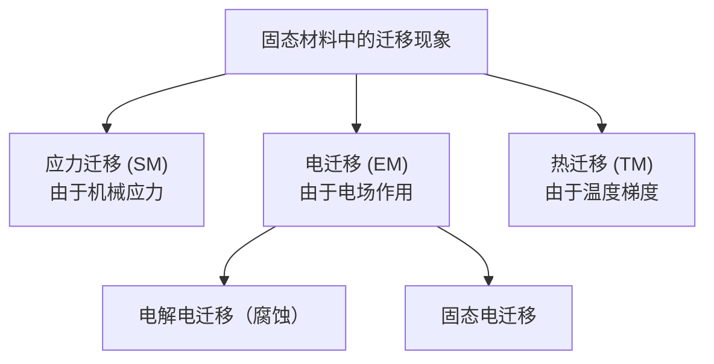

> [! tip]
> 标有“\*”的是我觉得不重要的部分，简要笔记略过。

>[! important] 复习重点
> 重点放在概念是什么，他的作用，有什么优缺点上即可。

# 1. 电子器件概述*
## 1.1. 二极管

![[一维形式的泊松方程]]

![[耗尽层总宽度定义式|耗尽区总宽度定义式]]

有峰值电场，
$$
\varepsilon (0) = \dfrac{2(V_{bi}-V_{A})}{W}
$$
## 1.2. 场效应晶体管

![[阈值电压计算式]]

![[长沟道 MOS 器件线性区漏极电流计算式]]

![[NMOS 饱和区的漏极电流计算式]]

# 2. 电子器件制造*

## 2.1. 半导体器件制造技术

和 [[《Part 1 光刻基础概念》笔记]]内容较为重合。

## 2.2. 关键 CMOS 制造工艺（模块）

**光刻**  
- **掩模制作**：设计并制造用于图案转移的掩模板。  
- **曝光**：通过光刻机将掩模上的图案投射到涂覆光刻胶的晶圆上。  
- **显影**：溶解未曝光（或已曝光）区域的光刻胶，形成所需图形。  

**掺杂**  
- **扩散**：在高温下使掺杂原子（如磷、硼）扩散进入半导体材料。  
- **离子注入**：通过高能离子束将掺杂原子注入半导体，精度更高且温度可控。 

**薄膜沉积（分层工艺）**  
- **物理气相沉积（PVD，溅射）**：利用高能粒子轰击靶材，使材料沉积在晶圆表面。  
- **化学气相沉积（CVD）**：通过气体化学反应在表面生成固态薄膜。  
- **电镀**：在导电层上电化学沉积金属（如铜互连）。  
- **氧化**：生长二氧化硅（SiO₂）绝缘层（如热氧化法）。  

**刻蚀**  
- **湿法刻蚀**：使用液态化学试剂选择性去除材料（各向同性）。  
- **干法刻蚀**：利用等离子体进行高精度、各向异性刻蚀（如反应离子刻蚀，RIE）。  

**其他工艺**  
- **化学机械抛光（CMP）**：结合化学腐蚀与机械研磨，实现晶圆表面全局平坦化。

# 3. 小尺寸效应、器件缩放与先进纳米级 CMOS 器件

## 3.1. MOS 缩放的背景

缩放的好处：
- 特征尺寸能缩减为上一代的 0.7；
- 整体面积能减小一半；
- 集成上一代两倍的晶体管数量；
- 增加封装密度；
- 提高电路速度；

## 3.2. 缩放规则✨

### 3.2.1. 恒定场缩放

恒定场缩放的核心就是维持 FET 内部的电场与原始器件相同，其他的如特征尺寸、电压等按照缩放因子 $\alpha$ 缩小，掺杂和电荷密度则是按照 $\alpha$ 增加，电路速度的增速为 $\alpha$，而电路密度则是 $\alpha^{2}$。

### 3.2.2. 恒定场缩放存在的问题

问题在于电压无法严格按照缩放因子同步进行降低，主要原因在于载流子速度饱和、亚阈值摆幅的物理极限和漏电流控制需求。

![[速度饱和效应]]

![[亚阈值摆幅]]

### 3.2.3. 广义缩放和广义选择缩放

为了适应恒定场缩放中面临的问题，G. Baccarani、M. R. Wordeman 和 R. H. Dennard 在 1984 年提出了更广义的缩放规则，其中允许电场增加一个因子 $\varepsilon$。此外，器件宽度和布线尺寸的缩放速度不如通道长度，导致这些尺寸的进一步缩放参数称为广义选择性缩放。对于广义选择性缩放，门长和器件宽度使用不同的维度缩放参数。$\alpha_{D}$ 应用于设备门长度和垂直尺寸。$\alpha_{w}$ 适用于设备的宽度和布线。由此得到了缩放法则，

![[缩放法则.png]]

更重要的是，缩放规则不会预测设备缩放对设备性能的任何影响。几何效应和短通道效应是影响实际设备缩放的主要问题之一。

## 3.3. 几何效应和短通道效应

### 3.3.1. 小型化和电路速度

微小型化的目的是提高封装器件的密度，提高电路速度等电路性能。很明显，随着器件尺寸的减小，我们可以在具有相同芯片面积的芯片上放置更多的晶体管。然而，**它对电路速度的影响并不明显**。在 MOS 电路中，MOSFET 的输出电流用于对其负载电容放电。电路速度由放电时间决定。延迟时间可以通过电容电压、放电电流来近似，
$$
\tau_{D} ~ \approx~ \Delta t ~ \approx~ {\frac{C \, \Delta\, V} {I_{D}}} \approx \dfrac{2L^{2}}{\mu_{n}V_{DD}}
$$
从公式中可以看出，如果要提高 MOSFET 的速度，可以，
1. 减小沟道长度 $\to$ 短沟道效应；
2. 增加 $V_{DD}$ $\to$ 热载流子效应、可靠性问题、高功率消耗
3. 增加迁移率 $\to$ 存在技术难点。

请注意，延迟时间不受栅极宽度 的影响。因为增加栅极宽度会增加栅极电容，其增加的幅度与漏极电流的增加一样多。因此，速度没有增加。

### 3.3.2. 短沟道效应✨

缩短沟道长度会在器件上有三个体现：
1. 漏极电压的增加会导致漏极电流 $I_{d}$ 的增加（[[沟道长度调制效应]]）
2. 阈值电压 $V_{t}$ 降低（电荷共享或漏致势垒降低 DIBL）
3. 难以完全关断，亚阈值特性以及 $\frac{I_{on}}{I_{off}}$ 比恶化（[[穿通效应]]）

#### 3.3.2.1. 沟道长度调制效应

具有 p 型衬底的 MOSFET 中的耗尽层宽度 Xd 及其相关的空间电荷 QB 由下式给出

$$
X_{d}=\! \left[ \frac{2 \varepsilon_{s} ( \phi_{0}+V )} {q N_{A}} \right]^{1 / 2}
$$
$$
Q_{B}=q X_{d} N_{A}=\left[ 2 q \varepsilon_{s} N_{A} ( \phi_{0}+V ) \right]^{1 / 2}
$$
其中 $\phi_{0}$ 表示 pn 结的内置电位或 MOS 晶体管中的表面带弯曲，V 是反向偏置电压。

**在电流饱和 （pinchoff） 开始时，零反转层电荷位于漏极电压 VDSAT 的通道的漏极端（点 y）； 如果漏极电压增加到 VDSAT + ΔV，则衬底/漏极 pn 结的耗尽层会变宽，因此夹断位置会移动到通道中（点 y' ）**

![[沟道长度调制效应_1.png]]

有效通道长度 L' = L - ΔL。耗尽层的增量变化由下式给出，
![[沟道长度调制效应耗尽层增量计算式]]
其中 $\phi_{p}$ 是 pinch off 处的表面带弯曲，是需要实验确定的参数。很明显，有效通道长度 L' 随漏极电压 – 通道长度调制而变化。

对于长通道器件，ΔL << L，因此通道长度调制可以忽略不计。然而，对于短通道器件，ΔL 可能与通道长度相当，并且通道长度调制可能会对 I-V 特性产生严重影响。

饱和区的漏极电流由下式给出
![[NMOS 饱和区的漏极电流计算式]]

由于 ΔL 随漏极电压的增加而增加，因此漏极电流会随着漏极电压的增加而增加（漏极电流未饱和）。 • 这会导致较差的 I-V 特性（高输出电导）。

#### 3.3.2.2. 短沟道效应

阈值电压可以表示为，
$$
V_{T}=V_{F B}+\Phi_{S i}+{\frac{Q_{B}} {C_{0}}}
$$
其中 VFB 是平带电压，Φsi 是表面的强反转硅带弯曲。QB 是栅极下的体电荷（空间电荷）（每单位栅极面积），C0 是栅极电容（每单位面积）。对于长通道器件，则有助于栅极下阈值电压的总电荷可以通过 $Q_{B}WL$ 估算。当强反转开始时，假设 $Q_{B}$ 为 $Q_{B}=-qN_{B}X_{dm}$，其中 $X_{dm}$ 是最大栅极耗尽宽度。

然而，这个假设忽略了 S 和 D 结附近的电荷，即栅极的耗尽区和 S/D 结附近的 S/D 重叠。如果我们考虑 S/D 结共享的电荷，由栅极控制的有效电荷变为 QB'<QB。假设梯形内部的电荷由栅极控制，则总有效体电荷变为：
$$
Q_{B} {}^{\prime} L W=q N_{A} X_{d m} \, {\frac{L+L^{\prime}} {2}} W=( {\frac{L+L^{\prime}} {2 L}} Q_{B} ) L W
$$

![[短沟道效应电荷分享模型.png]]

由此可以推出，
$$
Q_{B}= \left[ 1-\left( \sqrt{1+\frac{2 X_{d m}} {r_{j}}}-1 \right) \frac{r_{j}} {L} \right] Q_{B}
$$

再根据阈值电压可以导出电荷共享因子，
$$
F_l = 1-( \sqrt{1+\frac{2 X_{d m}} {r_{j}}}-1 ) \frac{r_{j}} {L} 
$$
长通道和短通道 MOSFET 之间的 VT 差异为 $\Delta V_{T, SC} = V_{T}(\text{long channel})-V_{T}(\text{short channel})$。

$$
\Delta V_{T,SC}=\frac{Q_{B} T_{o x}} {\varepsilon_{o x}} \frac{r_{j}} {L} ( \sqrt{1 \!+\! \frac{2 X_{d m}} {r_{j}}} \!-\! 1 )
$$

短通道效应 – DIBL 视角 

尽管电荷共享模型非常简单，但在通道非常短或漏极电压较大的器件中，它们无法给出良好的定量一致性测量 VT 值。 • 这是因为用于推导模型的某些假设在短通道和大 VD 条件下无效。这些包括：（1） 在 Yau 的模型中，感应电荷在栅极、源极和漏极之间任意分配，而准确的分配只能通过泊松方程的数值积分来实现。 （2） 在长通道 MOSFET 模型中，我们假设在亚阈值作中，整个 VDS 在漏极耗尽区下降。因此，通道区域其余部分的通道电位基本上独立于 VDS，仅取决于栅极偏置。这种传导在短通道 MOSFET 中击穿。

表面漏极引导势垒降低 DIBL

![[DIBL 示例.png]]

具有固定 L 的 MOSFET 中的表面 DIBL 可以通过测量和绘制一组以增加 $V_{DS}$ 为参数的 $\log_{}I_{DS}$ 与 $V_{GS}$ 曲线来经验表征。必须确定次表面穿通电流没有流动（即亚阈值摆动 St 没有变化）

表面 DIBL 的定量估计可以从低于 $V_T$ 的固定漏极电流（通常为 $0.1 \pu{ \mu A /\mu m }$）的栅极电压 （$V_{GS}$） 偏移中提取出来，归一化形式为 $\dfrac{\Delta V_{GS}}{V_{DS}}$。$\dfrac{\Delta V_{GS}}{V_{DS}}$ 的可接受值为 ~25 mV/V。

#### 3.3.2.3. 穿通

穿通的核心是 **源极和漏极的耗尽区在沟道中合并**，导致漏电流不受栅压控制。其发生条件为：
$$
L\leq W_{S}+W_{D}
$$
**穿通的典型特征是亚阈值摆动增加**，器件难以关断。

穿通通常发生在 FET 的次表面。次表面指半导体器件中，硅下方几十至几百纳米的区域。在短沟道 MOSFET 中，次表面区域的掺杂浓度通常更低，因为在制造时有阈值电压调整注入，使得表面沟道区域的掺杂浓度原高于原始掺杂浓度。

![[次表面穿通示例.png]]

## 3.4. 短通道效应的工程解决方案✨

器件是否为短沟道并不取决于沟道的物理门（掩膜）长度，而是取决于 $T_{ox}$、$N_{B}$、$r_{j}$。最终的目的还是减少阈值电压受到沟道长度的影响，
$$
\Delta V_{T}=\frac{Q_{B} T_{o x}} {\varepsilon_{o x}} \frac{r_{j}} {L} ( \sqrt{1 \!+\! \frac{2 X_{d m}} {r_{j}}}-1 )
$$
根据公式，有以下三个方法，
1. 缩放栅极氧化层并使用高 k 介电材料；
2. 增加掺杂 $N_{B}$ 来减小 $X_{dm}$ 并延迟穿通（沟道工程）；
3. 减小 $r_{j}$（浅结技术）。

### 3.4.1. 栅氧化层缩放

![[通过减薄栅极氧化层厚度来减少 VT 滚降.png]]

**通过减薄栅极氧化层厚度来减少 VT 滚降。**（S. Song 等人，2000 年 VLSI 技术）

Si ULSI MOSFET 器件的栅极绝缘体厚度持续减少。为了在受控的加工条件下获得均匀、稀薄的氧化物，已经做了大量工作。已经证明，具有 15 Å 厚栅极氧化层的 MOS 晶体管性能良好。此外，商用 65 nm 代 MOSFET 是使用厚度低至 13 Å 的氧化物或氮氧化物制造的（Iwai 等人，1998 年）。

![[《集成电路技术》笔记_2.png]]

**尽管可以通过多种技术生长非常薄的氧化物，但非常薄的 SiO2 层的缺陷密度可能很高**。最近的研究表明，在 Si 上对薄 SiO2 进行直接热氮化似乎是在这种非常薄的状态下生长高质量介电膜的可行替代方法。

栅极氧化物的缩放将很快达到其厚度极限。氧化物厚度通常以**等效物理氧化物厚度**表示，该厚度表示栅极电介质的物理厚度，通过栅极介电常数与 SiO2 的比率进行校正。因此，氮化硅栅极电介质 （$\epsilon_{r}=7.9$ ） 的厚度几乎是二氧化硅栅极电介质 （$\epsilon_{r}=3.9$ ） 的两倍，并且仍然提供与通道相同的栅极电耦合。

栅极氧化层厚度随世代的减少而减小，当 $L_{gate}<0.6 \pu{ \mu m }$ 时，栅极氧化场随 $L_{gate}$ 的减小而增大。

#### 3.4.1.1. 薄氧化层生长

使用熔炉Furnace

![[《集成电路技术》笔记_3.png]]

- 低成本⇒批量加工
- 高热质量⇒加工时间长
- 非常适合生长厚氧化物。
- 不易进行氮化氧化物的多处理。

灯管加热快速热氧化

![[《集成电路技术》笔记_4.png]]

- 单片加工 ⇒实时测量和控制
- 低热质量⇒短工艺时间。
- 非常适合生长超薄栅极氧化物。
- 复合电介质（例如氮化氧化物）的多重加工的理想选择。
- 超薄 Si3N4 的快速热 CVD

![[《集成电路技术》笔记_5.png]]

- 一次进行一个单层沉积：出色的控制
- 正在研究高 k 电介质，如 ZrO2、HfO2
- 低产量

#### 3.4.1.2. 与栅氧化层缩放相关的问题

低于 20 Å 的 SiO2 问题
- 栅极泄漏 => 电路不稳定、功率耗散
- $t_{ox}$（电气）> $t_{ox}$（物理）导致的性能下降

沟道中的载流子量子化和多晶硅栅极的耗尽
- 退化和击穿
- 掺杂剂通过栅极氧化物的渗透
- 缺陷

#### 3.4.1.3. 漏电流

泄露电流主要构成：
- $I_{sub}$ 源极亚阈值泄漏
- $I_{GIDL}$ 栅极诱导漏极泄漏 (GIDL)
- $I_{J}$ 结反向偏置泄漏
- $I_{G}$ 泄漏（直接隧穿）

![[漏电流贡献.png]]

渗漏对总渗漏的相对贡献增加（对于较深的亚微米结，呈指数级恶化）
#### 3.4.1.4. 隧穿电流

![[隧道电流.png]]

对于直接隧穿区域的栅极氧化层厚度，即 Tox< 5 nm，Tox 减少 2.5 Å 会导致栅极电流密度增加 10 倍！• 栅极氧化层泄漏在 100 nm 生成时或之后成为一个问题。 • 为了减少栅极氧化层泄漏，我们必须增加栅极氧化层的物理厚度，同时保持电厚度（或等效物理厚度）的缩放趋势 • 因此，需要增加 $\epsilon_{ox}$

### 3.4.2. 高 k 电介质

用高介电常数材料代替栅极氧化层的 SiO2
- 减少漏电流 
- 增加工艺范围 

当 SiO2 被替换时，替换材料必须比 SiO2 更厚，以减少直接隧穿电流，同时保持相同的 MOSFET 驱动电流能力；高 k 材料必须能够达到与 SiO2 相同的等效厚度（Tox_eq），如下所示

![[高k材料示例.png]]

在相同的电容下，更高的 κ 薄膜⇒更厚的栅极电介质⇒**更低的泄漏和功率耗散**

从历史上看，**Cox 是通过减少栅极氧化层厚度来增加的**。它也可以通过使用更高的 k 电介质来增加。

#### 3.4.2.1. 栅堆栈的等效厚度

当栅极电介质结构由多个电介质堆叠组成时，具有最低 k 值的层主导总电容，并对可实现的最小 Tox_eq 值设置限制。

两种串联材料的电容由下式给出，
$$
\frac{1} {C_{T o t a l}}=\frac{1} {C_{1}}+\frac{1} {C_{2}}
$$
具有 SiO2 底层和高 k 顶层的介电堆将具有，
$$
T_{O X_{-} e q}=T_{S i O_{2}}+T_{h i g k-k} \cdot\frac{3. 9} {\mathcal{E}_{h i g h-k}}
$$

![[《集成电路技术》笔记_6.png]]

SiO2 的替代品：Si3N4 或 SiON。

![[《集成电路技术》笔记_7.png]]

Si3N4 的 k 增加 2 倍，但是带隙减小，栅极漏电增加。

#### 3.4.2.2. 氧化物的氮化

过去的研究揭示了在 SiO2 中掺入 N 的优缺点。

优点：
- 更高的 k;
- 形成 Si-N 键并松弛应变的 Si-O 键; 
- 增强抗键断裂能力，提高氧化物可靠性; 
- 提高扩散阻挡性能

缺点：
- SiO2/Si 界面处的 N 存在很多问题，例如迁移率降低; 
- 扩散阻挡层质量受损; 
- 热空穴注入下热载流子可靠性下降

氮化 SiO2 中的低含量 N 仅略微增加 k 。将小比例的 N 混入 SiO2 的主要好处是**改善氧化物和界面质量**。

##### 3.4.2.2.1. SiO2 的远程等离子体氮化 （RPN）

远程等离子体氮化技术用于在二氧化硅（SiO2）上生长富含氮化物的表面。为了防止等离子体损伤，基片位于等离子体生长区域之外。• 通过电容耦合的射频激励，以 13.56 MHz 的频率（通常功率为 15 至 60 W）实现等离子体辅助激活反应物种。• 通过等离子体激励进气管将气体注入远程等离子体腔体，并通过气体扩散环将气体注入腔体内部。

> [!note]
> 很像等离子刻蚀

![[《集成电路技术》笔记_8.png|275]]

![[《集成电路技术》笔记_10.png]]

SiO2 后 N2 等离子体氮化，然后进行 RTA/Furnace 退火，在 SiO2 表面提供具有高氮浓度（高达 20%）的氧氮化物。

##### 3.4.2.2.2. SiO2 的解耦等离子体氮化 （DPN）

尽管等离子体的产生方法和位置不同，DPN 的工艺顺序与 RPN 类似。DPN 使用电感耦合产生氮等离子体，并将高浓度的氮掺入超薄栅极氧化层 (>13 at %)。• 使用高效等离子体产生的电感源来产生等离子体并确定等离子体密度。同时，晶圆通过电容偏置来确定离子能量。因此，在去耦等离子体源中，离子密度与离子能量去耦，从而允许调整等离子体的参数（例如等离子体温度、密度）或成分（例如不同原子或分子种类的相对浓度），以优化所需的材料效应。

![[《集成电路技术》笔记_9.png]]

#### 3.4.2.3. 搜索高 k 电介质

用于 MOS 栅极电介质的高 k 材料需要满足以下要求： 
- 高介电常数⇒在通道中感应出更高的电荷
- 宽带隙⇒更高的屏障⇒更低的泄漏
- 能够在具有干净界面的硅上生长高纯度薄膜
- 高电阻率和击穿电压
- 低体和界面捕集密度
- 与衬底和顶部电极的兼容性
- 最小的相互扩散和反应
- 生长和器件加工过程中的最小硅再氧化 - 即使是薄的 SiO2 层也会显着恶化 Cgate。 • 
- 热应力 — 大多数氧化物的热膨胀系数比硅大。• 
- 良好的硅制造加工兼容性。- 在更高的加工温度和环境中保持稳定性- 能够进行清洁、蚀刻等

![[高 K 介质示例.png]]

高 k 材料具有较低的带隙。• 有许多性能、可靠性和工艺集成问题有待解决• 需要更多的研究才能使这些材料可制造。

#### 3.4.2.4. 高 k 介电氧化物的热力学稳定性

不稳定的氧化物（例如 TiO2、Ta2O5、Ba0.5Sr0.5TiO3） – 热退火时与 Si 反应形成 SiO2 和硅化物 – 需要屏障（例如 Si3N4）来防止这种反应 • 电介质堆栈：聚硅/氮化物/不稳定的氧化物/氮化物/硅衬底 • 栅极电介质两侧的单层氮化物已经为物理氧化物厚度贡献了 5 Å。

稳定氧化物（例如 HfO2、ZrO2、Al2O3）及其硅酸盐（例如 ZrSixOy）和铝酸盐（例如 ZrAlxOy） – 热退火时不与 Si 反应（高达 1000°C） – 可能不需要在 Si 和金属氧化物之间设置阻挡层 • 结构简单：多晶硅/稳定氧化物/Si 衬底

#### 3.4.2.5. 金属氧化物与 Si 的稳定性

![[Pasted image 20250507130437.png]]

三元相图可用于解释系统的稳定性。

Ta 和 Ti oxide/silicate 不稳定 - 它们的氧化物和 Si 之间没有连接线，表明形成其他化合物

ZrO2/Zr-O-Si 在 Si 上稳定 - ZrO2 和 Si 之间的连接线

#### 3.4.2.6. 高 k 介质的问题

- 与 Si 的界面有多好？⇒ 迁移率 
- Si 被金属原子污染 
- 与栅极电极的兼容性⇒ 金属栅极 
- 器件可靠性和寿命 
- 可实现的最小 EOT 
- 技术集成需要进行更多研究以使这些材料可制造且可靠

使用高 k 堆栈的结构中的低电子和空穴迁移率

### 3.4.3. 与栅极氧化层缩放相关的其他问题

#### 3.4.3.1. 可靠性

栅极氧化层完整性 （GOI） 可以通过表征击穿行为来评估。 • 恒流和恒压应力被广泛用于确定氧化物的质量。 • 从恒流和恒压应力获得的电荷击穿比 （QBD） 和击穿时间 （TBD） 是用于判断氧化物质量的最常用参数。

• 对于给定的 VG，栅极氧化层厚度的减小会导致 QBD 和 TDB 的降低。 • 具有超薄栅极氧化层的器件，氧化层的可靠性可能是一个问题。

#### 3.4.3.2. 硼渗透

B 穿透导致 VT 移位、亚阈值斜率增加或穿通。

B 穿透的 PMOSFET 显示亚阈值斜率和 VT 偏移的增加更快。 • 但是，由于短通道效应的类似趋势。B 渗透在某种程度上很难识别。

VT 失配的特征是一对假定相同的晶体管之间的 VT 差 （$\Delta V_{T}$） 的标准差 $\sigma \Delta V_{T}$。 • VT 失配通常被认为是主要由通道区域中的随机掺杂剂波动引起的，可用于监测 B 穿透。

由于**氮氧化物**具有更好的扩散阻挡层性能，因此可以通过栅极氧化物的氮化来抑制 B 渗透

#### 3.4.3.3. 迁移率下降

• MOSFET 中较低的载流子迁移率是由于高表面散射 • **横向场的增加导致较高的表面散射**，从而降低了通道迁移率

有效迁移率是几个关键的氧化物半导体界面特性的一个非常敏感的指标。 

对迁移率的贡献是： 
- 体和表面声子（取决于 T）
- 本体电荷的库仑散射 （NB），越高，迁移率越小；
- 固定界面散射中心 （Nif）
- 物理表面粗糙度

氧化层厚度越小，有效电场越高，迁移率越小。由于表面散射较高，随着横向场的增加而降低迁移率。

如何提高、保持迁移率？

![[《集成电路技术》笔记_12.png|300]]

• 拉伸应变分裂导带谷，其中 2谷的能量降低，而 4 谷的能量增加到只有较低的 2 谷具有大量载流子的程度。

CB 简并性的提升导致间隔散射的减少，从而提高电子迁移率。

#### 3.4.3.4. 对 MOS 栅极电介质的要求

 低泄漏电流 - 整个制造过程中的低缺陷密度 - 高击穿场 - 低界面状态和固定电荷 - 低表面粗糙度 - 增强的对辐射和高场应力引起的损伤的抵抗力 - 针对栅极掺杂剂或材料的有效扩散屏障 - 氧化物等效厚度在不久的将来可放大到<1 nm - 可制造

#### 3.4.3.5. 与 Gox 衬底工程相关的工艺集成问题

- 氧气控制（H、退火与 Epi） - 成井 - 应变衬底
- 有效区域加工 - 隔离（LOCOS、STI） - 氧化前清洁（湿与干） 
- 栅极介电形成 - 栅极氧化生长。（湿/干，低 T/RTP） - 栅极介电材料
- 栅极形成 - Poly-Si/a-Si，掺杂 - 硅化物 - 金属
- 金属化 - 工艺引起的缺陷损害毒性结垢

### 3.4.4. 沟道工程

![[沟道工程示例.png]]

不同代的总体趋势是增加体掺杂 $N_B$ 以抑制短通道效应。

![[《集成电路技术》笔记_13.png]]

**NB 的增加表明抑制了短通道效应并延迟了穿通的开始**

但是同时也导致了 $V_{T}$ 的增加和驱动电流的减小。

#### 3.4.4.1. 逆向沟道掺杂 Retrograded Channel✨

![[逆向沟道掺杂.png]]

用于深亚微米 MOSFET 的逆行通道掺杂
- 通道表面的掺杂较低，
- 通道掺杂在次表面区域达到峰值。

- 非均匀通道掺杂可用于**保持 $V_{T}$ 缩放**的趋势并保持合理的 $V_{T}$ 滚降；
- 源漏延伸次表面底部的掺杂浓度峰，以**抑制次表面穿通**；
- 表面的低掺杂浓度可以减少散射，从而获得更好的**载流子迁移率**；

重离子注入形成逆行通道。

由于扩散系数高，使用 B、BF2 和 P 等传统物质无法实现超陡梯度 （SSR） 掺杂曲线。 • 使用 In、As、Sb 等重离子实现 SSR • 建议使用铟 In用于 NMOSFET 的 SSR 通道注入 • As 和 Sb 可用于 PMOSFET

#### 3.4.4.2. 用于 NMOSFET 的铟 SSR 通道

好处有，
- 更少的杂乱/陡峭轮廓 - 无 VT 波动
- 表面低浓度- 高迁移率 - 高驱动电流
- S/D 延伸底部高浓度- 抑制穿通
- S/D 结处浓度低- 结电容降低

改进的亚阈值斜率 • 降低 DIBL • 降低 Ioff 电流

具有传统和 SSR 通道掺杂的 0.12 mum NMOSFET 的亚阈值特性

- 与硼相比，In 在 Si 中的固体溶解度较低，适用于通道掺杂，但不适用于高剂量应用（S/D、多晶掺杂）
- Si 中的能级相对较高带隙载流子冻结和掺杂剂活化减少
- 由于质量重，注入损伤高

#### 3.4.4.3. 缩放 MOSFET 中的防穿通结构

大角度注入穿通阻止器 (LATIPS)，也称为口袋注入或晕环注入，为控制 VT 和穿通提供了额外的灵活性。• 通常，注入角度与晶圆法线成 20o -45o 角。• 注入通常分为 4 个剂量相等的段，晶圆在各段之间旋转 90o（“四重注入”）。• 由于扩散率较低且注入间隔较大，In 和 Sb 等更高质量掺杂剂越来越多地用于晕环注入。

![[晕环注入.png|275]]

### 3.4.5. 浅结技术

#### 3.4.5.1. 深亚微米 S/D 浅结

- 我们将如何形成如此浅的连接点？- 我们如何与它们进行低电阻接触？- 我们将如何最小化结点的薄层电阻？ 
- 源极/漏极掺杂要求表明，不断追求获得浅结

#### 3.4.5.2. 掺杂扩散

扩散方程的解（菲克定律）给出了体扩散率 • **在浅结技术中，许多效应会改变这些值，从而导致扩散增强**。瞬态增强扩散 （TED） 
$$
D = D_{i}+D_{0}\cdot e^{-\frac{t}{\tau}}
$$
掺杂剂扩散受缺陷影响的扩散，例如氧化诱导的点缺陷。

#### 3.4.5.3. 瞬态增强扩散 （TED）
$$
D=D_{i}+D_{o} \cdot\exp\! \left(-\frac{t} {\tau} \right)
$$ 
$D_{i}=D_{i}^{o} \exp \left(-{\dfrac{E_{0}} {k T}} \right)$ 是固有扩散

在较低温度下，损伤可以停留更长时间并增强掺杂剂扩散，而在较高温度下，损伤会更快地消失。**扩散率是瞬态期间时间的函数**。

#### 3.4.5.4. TED 对结深度的影响

- 在较低温度下，需要更长的时间来退火损伤，瞬态增强的掺杂剂扩散效应更强，结深更大
- **需要更高的温度和更短的时间来最大限度地减少 TED**。难以控制过程。

#### 3.4.5.5. 浅结形成 – 低能量注入

通过降低注入的能量来减少注入时的结深度，会使用较重的离子进行注入，然而，最终的结深度要经过退火处理。

#### 3.4.5.6. Ion Implant Damage

![[离子注入损伤.png]]

重离子会造成过度损伤，使植入区域变成无定形。 • 轻离子有埋藏损伤

#### 3.4.5.7. 离子注入损伤退火 Ion Implantation Damage Anneal

![[《集成电路技术》笔记_14.png]]

完全非晶化区域可以通过固相再生完全退火，埋藏损伤会在再生从顶部和底部发生时产生损伤的地方留下缺陷。

#### 3.4.5.8. 预非晶化注入 Pre-amorphization implants

Si 表面区域通过使用 Si 或 Ge 注入进行预非晶化。 • 然后进行结离子注入。 •预非晶化可以减少损伤，但获得较浅的结。

#### 3.4.5.9. S/D 结缩放趋势

随着 Lg 的缩小，Rsd 变得与 Rch 相当 • Rsd 成为器件电流的重要因素 • 器件的寄生部分现在在器件性能和 CMOS 缩放中起着重要作用。

#### 3.4.5.10. 寄生串联电阻的影响

结点缩放问题：
- 结点的薄层电阻是掺杂密度的强函数
- 最大掺杂密度受固体溶解度限制，且不缩放！
- 硅化可以最大限度地减少结点薄层电阻的影响
- 接触电阻 Rcsd 是未来技术的主要组成部分之一

#### 3.4.5.11. 结深与薄层电阻权衡

为了抑制短通道效应，必须减小 S/D 结深度。实现 S/D 延伸的浅连接深度的主要方式是降低注入能量。对于低于 0.1 $\mu m$ 的技术节点的 S/D 结构，需要个位数的 keV 能量。

将很难满足结深和薄层电阻的 ITRS 缩放要求，**硅化是必要的**。

#### 3.4.5.12. 硅化的重要性

R (total) = Rch + Rparasitic 
Rparasitic = Rextension + Rextrinsic 
Rextension = Rd’ + Rs’ 
Rextrinsic = Rd + Rs + 2Rc

结的硅化是必要的，以最大限度地**减少结寄生电阻**的影响！

#### 3.4.5.13. TiSi2、CoSi2 和 NiSi 的多晶硅化物和自对准硅化物

硅与金属形成许多稳定的金属和半导体化合物。此类化合物称为硅化物。几种金属硅化物表现出低电阻率和高热稳定性，使其成为 ULSI 应用的合适材料，用于 ULSI 的硅化物包括：WSi2、TaSi2、MoSi2、TiSi2、CoSi2 和 NiSi

#### 3.4.5.14. 多晶硅化物

多晶硅化物 = 多晶硅-硅化物 

由于多晶硅化物是在栅极制造序列中形成的，因此它们必须能够承受栅极之后的工艺温度（通常为 800-1000 oC）• 多晶硅化物：WSi2、TaSi2、MoSi2。• 它们是基于难熔金属的材料，具有足够的热稳定性和耐加工化学品性。

#### 3.4.5.15. 自对准硅化物结构 Salicide Structure✨✨

Salicide =Self-Aligned-Silicide

自对准工艺（Self-Aligned Process） 是一种通过**利用现有结构（如栅极或侧墙）作为掩模**，自动对齐后续工艺步骤的技术。这种工艺显著减少了光刻对准的次数和误差，从而提高了器件的精度和性能。

用于硅化多晶硅栅极和源漏极 (S/D) 结，该工艺在源漏极注入和退火后进行，使用 TiSi2、CoSi2 和 NiSi。硅化温度低。适用于浅结。
硅化物：1-2 ohm/sq 扩散结：40-120 ohm/sq

##### 3.4.5.15.1. TiSi2 Salicide

![[TiSi2 Salicide 桥接.png]]

**桥接**。Ti 和 SiO2 间隔物之间的反应导致桥接 • 如果硅是主要扩散器，则硅化物可能会横向侵占氧化物间隔物，从而导致桥接。• 需要在垫片上创建屏障。

**窄线效应**。低电阻 TiSi2 是通过从 C49（60-90 μΩ-cm）到 C54（14-18 μΩ-cm）的相变形成的。• 由于 C49 TiSi2 的晶粒尺寸较大，这种转变对于窄线和细线来说变得极其困难，• 对于小于 0.25 m 的线宽，难以形成低薄层电阻率的 TiSi2。在窄线和薄层中，由于核数量较少，C-45 相到 C-54 相的转换不完全。难以形成低电阻 TiSi2。

**掺杂再分布**。硅化物本质上是多晶性的，具有较大的晶界密度。晶界中存在大量缺陷。 • 因此，**硅化物的扩散性非常高**。Si 中的掺杂剂很容易重新分布成硅化物。 多晶硅栅极硅化物/Si 界面处的掺杂剂重新分布/扩散⇒多晶硅栅极功函数的变化⇒**VT 偏移**

![[硅化物导致的掺杂重新分布.png]]

##### 3.4.5.15.2. CoSi2 Salicide

低电阻率：16-18 -cm •
热稳定性高达 900oC 
• 晶粒尺寸比 TiSi2 小十倍（~0.05 mu m vs.~ 0.5 mu m）
良好的相变，低至 0.1 mu m 线宽 
掺杂剂再分布少

问题： 
- Co 硅化物对共沉积前硅区域的表面状况（天然氧化物或其他污染）很敏感 
- 与 TiSi2 相比，Si 消耗量更高
- Co 污染可能会影响 GOI 
- 高温下的高扩散性和溶解度＠表面/界面形态差

##### 3.4.5.15.3. NiSi Salicide

低电阻率：15-18 cm 
热稳定性高达 900oC
小晶粒 窄线效应不强 •
硅消耗量仅为 CoSi2 的 80% 
• 400-500oC 温度范围内的单个 RTP 步骤，有利于浅结工艺 •

问题：
- 热稳定性差：在 T>600oC 时转变为高电阻率 NiSi2 相
- 对表面污染敏感

##### 3.4.5.15.4. 三种材料对比

| 材料             | $\ce{ TiSi_{2} }$                                                               | $\ce{ CoSi_{2} }$                | $\ce{ NiSi }$                    |
| -------------- | ------------------------------------------------------------------------------- | -------------------------------- | -------------------------------- |
| 电阻率            | $10\sim20\pu{ \mu \Omega-cm }$ (C-54) $60\sim 90\pu{ \mu \Omega-cm }$ (C-49) | $16 \sim 18\pu{ \mu \Omega-cm }$ | $16 \sim 18\pu{ \mu \Omega-cm }$ |
| **热稳定性**       | 弱，与 $\ce{ SiO_{2} }$ 有桥接效应                                                      | 900 $^{\circ}C$                  | 900 $^{\circ}C$                  |
| 晶粒大小           | 大 $\sim 0.5 \pu{ \mu m }$                                                       | 小 $\sim 0.05 \pu{ \mu m }$       | 小                                |
| 相变             | 不良                                                                              | 良好                               | 良好                               |
| **窄线效应**       | 强，难以形成低阻薄膜                                                                      | 不强                               | 不强                               |
| **掺杂剂再分布**     | 强，导致 $V_{T}$ 偏移                                                                 | 少                                | 差                                |
| 表面污染敏感性        |                                                                                 | 敏感                               | 敏感                               |
| $\ce{ Si }$ 消耗 |                                                                                 | 高                                | 为 $\ce{ CoSi_{2} }$ 的 80%        |

## 3.5. 器件隔离

器件隔离的重要性在于，
- 适当隔离才能**单独控制**每个晶体管；
- **减少漏电**路径，从而减小动态节点上的直流功率耗散、噪声容限下降、电压偏移等
- 晶体管之间的串扰会破坏每个器件的**逻辑状态**。
- 动态 RAM 对泄漏非常敏感，因为它会降低内存保持时间，因此需要更多的**刷新周期**。
- 在 CMOS 电路中，隔离区域中的漏电流会**加剧闩锁**。
- 由于晶体管数量增加和**隔离空间缩小**，器件隔离在 VLSI 中变得越来越重要。
- 对于 VLSI 芯片，每个晶体管的少量漏电流会为整个芯片带来显著的**功率耗散**。 

### 3.5.1. 漏电路径和隔离设计要求

在设计隔离结构时，需要考虑各种泄漏路径和相应的设计规则。一些漏电路径包括，
1. 同种类型的 MOSFETs；
2. NMOSFET （PMOSFET） 和 N 井（P 井）；
3. N-MOSFET 和 P-MOSFET 。
隔离距离（AA1 和 AA2）是一个重要参数。

![[泄漏路径和隔离设计要求.png]]

### 3.5.2. 隔离技术✨✨

#### 3.5.2.1. 反向偏置二极管

![[反向偏置二极管隔离.png|300]]

使用反向偏置二极管进行扩散隔离。历史上用于双极管。目前用于通过井将 NMOS 与 PMOS 隔离。需要较大的隔离面积。

#### 3.5.2.2. 厚氧化物

![[厚氧化层隔离.png|300]]

用于 MOS 的早期。但是有场区注入对寄生晶体管阈值电压控制的困难和工艺步骤导致的台阶高度过大问题

##### 3.5.2.2.1. 硅的局部氧化 LOCOS✨

LOCOS 的流程如下图所示，

![[LOCOS.png]]

1. **Grow SiO₂, deposit Si₃N₄**
    - **生长二氧化硅（SiO₂）**：在硅衬底上生长一层薄氧化层（称为垫氧化层，pad oxide），用于缓解后续氮化硅（Si₃N₄）与硅衬底之间的应力。
    - **沉积氮化硅（Si₃N₄）**：在SiO₂层上沉积氮化硅，作为后续氧化步骤的掩膜层（阻挡氧扩散）。
2. **Pattern, Field implant**
    - **光刻（Pattern）**：通过光刻胶定义需要隔离的区域（场区），未被光刻胶保护的区域（场区）会被后续工艺处理。
    - **场区注入（Field implant）**：在暴露的场区注入硼（Boron）等杂质，形成高掺杂区域，抑制寄生晶体管导通（提高场阈值电压）。
3. **Grow fieldoxide**
    - **生长场氧化层**：通过湿氧氧化（高温氧化）在场区生长厚氧化层（SiO₂），而氮化硅覆盖的区域（有源区）被保护，不会氧化。
4. **Strip nitride, pad-oxide**
    - **去除氮化硅和垫氧化层**：使用化学蚀刻（如热磷酸去除Si₃N₄，HF酸去除SiO₂），留下厚场氧化层隔离器件。
 

目前的主要方法，以多种形式使用，例如，半嵌入式 LOCOS、全嵌入式 LOCOS、SWAMI、多缓冲 LOCOS。

##### 3.5.2.2.2. STI 沟槽隔离

![[STI 示例.png]]

当今的尖端技术 • 隔离面积小 • 过程复杂

##### 3.5.2.2.3. SOI 绝缘体上硅

绝缘体上硅 （SOI） CMOS 结构通过在绝缘衬底（或层）上分别为 p 沟道和 n 沟道晶体管构建 n 型和 p 型孤岛，消除了前面提到的所有隔离问题。在 SOI 技术的早期阶段，这种绝缘体由氮化硅或蓝宝石 - 蓝宝石上的硅 （SOS） 制成。如今，SOI 中的绝缘体基于氧化层 - 埋藏的氧化层，用于将有源器件薄膜区域与衬底隔离。

![[绝缘体上硅.png]]

#### 3.5.2.3. 常见 MOS 隔离

在 MOS 技术中，隔离通常使用厚氧化物（场氧化物）和/或场区（通道截止）中的重掺杂 Si 层在有源区。

![[《集成电路技术》笔记_16.png]]

用于 MOS IC 的具有自对准通道截止的场隔离。

当 VG > VT 时，将形成导电通道。回想一下，**阈值电压随着氧化物厚度或衬底掺杂浓度的增加而增加**。因此，由厚场氧化物和/或重掺杂区域组成的场区域中的阈值电压可以远高于有源器件的阈值电压（至少比有源 MOSFET 的阈值电压高一个数量级）。例如，有源 nMOSFET 的 VT 为 0.7V，但场晶体管的 VT 通常在 10 V 左右。

因此，在场氧化物下不会发生表面反转（即场晶体管不导通），因为氧化物上的多晶硅或金属线通常偏置在 5V 或更低（即 VDD ≤ 5V）。 • 实际上，场域的 VT 需要比电源电压高 3 – 4 V，以确保隔离的 MOS 器件之间流过的电流小于 1 pA（例如，对于 5V 电路作，最小场域 VT 必须为 8-9 V）。 • 请注意，VT 随着温度的升高而降低，当温度从 25 oC 上升到 125 oC 时，在现场观察到 VT 值降低多达 2V。 • VT 也会随着通道长度的增加而减小，就像有源设备中的短通道效应一样。因此，字段区域存在最小距离。

#### 3.5.2.4. LOCal Oxidation of Silicon （LOCOS） 硅的局部氧化

基本原理：- 氮化物薄膜可作为场氧化物的掩蔽层。（氮化物的氧化速度比硅的氧化速度慢 25 倍。）

场氧化物体积比 ：45% 。
$$
\text{体积比}= \dfrac{\text{原始硅表面下的场氧化物厚度}}{\text{场氧化物总厚度}}
$$
当器件宽度足够宽时，隔离过程不会对器件特性产生太大影响 • 使用了不同的方案，例如半嵌入式 LOCOS、全嵌入式 LOCOS、SWAMI、多缓冲 LOCOS。 • LOCOS 工艺通常用于 MOS IC 行业中栅极长度大于 0.35 um 的有源器件的隔离

#### 3.5.2.5. 半嵌入式 LOCOS semi-recessed-oxide LOCOS

![[半嵌入式 LOCOS.png|300]]

- 该工艺使用图案化氮化物层以及下面的薄缓冲氧化物 （垫氧化物，也称为应力消除氧化物 （SRO）） 来掩盖活性区域。
- 氮化物/氧化物掩模用于在通道停止注入过程中封闭离子，**然后用于局部氧化**。氮化物/氧化物掩蔽层在 LOCOS 后被剥离。场氧化物边缘的“鸟喙 Bird beak”（翘起）！

#### 3.5.2.6. 全嵌入式 LOCOS all-recessed-oxide LOCOS

![[全嵌入式 LOCOS.png|250]]

嵌入式 LOCOS 工艺，其中硅在 LOCOS 之前蚀刻。 • 局部氧化更好地限制在凹槽区域，以产生最终的平面。 • 场氧化物的形状并不“理想”。“鸟喙”仍然存在。

#### 3.5.2.7. LOCOS 结构参数取决于工艺参数

![[LOCOS 结构参数取决于工艺参数.png]]

描述 LOCOS 结构的参数：

- 鸟的喙 
	- Lbb：鸟的喙长度 
	- Hbb：鸟的喙高度
	
- 鸟的头部处于完全凹陷的 LOCOS 结构中：
	- Hbh1 & Hbh2

#### 3.5.2.8. 沟槽隔离 Trench Isolation

![[沟槽隔离.png]]

使用深沟槽和浅沟槽隔离，在蚀刻和再氧化沟槽侧壁后，它们被沉积的电介质填充并平坦化。

#### 3.5.2.9. 典型的 STI 工艺流程✨✨

![[Pasted image 20250507160827.png]]

1. 首先将 0.3-0.5 um 的浅沟槽蚀刻到 Si 衬底中
2. 短热氧化形成的衬垫氧化物，以控制界面质量。 
3. 用绝缘材料重新填充沟槽 
4. CMP 的表面平坦化

#### 3.5.2.10. 浅沟槽隔离 （STI） 工艺流程

**沟槽定义**：沟槽的侧壁角度为 >80°，以保持沟槽深度和狭窄空间的隔离。沟槽底部是圆形的，以最大限度地减少应力。

**圆角**：在卤素环境或高温下氧化之前，氧化垫底切提供足够的圆角以**抑制边缘泄漏**，同时将有效面积的损失降至最低

**间隙填充**：HDP 和 TEOS-O3、CVD 氧化物可以达到 0.16 m 宽的沟槽，没有空隙。较低的沟槽纵横比（更薄的氮化物和衬垫氧化物，以及更浅的沟槽）和工艺改进允许扩展到更小的尺寸。间隙填充工艺、衬垫氧化物和热循环经过定制，以防止应力引起的缺陷、沟槽侧壁和拐角损坏。

**平坦化**：通过使用虚拟有效区域、氮化物覆盖层或图案化蚀刻板，改善了 CMP 台阶高度的均匀性。

**阱注入**：逆行阱和通道停止注入的优化可最大限度地降低 N+-P+ 隔离对覆盖层耐受性的敏感性，并提高闩锁性能。

![[浅沟槽隔离 STI 工艺流程.png]]

• 工艺复杂性 - 更多的工艺步骤 - 更高的成本/更低的吞吐量 • 集成问题 - 间隙填充能力和氧化物质量  HDP 氧化物 - 污染控制专用加工工具 • 拐角/侧壁泄漏 - 尖锐顶槽的栅极缠绕和 GOX 变薄 - 拐角/侧壁传导的高 Ioff - I-V 特性扭结 - 反向窄通道效应（VT 低调） - GOX 完整性和可靠性下降

#### 3.5.2.11. 拐角泄漏

沟槽角表示从晶体管有效区域到隔离区的突然转变。尖锐沟槽角的栅极多晶缠绕导致该角的单独导电特性，从而导致晶体管 Id-Vg 特性出现“双驼峰”。

![[拐角泄露.png|275]]

#### 3.5.2.12. 衬垫氧化和圆角

可以通过多种技术来增加圆角半径 -
- 沟槽侧壁的热“衬垫”氧化，这也消除了沟槽蚀刻造成的侧壁损坏。
- 在衬板氧化之前对垫氧化物进行底切，促进沟槽角处的氧化物生长，并增加刀角半径
- 在高温（1000-1100C）和使用 HCl/其他卤素环境温度下进行衬板氧化。 
- 保护沟槽角的新型方案包括使用氮化物垫片、在有效区域使用多晶硅形成沟槽，然后将其图案化以形成栅极、使用 H 中的高温退火进行硅的微结构转变 （MSTS） 和 Mini-LOCOS 等。

#### 3.5.2.13. H2 中的介电回拉和高温退火

SiN/SiO2 回拉 • H2 退火或将 HCl 添加到干式 O2-RTO 工艺中（硅的微结构转变）（沟槽填充前退火 @ 1100 oC） MSTS（Matsuda 等人，1998 IEDM） • 硅表面原子迁移并建立代表能量最低结构的位置：尖角圆角（硅的微观结构转变，MSTS）

#### 3.5.2.14. 间隙填充✨

传统的介电沉积技术，如 PECVD 给出 
- 间隙填充不良（锁孔）
- SiO2 的各向异性特性
- 需要高 T 退火以改善性能 
- 高 T 退火会增加应力

可以通过 （1） 优化工艺条件和/或 （2） 改变壁的坡度来提高台阶覆盖率。但第 2 种方法可能会导致面积处罚

通过更改墙的坡度来提高台阶覆盖率。这可能会导致更大的隔离区域。

![[改善坡度.png]]

CVD 趋势填充过程中轮廓的时间演变 • 不同的线条显示了沉积和蚀刻模拟器 SPEEDIE 模拟的轮廓的时间演变。

高密度等离子体 HDP CVD 通过同时沉积和蚀刻（无键孔）实现**良好的间隙填充**。沉积刻蚀比通常保持在 0.14 到 0.33 之间 • SiO2 的**各向同性**优异性能 • **无需退火**

|                     | PECVD   | HDP CVD |
| ------------------- | ------- | ------- |
| 间隙填充                | 有锁孔     | 良好      |
| $\ce{ SiO_{2} }$ 性能 | 各向异性    | 各向同性    |
| 退火                  | 需要以改善性能 | 不需要     |
|                     |         | 同时沉积和蚀刻 |

#### 3.5.2.15. 化学机械抛光 （CMP）

CMP 曾经被认为是一种对于 IC 制造来说过于粗糙和肮脏的技术，现在被广泛使用。 • 可以实现全局或接近全局的平坦化。 • 广泛用于电介质以及金属（例如 W 插头）的平坦化。

沉积态 HDP 间隙填充 STI • 后 CMP - STI 氧化物 CMP 工艺在 SiN 处停止，并有一些 SiN 损失

#### 3.5.2.16. 与 STI 的 CMP 相关的碟形问题

![[碟形问题.png]]

出现碟形的原因是：（1） 抛光垫不是完全刚性的;（2） 氧化物去除比氮化物去除快。

#### 3.5.2.17. SOI 隔离技术✨

CMOS 行业在 1970 年代后期开始对 SOI 技术感兴趣。最初，它基于蓝宝石上硅 （SOS） 晶圆。 • 自 1980 年代初以来，SOS 技术已被 SIMOX（通过注入氧气进行分离）和 ZMR（区域熔化和再结晶）技术所取代。 • 由于粘结和蚀刻背面 SOI （BESOI） 技术的进步，ZMR 技术已被取代。 • SIMOX 和 BESOI 已成为当今主流的 SOI 技术。 • 最近，智能切割 SOI 技术出现了。目前，SIMOX、BESOI 和 smart-cut SOI 是 SOI 晶圆制造中最重要的 SOI 技术。

smart-cut 工艺示例如下，

![[smart-cut 工艺示例.png]]

相当于同时用两片晶圆，分别氧化和 H+ 注入，随后倒置并剥离上面的部分。

优点：良好的隔离，无通过衬底的泄漏路径 • 最低的结电容 • 开启晶体管所需的电压较低

缺点：源极和漏极中的高电阻可以通过提高 S&D 来解决。

## 3.6. 互连和低 k 电介质

### 3.6.1. ULSI 中互连的重要性

芯片面积随每个节点的增加而增加 • 设备尺寸被缩放 • 缩放的导线为： - 更长（芯片面积缩放） - 更细（最小尺寸缩放）

缩放的设备速度更快 • 缩放的导线更长、更细 ⇒ 导线延迟随着缩放而恶化

### 3.6.2. 铝互连、铜互连、低 k 材料✨

![[《Part 1 光刻基础概念》笔记#6. 互联技术]]

## 3.7. 高级纳米级 CMOS 器件（FinFET 和 GAAFET）❌

### 3.7.1. MOS 扩展面临的挑战

- 在最近几代产品中，门长无法与器件间距成比例缩放（每代 0.7 倍）。 
- 晶体管性能已通过其他方式得到提升。

### 3.7.2. 晶体管性能助推器

![[晶体管性能助推器.png]]

- 应变沟道区→有效迁移率上升
- 高 k 栅介质和金属栅电极→Cox
### 3.7.3. 新架构

- 当 Lg 按比例缩小时，必须抑制关断态泄漏 （IOFF） - 允许减少 VTH，从而减少 VDD 
- 泄漏发生在远离通道表面的区域 - 使用 Si-on-Insulator （SOI） 晶圆消除泄漏

### 3.7.4. 双栅 （DG） MOSFET 到 DG FinFET

- 自对准栅极跨越狭窄的硅鳍片
- 电流平行于晶圆表面流动

![[DG finfet.png]]

### 3.7.5. 双栅极到三栅极

![[双栅极到三栅极.png]]

- 由于具有保护性介电硬掩模，双栅 FinFET 不需要高选择性栅极蚀刻。 
- 三栅极 FET 提供更大的驱动电流（更大的通道宽度），由于顶部鳍片表面有助于导通状态下的电流传导，因此额外的栅极边缘电容问题更少。

### 3.7.6. 从平面到GAA

全环绕栅极 （GAA） 结构在栅极和通道之间提供了最大的电容耦合。

![[栅极演变.png]]

## 3.8. 工艺整合✨

工艺集成就是在 ULSI 环境中集成硅工艺步骤以创建硅器件。这需要器件物理学和晶圆加工方面的知识。随着集成电路复杂性和性能的增加，需要更多的加工步骤来制造它们。

![[《集成电路技术》笔记_1.png]]

一种管理多种技术设计的模块方法，最多使用通用模块或构建块以及一组通用制造设备，这对于 ULSI 技术开发至关重要。

### 3.8.1. FEOL✨

FEOL（Front-End-of-Line）：晶体管级制造，其核心目标是在硅衬底上形成晶体管等有源器件（如MOSFET）。

![[FEOL 示例.png]]

 1. 工艺整合 – 前端工艺（FEOL）
	 - **栅堆叠（Gate Stack）**  
		 - 双功函数（Dual workfunction）。使用不同功函数的金属（如 TiN/TaN）或掺杂多晶硅，调节 nFET 和 pFET 的阈值电压，实现 CMOS 的对称性能。  
		 - 低薄层电阻（Low sheet resistance）。通过硅化物（如 TiSi₂）或金属栅极降低栅极电阻，提升器件开关速度。  
		 - 无硼渗透（No boron penetration）。采用氮化硅（SiN）阻挡层或优化退火工艺，防止硼原子从 p+栅极扩散到栅介质中，避免阈值电压漂移。  
		 - 严格尺寸控制（Tight dimensional control）。依赖先进光刻（如 EUV）和刻蚀技术，确保栅极线宽和形貌精度，减少工艺波动。  
	 - **栅介质（Gate Dielectric）**  
		 - 超薄栅介质（Very thin） 。采用高 k 介质（如 HfO₂）替代传统 SiO₂，在减小等效氧化层厚度（EOT）的同时抑制隧穿电流，提升栅控能力。    
 2. 隔离技术
	 - **STI 浅槽隔离（Shallow Trench Isolation）** 
		 - 光刻限制的尺寸（Litho limited dimensions） 。隔离槽宽度由光刻分辨率决定，需结合自对准双重成像（SADP）等技术突破光刻极限。  
		 - 厚度与尺寸无关（Thickness indep. of size）。通过化学气相沉积（CVD）填充氧化硅（SiO₂），确保不同尺寸隔离槽的填充均匀性。  
		 - 低电容（Lower capacitance）  。化填充材料介电常数（如掺氟氧化物），减少相邻器件的寄生电容。  
		 - 无需扩展热氧化（No extended thermal oxidation） 。避免高温长时间氧化导致的衬底损伤和应力积累，降低热预算。  
 3. **源/漏区（Source/Drain）**
	 - 浅扩展结（Shallow extension） 。采用低能量离子注入（如 BF₂⁺/As⁺）结合尖峰退火（Spike RTA），形成轻掺杂漏（LDD）结构，缓解短沟效应（SCE）。 
	 - 剖面优化（Profile optimization） 。通过多次注入（如倾斜注入）和激光退火，平衡结深、掺杂梯度与缺陷密度，提升击穿电压和热载流子可靠性。  
	 - 低薄层电阻（Low sheet rho）。硅化物（如 NiSi）形成于源/漏表面，降低接触电阻，同时避免过度硅化导致结漏电。  
4. **非均匀沟道（Non-uniform Channel）**
	- Halo 植入（Halo implantation）  。在沟道边缘进行倾斜离子注入（如 B⁺/P⁺），形成局部高掺杂区，抑制阈值电压（$V_T$）滚降，改善短沟效应。  
	- 降低结电容（Reduce junction capacitance）  。通过优化掺杂分布，减少源/漏与衬底/阱之间的耗尽区宽度，降低寄生电容，提升高频性能。  
5. 其他关键技术
	- **双阱结构（p-well/n-well）**  
		- p-well：通过硼（B）注入形成 nFET 的衬底，与 n-well 隔离。
		- n-well：通过磷（P）或砷（As）注入形成 pFET 的衬底，需精确控制掺杂浓度以避免闩锁效应（Latch-up）。  
	- **多晶硅栅极（n+/p+ Poly）**  
		- n+ Poly（磷掺杂）用于 nFET 栅极，p+ Poly（硼掺杂）用于 pFET 栅极，需防止掺杂互扩散（通过 SiN 间隔层隔离）。  

| 问题                             | 原因/机制                                                                                         |
| ------------------------------ | --------------------------------------------------------------------------------------------- |
| 栅极漏电流 (Gate leakage current)   | 超薄氧化层直接隧穿 (Direct tunneling through ultra-thin oxide)                                         |
| 短沟道效应 (Short channel effect)   | 沟道长度减小，但结深未等比例减小且结区展宽 (Reduced channel length with less reduced junction depth and broadness) |
| 阈值电压波动 ($V_{T}$ fluctuations)  | 栅极长度波动、掺杂浓度波动 (Gate length fluctuations, dopant density fluctuations)                         |
| 栅多晶硅耗尽 (Gate poly depletion)   | 固溶度限制、垂直电场增强、硼穿透 (Solid solubility limit, increased vertical field, boron penetration)        |
| 结电容 (Junction capacitance)     | 高掺杂及陡峭结区 (Higher doping and abrupt junction)                                                  |
| 迁移率退化 (Mobility degradation)   | 沟道掺杂浓度增加、垂直电场增强、硼穿透 (Increased channel doping, increased vertical field, boron penetration)   |
| 源漏电阻 (S/D resistance)          | 浅结区 (Shallow junctions)                                                                       |
| 栅极薄层电阻 (Gate sheet resistance) | 栅极长度窄化 (Narrow gate length)                                                                   |

### 3.8.2. BEOL

BEOL （Back-End-of-Line）互连级制造。主要是在晶体管上构建金属互连网络，连接器件并供电。

![[BEOL 示例.png]]

### 3.8.3. FEOL+BEOL

最后的集成如下，可以看到 FEOL 占了 10%的厚度，但是有 60%的问题。

![[FEOL+BEOL 示例.png]]

- FEOL：设备缩放和相关问题 
- BEOL：Cu & low-k。降低缺陷密度和提高工艺良率是主要挑战。

### 3.8.4. CMOS 制造流程✨

![[CMOS 制造流程.png|300]]

制造一个上图的 CMOS，需要的步骤如下：
- 起始晶圆 
- STI 
- N-well 植入
- p-well 植入 
- p-Vth（阈值电压调整注入） & p-pthrough （防穿通注入）植入 
- n-Vth （阈值电压调整注入）& n-pthrough （防穿通注入）植入 
- 聚合物沉积和植入
- 聚合物蚀刻和 SiN 隔离
- LDD （Lightly Doped Drain，轻掺杂漏极）注入 
- 氧化物隔离
- S&D （源漏极）注入
- 栅极和 SD 自对准硅化物 
- 第一层间电介质 
- CMP 和 W- plug（钨栓塞）
- 金属 1 
- 第二层间电介质 
- CMP， W-plug和金属 2 
- 金属 3 至 6 和钝化

# 4. CMOS 技术中的闩锁效应

## 4.1. CMOS 闩锁简介

CMOS 闩锁是一种内部反馈机制，这种机制可能会导致电路功能暂时或者永久丧失。闩锁效应是构建在块硅晶圆上的 CMOS 电路的固有问题。闩锁与电路密度强相关，由其是 NMOS 和 PMOS 间距。随着 CMOS 特征尺寸的不断缩小，横向和垂直尺寸被缩小，使得寄生双极晶体管特性被优化。因此，闩锁效应是 ULSI 中越来越受到关注的问题。如今，闩锁效应仍然是制造商和客户应用中认证流程中的潜在潜在故障来源。

具体来说，**闩锁就是在 CMOS 的电源端 $V_{SS}$ 和地端 $V_{DD}$ 之间存在一条低阻通路**。通常会被一些外部因素，例如电流的注入或者过压而触发，触发之后低阻通路可能持续存在。**由于闩锁导致的电流通常很大，可能会导致器件的永久损坏。**

## 4.2. CMOS 闩锁的基本开关行为✨✨

### 4.2.1. CMOS 中固有的 BJT 结构

![[CMOS 中固有的 BJT 结构.png|300]]

CMOS 结构具有固有的 pnp 和 npn 寄生双极晶体管。对于上图所示的 n-well CMOS，p+、n-well 和 p-衬底形成一个寄生垂直 pnp 双极晶体管，而 n+、p-衬底和 n-well 产生一个寄生的横向 npn 器件。最简单的集总元件等效电路模型由图中所示的粗线表示。

### 4.2.2. 闩锁的基本机制

当衬底电流 $I_{S}$ 和井电流 $I_{W}$ 足以引起大约 0.7V 的欧姆压降时，两个晶体管的基极-发射极结都有足够的正向偏置 $\text{VBE}\approx 0.7 \pu{ V }$ 以提供显着电流来触发双极晶体管动作。所以当两个固有 BJT 都处于偏置情况的时候，闩锁就被触发了。

![[CMOS 中寄生电阻和双极晶体管的原理图和等效电路.png|300]]

闩锁还需要考虑阱和衬底电阻的影响。0.7 V 欧姆降的实际上是由与阱和衬底相关的电阻 $R_{S}$ 和 $R_{W}$ 产生的。因此，当两个 BJT 的欧姆压降为 0.7 V 时，npn 和 pnp BJT 处于有源模式。

### 4.2.3. 闩锁触发的必要和充分条件

参考图 1，当只考虑 BJT 时，可以找到闩锁的必要条件。因为 pnp 的基极连接到 npn 的集电极，npn 的基极又连接到了 pnp 的集电极，由此两个双极晶体管形成一个反馈回路，回路增益等于 beta 积 $\beta_{pnp}\beta_{npn}$。$\beta_{pnp}$ 和 $\beta_{npn}$ 分别是 PNP 和 NPN 晶体管的共发射极电流增益。如果环路增益小于 1，则 $I_{b}$ 会衰减为 0。npn 和 pnp BJT 均关闭。因此，不会触发闩锁。要获得正反馈，环路增益必须大于 1 。通过减小共基极增益就能提高对闩锁的抗性。

> [! tldr] 闩锁触发的必要条件
> 即回路增益 $\beta_{npn}\beta_{pnp}>1$

参考图 2，BJTs 和衬底和井电阻都被考虑在内，可以找到必要和充分的条件进行闩锁。由电子构成的 npn 集电极电流 $I_b \beta_{npn}$ 不会完全流入 pnp 基极，因为它的一部分通过井电阻 （$R_{W}$） 分流到 n+ 井触点。该电流表示为 $I_{RW}$。剩余电流 $I_b \beta_{npn}-I_{RW}$ 成为 pnp 基极电流。因此，pnp 集电极电流为 $(I_{b}\beta_{npn}-I_{RW})\beta_{pnp}$。同样，一部分 pnp 集电极电流 $I_{RS}$ 通过衬底电阻 $R_{S}$ 分流到衬底触点。流入 npn 基极的反馈电流现在是 IRS 偏移的 pnp 集电极电流，即 $(I_{b}\beta_{npn}-I_{RW})\beta_{pnp}-I_{RS}$。

所以为了形成正反馈，进入 npn 基极的电流必须大于原本的 npn 的基极电流。
$$
\begin{align}
  (I_{b}\beta_{npn}-I_{RW})\beta_{pnp}-I_{RS} & >  I_{b} \\
  I_{b}(\beta_{npn}\beta_{pnp}-1) &  > I_{RS}+I_{RW}\beta_{pnp}
\end{align}
$$
同时，总电流又能表示为 $I_{dd}=I_{RS}+I_{b}(\beta_{npn}+1)$，将这个代入不等式中就能得到，
![[CMOS 闩锁发生的充分必要条件式]]

这个就是触发 CMOS 闩锁的必要充分条件。相较于必要条件，更多地考虑了 n 阱电阻和 p 衬底的电阻。

$I_{RS}\approx \dfrac{V_{ben}}{R_{S}}$，$V_{ben}$ 是 npn 的基极-发射极电压；$I_{RW}\approx \dfrac{V_{bep}}{R_{W}}$，$V_{bep}$ 是 pnp 的基极-发射极电压。

所以根据不等式，如果想要避免闩锁，要么降低 npn 和 pnp 的共基极增益，要么就增加打开 npn 和 pnp 所需要的 $I_{RS}$ 和 $I_{RW}$。

当 $V_{ben}\approx 0.7 \pu{ V }$ 和 $V_{bep}\approx 0.7\pu{ V }$ 时，npn 和 pnp 就会打开。这意味着，为了避免闩锁，应降低在 npn / pnp 区域中基底电阻和井电阻以及基板电流和井电流。

## 4.3. 闩锁的原因

参见图 3 和图 4。当寄生[[晶闸管]]（寄生 npn 和 pnp BJTs+井电阻 Rw 和衬底电阻 Rs）以各种方式触发时，就会发生闩锁，如下所述。

![[闩锁的原因.png]]

> [!tldr] 闩锁触发原因总结
> 1. 输入或输出电压高于电源电压（过压）或低于地电平/衬底电位（欠压）；
> 2. ESD 或者高电源电压击穿晶体管；
> 3. 衬底电流和阱电流导通寄生 BJT。

如果输入或输出电压高于电源电压（过压） 或低于地电平/衬底电位（欠压），电流会注入晶闸管（寄生 SCR 结构）的栅极。若电流的幅度和持续时间足够，晶闸管将被触发。寄生晶体管的渡越频率仅约 1 MHz，因此仅持续几纳秒的过压/欠压（如电路板上的信号反射）通常不足以触发闩锁。但对于数米长的导线或持续时间更长的过冲，必须考虑晶闸管被触发的可能性。这一风险同样存在于芯片与外部世界的接口处，此处常出现不可接受的过压。  

静电放电（ESD） 可能触发寄生晶闸管。即使放电持续时间仅几十纳秒，整个芯片可能被载流子淹没，这些载流子缓慢泄放，最终导致晶闸管触发。过高的电源电压（远超出数据手册额定值）也可能触发晶闸管。此时，电源电压需升至晶体管的击穿电压。在击穿状态下，本应截止的寄生晶体管电流会因雪崩效应激增，从而激活晶闸管。  

如同前面所言，当 $V_{ben}= I_{RS}\times R_{S}\approx 0.7\pu{ V }$ 和 $V_{bep}= I_{RW}\times R_{W}\approx 0.7\pu{ V }$ 当满足以下条件时，衬底电流和阱电流足以导通寄生 NPN 和 PNP 双极晶体管。
衬底/阱电流的产生原因包括：  
- 瞬态位移电流（电源或地的突然瞬变）；  
- 辐射（X 射线、宇宙射线或α粒子）在衬底和阱区产生足够电子-空穴对；  
- 阱结的漏电流导致较大的横向电流；  
- 阱结反向偏压过大引发的雪崩击穿；  
- 热载流子效应。  

### 4.3.1. 闩锁问题的分类

闩锁问题主要分为两类：  
- 内部闩锁（ILU）：由内部电路引起，如电源弹跳、片上传输线反射或载流子生成，触发体硅 CMOS 中的寄生 SCR。  
- 外部闩锁（ELU）：由 I/O 电路接收的片外信号触发，这些信号产生大幅电压波动或载流子注入。若载流子未限制在 I/O 单元内，可能触发 I/O 电路或邻近内部电路中的闩锁。  

## 4.4. 闩锁特性

### 4.4.1. 触发特性：雪崩条件触发

晶闸管在常态下处于"阻断状态"（即高阻态），此时阳极到阴极的电流可忽略不计。在关断状态下，晶闸管在电源（VCC）与地之间呈现高阻抗路径。若在n阱-p衬底结施加大反向偏压，将引发雪崩条件。此时，大量阱/衬底电流会导通PNP和NPN双极晶体管，导致闩锁发生。换言之，当电源电压远超过数据手册标定的VCC值时，晶闸管可能被触发。此时电源电压已达到雪崩击穿电压水平。闩锁通常以n阱-p衬底pn结的雪崩击穿为触发特征。下图展示了在电流强制模式下测量电压时，雪崩诱发闩锁的典型I-V特性曲线。 

![[雪崩诱发闩锁的典型I-V特性曲线.png|300]]

- 开关电压（临界电压）$V_{S}$：器件保持阻断/关断状态的最大电压阈值。当电压达到 $V_{S}$ 时，两个双极晶体管同时激活。若环路增益足够，PNPN结构的再生反馈会将器件切换至大电流、低电压状态（即导通/闩锁状态）。
- 临界电流 $I_{S}$：此切换点的电流值，也称为进入闩锁状态的临界（开关）电流。
- 维持电压 $V_{H}$：图中标注的维持闩锁状态所需电压，此时器件进入低阻抗状态。
- 维持电流 $I_{H}$：维持电压对应的电流称为维持电流。

警告：导通状态电流可能极大，导致器件损毁。

### 4.4.2. 触发特性：由 p+ 过压触发

参见图 7（a）。将 p+ 电压提高到电源电压 $V_{DD}$ 以上（通过 p+ 过压触发）。p+ 扩散区电压在 $V_{DD}$ 以上，而电源保持在 $V_{DD}$ 上。$V_{SS}$ 为负值或 0 V。总结一下就是，p+ 区过压，使得载流子注入，从而使得寄生 pnp 导通从而实现正反馈形成闩锁。

![[通过 p+ 过压触发闩锁.png|300]]

在闩锁即将被触发前注入p+区的电流称为触发电流，对应的电源电流定义为临界电流。触发开始时的电压称为触发电压。图7 (b) 展示了使用HP4145参数分析仪测得的I-V特性曲线。

![[I-V 特性.png|300]]

随着p+区电压 ($V_{p}$) 升高，流向p+区的电流 ($I_{p}$) 和电源电流 ($I_{s}$) 均会增大，直至电流达到足以诱发闩锁的临界值（表现为电流的急剧上升）。电流剧增前的 $I_{p}$ 和 $I_{s}$ 分别定义为触发电流和临界电流，二者关系可表示为：
$$
I_{p}=I_{T R I G} \cong \dfrac{V_{b e n}}{\alpha_{p n p} \, R_{s}}
$$
$$
I_{s}=I_{CRIT} \cong \dfrac{V_{ben}}{R_{s}}
$$
$\alpha_{pnp}$ 为纵向 pnp 晶体管的共基极电流增益。

### 4.4.3. 触发特性：由 n+ 过压触发

在 $V_{SS}$ 接地的情况下，将 n+ 扩散区电压降至 $V_{SS}$ 以下。

![[n+ 过压触发的闩锁.png]]

在闩锁即将被触发前注入n+节点的电流（$I_{n}$）称为触发电流，对应的电源电流（$I_{d}$）定义为临界电流。两个电流的关系可表示为：
$$
I_{n}=I_{TRIG} \cong \dfrac{V_{bep}}{\alpha_{npn}R_{W}}
$$
$$
I_{d}= I_{CRIT}\cong \dfrac{V_{bep}}{R_{W}}
$$
$\alpha_{npn}$ 是 npn 晶体管的共基极电流增益。

### 4.4.4. 保持特性：稳态闩锁保持

保持电流（Holding Current） 与保持电压（Holding Voltage） 是指维持闩锁状态所需的最小电源电流和电压。
测试方法：
- 首先通过过压应力等方法触发器件进入闩锁状态；
- 移除触发激励后，逐步降低电源电压，直至器件恢复高阻抗状态；
- 恢复临界点的电压和电流即定义为保持电压和保持电流。

图9 (a) 和 (b) 分别展示了保持特性测试的示意图和I-V特性曲线。首先通过 p+过压触发闩锁；然后逐步降低 $V_{DD}$ 电压，直到电源电流 $I_{D}$ 突然下降；该临界点的电压和电流即为保持电压和保持电流。

![[a. 保持测量 b. 保持条件下的 I-V 特性.png]]

### 4.4.5. 保持特性表征：回滞测量

测试配置（参见图10 (a)）：采用恒流源激励并测量电压。I-V特性曲线（图10 (b)）可确定：保持电流 $I_{H}$ 和保持电压 $V_{H}$。

![[(a)测试配置(b)回滞I-V特性曲线.png]]

> [! note] 施加 $V$ 测量 $I$ 的图像
> ![[CMOS 闩锁 施加 V 测量 I.drawio.png|300]]
> 

## 4.5. 防止闩锁的方法

闩锁效应（Latchup）预防是晶圆厂和IC设计者最重要的任务之一。晶圆厂的职责：设计合理的CMOS结构，并采用优化的工艺技术（如高掺杂阱、绝缘隔离等），从制造层面降低闩锁风险。提供详细的工艺设计规则（Design Rules）和闩锁特性数据（如触发/保持电流电压值），指导设计者规避风险。IC设计者的职责：根据芯片设计方案，结合晶圆厂的工艺指南和硅实测数据，选择适当的防护措施。需在电路设计阶段（如布局、电源网络规划）即考虑闩锁抑制，确保产品可靠性。常见防护策略：布局优化：缩短nMOS/pMOS间距，增加阱/衬底接触密度（降低寄生电阻）。工艺增强：采用深阱（Deep N-well）、绝缘衬底（SOI）等先进工艺。电路设计：添加ESD保护器件，避免I/O接口过压。

### 4.5.1. 策略 1：基于闩锁的必要和充分条件

通过破坏闩锁发生的充分必要条件，主要采取以下两种途径：
1. **降低环路增益**：减小寄生双极晶体管电流增益；
2. **提高触发电流阈值**：通过降低阱电阻和衬底电阻来增加所需触发电流（$I_{RS}$ 和 $I_{RW}$）。

#### 4.5.1.1. 降低环路增益✨

通过增加 NMOS 到 PMOS 的间距来减小 $\beta_{npn}$ 和 $\beta_{pnp}$。间距增加，npn 和 pnp 的基极宽度增加，电流增益就下降了。

![[通过增加 NMOS 和 PMOS 间距来减小增益.png]]

闩锁对 n+ 到 p+ 间距具有依赖性。下图显示了 p+ 和 n+ 过压感应触发的触发电流和临界电流与 n+ 到 p+ 分离的关系。对于 n+ 过电压应力，触发电流随着 n+ 到 p+ 分离的扩大而迅速增加。随着 n+ 到 p+ 间距的增加，$\alpha_{npn}$ 减小，因此 $I_{TRIG}(\cong \dfrac{V_{bep}}{\alpha_{npn}R_{W}})$ 增加。

![[闩锁对间距的依赖性.png|300]]

其实从 npn 和 pnp 的位置就能看出来，n+和 p+的间距对横向的 npn 的 $\alpha_{npn}$ 影响最大，对于纵向的 pnp 的 $\alpha_{pnp}$ 的影响不大。

> [! question] 为什么增加 n+ 到 p+ 的间距会增加 n+ 过压触发的触发电流而对 p+ 过压触发的触发电流影响不大
>  n+过压触发依赖于横向NPN管（n+发射极 → p衬底基极 → n阱集电极），
> 该NPN的**基区宽度**直接由n+到p+的间距决定。p+过压触发依赖于纵向PNP管（p+发射极 → n阱基极 → p衬底集电极），该PNP的**基区宽度**主要由n阱深度决定，与n+到p+的横向间距无关。

#### 4.5.1.2. 降低 $R_{W}$ 和 $R_{S}$ 来提高触发电流

通过降低 $R_{W}$ 和 $R_{S}$ 来增加闩锁触发所需的 $I_{RS}$ 和 $I_{RW}$。降低 $R_{W}$ 或 $R_{S}$ 的影响可以解释为，对于给定的衬底或井电流，较低的衬底或井电阻意味着更难产生 $V_{BE}$ 来打开 npn 或 pnp BJT。较低的 $R_{S}$ 或 $R_{W}$ 意味着衬底或井电流更容易从 pnp 的 n+ 发射极或 p+ 发射极分流出去，因此 n+/p-sub 或 p+/n-well pn 结不容易打开。

降低 $R_S$ 的方法。通过使用外延衬底，可以通过在重掺杂衬底上使用轻掺杂的薄外延层来降低 $R_{S}$。因为重掺杂衬底离有源通道区域较远，所以这种方法不会影响 MOSFET 的性能。

![[在重掺杂衬底上使用轻掺杂的薄外延层.png|400]]

$R_{S}=R_{epi}+R_{p+sub}$，薄外延层意味着 $R_{epi}$ 小，p+基底意味着 $R_{p+sub}$ 小。

> [! question] 为什么在重掺杂衬底上使用轻掺杂薄外延层能增加对闩锁的抗性？为什么薄延伸层更有效？
> 因为重掺杂能有效提供一条低阻路径，使得衬底电流能被快速导走。同时通过减薄外延层的厚度能进一步减小电阻从而更有效地减小 $R_{S}$，从而增加触发电流。

降低 $R_{W}$ 的方法。采用倒掺杂阱 retrograde well 技术，在阱区底部引入高浓度掺杂，显著降低阱电阻 $R_{W}$。高掺杂阱底部形成低阻电流通路，有效分流阱电流。减弱寄生NPN与PNP晶体管的耦合效应，抑制闩锁正反馈。当 n+ 过压触发闩锁时，改善更为显着，因为 n+ 过压应力期间的触发电流和临界电流都与 $R_{W}$ 成反比。

![[传统阱技术和倒掺杂阱的比较.png|300]]

### 4.5.2. 策略 2：保护带

n+和p+扩散区可用于阱或衬底接触，如图18所示，将其置于n沟道和p沟道MOSFET之间。
在这种配置中，多数载流子在注入双极晶体管基极或导致阱/衬底欧姆压降之前，会被接触扩散区预先收集。这些扩散区被称为保护带（guard bands） ，通常用于I/O电路，因为闩锁问题在这些区域更为突出。

![[保护带.png]]

如图19所示，n阱中的n+保护带用于引导阱中的电子电流，使其远离纵向PNP晶体管的基区。

![[多载流子保护 n+ 在井中以引导电流远离垂直 pnp.png]]

类似地，p衬底中的p+保护带（图20）用于引导空穴电流远离n+结，避免其触发横向NPN晶体管。

![[p衬底中的p+保护带用于引导空穴电流远离n+结.png]]

保护环的类型：
- 多数载流子保护环（Majority-carrier guard ring）：用于收集多数载流子（如n阱中的电子或p衬底中的空穴），有效解耦寄生双极晶体管的作用。
- 少数载流子保护环（Minority-carrier guard ring）：通过反向偏置的阱/衬底结收集注入的少数载流子（如n阱中的空穴或p衬底中的电子）。
由于n阱结深较大，n阱保护环在p衬底体CMOS工艺中比n+扩散区更有效。

![[多数载流子环和少数载流子环.png]]

输出单元中使用的多数载流子保护环和少数载波保护环（上图）。P+ 少数载流子保护环从 N-Well 收集空穴（N-Well 中的少数载流子）。n+/n-well 少数载流子保护环抑制 p-Sub 中的电子（p-sub 中的少数载流子）注入。

由于硅面积问题，具有多数载流子和少数载流子保护环的结构很少应用于内部电路。内部电路通常只使用多载流子保护环。 输入-输出 （I/O） 焊盘基本上容易受到闩锁的影响，因为外部电压可能低于 GND 或高于  $V_{DD}$，这会导致漏极和衬底或漏极和阱之间的结点正向偏置，并将电流注入衬底。建议在 I/O 电路中使用带有多载流子和少载流子保护环的结构。

对于一些特殊器件，例如高噪声或大功率器件，可以使用双保护环或三重保护环。p-和/或 n-阱周围的保护环，与环频繁接触，降低了寄生电阻。

![[单保护环双保护环和三保护环的布局.png]]

### 4.5.3. 策略 3：深层氧化物沟槽隔离

氧化物沟槽隔离导致 npn 和 pnp BJT 去耦。去耦意味着 npn 和 pnp BJT 的电流增益更小。沟槽越深，闩锁保持电压越高。较高的保持电压意味着更难保持锁存状态（如果触发了闩锁）。

![[氧化物沟槽隔离深度对闩锁保持电压的影响.png|300]]

### 4.5.4. 策略 4：SOI（绝缘体上硅）晶圆

SOI 完全避免了闩锁，因为它们没有寄生 npn 和 pnp BJT。

![[绝缘体上硅晶圆.png]]

### 4.5.5. 策略 5：大闩锁保护窗口

通过增加保持电压 $V_{H}$ 来增加闩锁保护窗口。

![[增大闩锁窗口.png]]

这里 $R_{S_{1}}$ 是 p+基底和延展层的电阻的和 $R_{S_{1}}=R_{p+sub}+R_{epi}\cong R_{epi}$。$R_{S_{2}}$ 是 n+和 n 阱之间的电阻。
$$
V_{hold} = (V_{ec})_{pnp}+(V_{be})_{npn}[1+\dfrac{R_{S_{2}}}{R_{S_{1}}}]
$$

- $(V_{ec})_{pnp}$ 是PNP管的集电极-发射极饱和压降（通常≈0.1~0.3 V）。
- $(V_{be})_{pnp}$ 是NPN管的基极-发射极导通电压（≈0.7 V）。

所以增加 $R_{S_{2}}$ 就是增加 n+到 n 阱的间距；减小 $R_{S_{1}}$ 就是减小延展层厚度和用重掺杂 p+基底。

也可以通过降低 $V_{DD}$ 来增加闩锁保护窗口。在低功耗 CMOS 电路中，$V_{DD}$ 小于 0.7 V 的 CMOS 工艺不受闩锁的影响，因为 npn 和 pnp BJTs 从未有过大的基极到发射极电压 $V_{BE}$ 来开启。随着 CMOS 技术已缩小到 5 nm 节点以用于低功耗应用，核心电路的 $V_{DD}$ 已降低到 1 V 以下。在  $V_{DD}$ < 1 V 的应用中，由于  $V_{H}$ 通常高于  $V_{DD}$，因此不会持续闩锁，在这种情况下闩锁风险最小。但是，内核电路可以在过驱动模式下工作（例如，在瞬态条件下），或者 I/O 电路在  $V_{DD}$ > 1 V 的正常工作电压下工作。在这种情况下，当  $V_{H}$ 低于  $V_{DD}$ 时，可能会考虑持续闩锁，因此需要适当的闩锁预防。

> [! question] 解释为什么如果保持电压大于电源电压，则无法维持闩锁。建议一种提高保持电压的有效方法。
> 当保持电压大于电源电压的时候，即使触发闩锁，电源电压也无法维持 $V_{be}$ 和 $V_{ec}$，导致寄生晶体管截止，闩锁无法持续。
> 提高保持电压可以从 $R_{s_{1}}$ 和 $R_{S_{2}}$ 两个电阻入手。通过使用重掺杂 p+ 衬底和使用薄外延层能减小 $R_{S_{1}}$；通过增加 n+ 到 n 阱之间的距离能增加 $R_{S_{2}}$。

### 4.5.6. 策略 6：多接触单元 tap cells

早期CMOS标准单元（图30a）在每个单元内部集成n阱-VDD和p衬底-VSS的连接结构，这种设计导致每个单元面积较大，芯片集成度受限。结构改进：现代无接触单元（图30b）移除了单元内部的阱/衬底接触，改由独立的接触单元 (Tap Cell) 提供连接。多个标准单元共享一个接触单元，显著节省硅面积。

![[传统与无接触单元对比.png|300]]

接触单元将n阱连接至VDD，p衬底连接至VSS。提供低阻路径，防止闩锁效应（Latchup）和浮体效应（Floating-body Effect）。接触单元按照固定间隔插入，所以基本上每个 CMOS 单元都不需要接触单元。基础单元布局的典型结构如图 31 所示，其没有输入和输出引脚，因此称为纯物理单元。由于 n-阱/p 基底的面积很大，单点接触无法有效维持电位稳定。因此，在设备周围放置了多个接触单元，以确保它们吸收噪声并保持恒定的体电位。

![[接触单元示意图.png|200]]

### 4.5.7. 体 FinFET 技术中的闩锁预防

在每个新的技术节点中，晶体管的尺寸和它们之间的间距都在不断减小。为了保持缩小尺寸，使用了 NMOS 和 PMOS 晶体管的 3D FinFET 几何形状。与平面工艺一样，FinFET 晶体管的源极和漏极在 p 或 n 阱中用 n 和 p 扩散处理。因此，与平面 CMOS 类似，寄生晶闸管存在于 FinFET CMOS 中。这意味着 FinFET CMOS 中确实存在闩锁风险。
![[FinFET 演示.png]]
体式 FinFET 技术已从 20 nm 扩展到 7 nm 或以下节点。基于应用的低功耗要求，随着 FinFET 技术的扩展，内部核心模块的 VDD 已降低到 1.0V 以下。在低功率应用中，由于低于 1 V 的较低电源电压，核心电路中的闩锁风险较低。然而，I/O 接口电路和低于 20nm FinFET CMOS 技术中的一些模拟/电源管理/射频电路仍然需要更高的电源电压（例如，1.8V 或 3.3V），如图 33 所示。这意味着防止闩锁效应仍然是 FinFET CMOS 设计中的主要关注点。

低功耗 FinFET 技术对闩锁安全设计提出了新的挑战。 减小特征尺寸会导致触发电流和保持电压的显著下降。 伴随着井和水龙头连接中阻力的增加。井电阻的增加导致闩锁保护环的效率下降。 可以通过以类似于平面 CMOS 的各种方式使用工艺或布局优化来实现闩锁预防，例如，增加触发电流和保持电压。 增加吸孔器，甚至在闩锁路径中插入双保护环都是有效的解决方案。

# 5. 集成电路的 ESD 和 EOS 保护

## 5.1. ESD/EOS 简介

在 IC 中产生高能量/短持续时间的电感应损伤主要有三种机制：静电放电 Electrostatic discharge（ESD）（持续时间通常小于 1 $\pu{ \mu  s}$）、更普遍的电气过应力 electrical  overstress（EOS）（持续时间较长的电流从微秒到毫秒）和闩锁（不受控制的闩锁可能导致类似 EOS的损伤）; EOS 也可以触发 latchup。随着器件尺寸缩小到纳米级，ESD、EOS 和闩锁故障将成为先进纳米级 CMOS IC 产品中更严重的可靠性问题。有效且稳健的 ESD/EOS 保护解决方案的可用将成为现代和下一代 Si、GaAs、GaN 和其他技术进步和商业化的关键和必不可少的组成部分。

简单定义一下 EOS 和 EDS。
- EOS：Electrical Overstress，电气过应力，指器件承受超出其额定最大值的电流或电压（无严格时间限制的持续或瞬态事件）。
- EDS：Electrostastic Discharge，静电放电，指不同静电电位的物体间电荷快速自发转移的现象，通常会诱发火化放电。EDS 是 EOS 的子集。

EOS 在最广泛的定义下）可以由这些因素产生：
- 静电场：静电场
- 感应电压：通过触点感应到电路板或元件中的电压
- EMI：电磁干扰
- EMF：电磁场
- E-Field：电场
- RFI：射频干扰
- EFT：电子快速瞬变
- H 场：磁场
- 浪涌 surge：电路中电流或电压的突然急剧增加

EOS 在其最广泛的定义中包括 ESD 。然而，这两种效应通常是有区别的，EOS 更狭义地定义为器件出现过压或过流。为了进行比较，让我们看看 IC 行业中区分 EOS 和 ESD 定义的重要特性（见表 1）。

| ESD 事件               | EOS 事件               |
| -------------------- | -------------------- |
| 摩擦电或静电场感应            | 非摩擦电或非静电场感应          |
| 高压 （kV）              | 较低电压：可能略高于绝对最大额定值    |
| 短持续时间事件 （ < ~ 150ns） | 持续时间更长：毫秒或更长时间可以是连续的 |
| 极低的功率                | 低功耗                  |

考虑到这些差异，EOS 与电子设备受到超出设备规格限制的电流或电压时发生的**热损伤**有关。热损伤是 EOS 事件期间产生的过热的结果，而 EOS 事件又是器件内部连接中的电阻加热的结果。EOS 事件期间的大电流会产生局部高温，即使在通常的低电阻路径中也是如此。这些高温会对设备中使用的材料造成破坏性损坏。如图 2 所示，EOS 损伤可以是外部的（肉眼或低倍显微镜可见的），也可以是内部的（用高功率显微镜解封后可见）。外部损坏可能包括模塑料中可见的凸起、模塑料中的物理孔、模塑料烧焦/变色或包装破裂。内部损伤表现为金属熔化或烧焦、碳化模塑料、金属线路热损坏迹象以及键合线熔化或蒸发。

![[典型 EOS 损伤.png]]

这一章主要关注 ESD，其来源、转移过程以及对静电转移进行描述的三种不同模型：
1. 器件充电模型（Charged Device Model, CDM）
    - 描述芯片自身积累静电荷后通过引脚瞬时放电的场景
2. 机器模型（Machine Model, MM）
    - 模拟金属设备（如自动化机械臂）与芯片接触时的放电特性
3. 人体模型（Human Body Model, HBM）
    - 表征人体带电后接触芯片时的放电过程

## 5.2. ESD 模型

模型的核心作用：
1.  建立 ESD 敏感度基准：为芯片设计提供可量化的抗静电能力指标；
2. 模拟真实场景：不同模型对应制造/测试/使用中的典型静电威胁；
3. 失效分析与防护设计：帮助定位ESD失效根源并优化防护方案。

| 模型类型        | 放电路径描述                    | 典型应用场景           |
| ----------- | ------------------------- | ---------------- |
| 人体模型（HBM）   | 人体静电通过肢体→器件→接地释放          | 人工操作环节（如芯片拿取、插件） |
| 机器模型（MM）    | 自动化设备或金属工具积累的静电通过器件→接地释放  | 生产线自动化装配与测试      |
| 器件充电模型（CDM） | 芯片自身积累静电荷后通过引脚对地/其他引脚瞬时放电 | 高速传输带摩擦、真空吸笔操作等  |

> [!note]
> 记住三个模型的电路。

### 5.2.1. HBM

人体模型模拟了人与 IC 的一个引脚接触的同时，这个 IC 的另一个引脚或引脚组保持较低电位或接地时产生的瞬态应力。本模型中描述的人的基本人体电电路由 $100\pu{ pF }$ 的接地并联电容器和一个与被测设备 （DUT） 路径串联的 $1500\pu{ \Omega }$ 电阻组成。

![[人体电路模型.png|300]]

在实际情况下，人体的参数将与此模型不同。电感小，通常为 5 – 10 nH。电容可以从 167 到 514 pF，具体取决于所穿的鞋子的类型。皮肤阻抗也因皮肤上的油腻程度和汗水量而异。电阻可以从 $1\pu{ k\Omega }$ 到 $100\pu{ k\Omega }$ 不等。如果在接触 DUT 时将金属物体握在手中，电阻会降低，从而导致更快的上升时间和更高的峰值电流。

![[考虑寄生器件的 HBM ESD 模型.png|300]]

ESD 测试仪具有寄生 L&C，如图 8（a） 所示。考虑到人的 R、C&L 和测试者的寄生 L&C，可以将 ESD 事件视为 RLC 电流源，电流波形如图 8（b） 所示。

DUT 阻抗为零的理想 RLC 电流源建模（图 9）。

![[DUT 阻抗为零的理想 RLC 电流源建模.png|300]]

图 10 显示了从 ESD 标准 IEC 61000-4-2 中提取的接触放电电流波形。

![[图 10 显示了从 ESD 标准 IEC 61000-4-2 中提取的接触放电电流波形.png|300]]

典型的 HBM 损坏与热有关，与电压过应力非常相似。它通常出现在设计中最薄弱的地方，并且比其他模型的应力引起的失效更大。在某些情况下，损伤是肉眼显而易见的。图 11 显示了在镍铬合金电阻器上使用 HBM 测试仪的故意 ESD 事件造成的损坏。

![[ESD 造成的破坏.png|300]]

### 5.2.2. MM

MM 旨在表示制造过程中，使用的设备对器件造成损坏的类型。  MM 事件旨在表示来自带电的导电源的放电与元件的相互作用。该模型假设初始条件下设备是充电的，然后带电源会接触元件。在这个模型中，假设电弧放电发生在源和元件之间，从而允许在带电物体和元件之间传输电流。

MM 与 HBM 类似，只不过用 $0.75\pu{ \mu H }$ 电感代替 $1500\Omega$ 电阻，将电容增加到 $200\pu{ pF }$。它代表最坏情况的 HBM 事件，并产生与 HBM 相似的损坏，但阈值水平要低得多。 （ 模型中的电感值是最关键的参数，因为它控制放电过程中电流的上升时间。

![[MM 电路.png|300]]

由机器模型类型的 ESD 事件引起的典型故障如图 14 所示。 损伤局限于一个主要事件，小箭头表示一些小应力。

![[MM 引起的 ESD 事件.png|300]]

### 5.2.3. CDM

CDM 表示 IC 元件自动化制造和处理过程中的 ESD 事件。据估计，超过 95% 的 ESD 事件是由 CDM 事件引起的。该模型表示 IC （已获得正电位或负电位） 向导体（即较低电位或接地）的放电。 CDM 是最新的模型，也是最难复现的。它对测试硬件中的寄生效应非常敏感。 IC 元件中产生静电荷：静电荷通常是由两种不同材料之间的摩擦产生的，其中至少一种是非/不良的电导体（例如，导电 IC 引脚和非导电 IC 塑料容器）。

#### 5.2.3.1. CDM 仿真测试

在 CDM 仿真器设备中，DUT 放置在绝缘夹具上，引脚向上，如图 17 所示。用高压发生器设置磁场板上的电位，并将设备充电至所需的电压水平，通常在 125V 至 1000V 的范围内。然后，通过连接到机械臂的接地弹簧针，通过其中一个设备引脚对设备进行放电。如图 18 所示，由芯片、散热器、焊料凸块、封装引脚/焊球、基板等组成的整个 DUT 都进行了充电。CDM 充电总量是器件属性的函数。

![[CDM 模拟.png|300]]

DUT 的最大放电电流与总电荷成正比，因此每个器件芯片和封装特性都会有所不同。当被充电的 DUT 通过其一个引脚接地时，放电电流波形以第一个峰值的电流 （$I_{PEAK}$） 为特征，如图 19 所示。图 20 显示了 CDM 峰值电流对器件尺寸的依赖性。

![[《IC Tech》笔记.png|600]]

#### 5.2.3.2. CDM 损伤

随着电子板自动化组装的出现，工厂内人员对设备的处理不再是现代半导体工厂的主要威胁。相反，大多数 ESD 故障是由于器件在杂散场中充电，然后在与接地表面接触时放电，或者器件直接接触带电表面造成的。破坏性 CDM 事件通常与器件内的氧化物故障有关。图 21 显示了 CDM 氧化物损伤失败，显示相对于 NMOS 晶体管的源极，多晶硅栅极边缘存在“鼠咬”效应。

![[输入 NMOS 晶体管栅极上的 CDM ESD 事件导致的氧化物损伤.png|300]]

## 5.3. ESD 防护
### 5.3.1. 处理 ESD 敏感器件

- （A） 工作区域： 1. 在防静电工作站处理设备是必不可少的。 2. 在防静电工作站上无法使用或不可能使用防静电腕带或移除由绝缘材料组成的物品时，请使用旨在中和静电荷的空气离子发生器或应用局部防静电剂来控制静电荷的产生和积累。
- （B） 人员：在打开装有设备的保护容器之前，应先释放人类作员身上的任何累积电荷。可以通过将手放在接地表面上来完成放电，或者理想情况下，佩戴接地的防静电腕带来完成。 
- （C） 包装和运输：器械在储存或运输过程中应始终装在静电保护袋或容器中。

### 5.3.2. 片上 ESD 保护

为了给 CMOS IC 提供有效的 ESD 保护，必须设计片上 ESD 保护电路，并围绕输入、输出和电源焊盘放置，以钳位内部电路上的过应力电压，并提供低电阻接地路径，以释放几安培的 ESD 电流。基本上有两种类型的保护设计方式：（1） 局部钳位方法（例如二极管）和 （2） 电源轨钳位方法（即 SCR），如图 24 所示。

![[CMOS IC中片上ESD保护电路的典型位置.png]]

>[! note]
> 局部钳位方法：在 I/O 接触附近保护电路，直接在接触处就处理过应力电压。
> 电源轨钳位方法：在电源线和地线之间进行电压的钳位，处理电源轨之间的过应力电压。

#### 5.3.2.1. ESD 钳位

如图 24 所示，ESD 钳位电路用于应对不同 ESD 应力模式的防护：

ESD 应力模式包括：
- 电源轨 ESD 钳位：电源轨之间的 Vdd 至 Vss（或 Vss 至 Vdd）ESD 应力
- 输入/输出（I/O）与 Vdd/Vss 之间的 ESD 钳位（局部钳位）：
  - 正极对 Vss（PS）模式
  - 负极对 Vss（NS）模式
  - 正极对 Vdd（PD）模式
  - 负极对 Vdd（ND）模式

ESD 钳位电路必须在 ESD 事件期间提供低阻抗泄放路径，同时在正常电路工作条件下保持关断状态，且静态漏电流尽可能低。

电源轨 ESD 钳位电路是应对不同 ESD 应力模式的关键保护元件，能够通过高效泄放路径在各种 ESD 应力条件下保护内部电路。

#### 5.3.2.2. 片上 ESD 保护的总体目标

• 钳制 ESD 电压以分流 ESD 应力电流
• 快速开启（响应时间<300 皮秒）
• 承载 1-2 安培或更大电流持续 150 纳秒
• 具备低导通电阻
• 在焊盘区域占用最小面积
• 引入最小寄生电容
• 产生最低串联电阻
• 不受工艺漂移影响
• 可承受多次脉冲冲击
• 提供人体放电模型（HBM）和器件充电模型（CDM）防护
• 不影响芯片功能测试
• 不会增加静态电流（IDDQ）或 I/O 漏电流
• 通过老化测试验证可靠性
• 避免引发闩锁效应或电气过应力（EOS）失效

#### 5.3.2.3. ESD 保护器件

三种半导体器件常用于实现 ESD 保护方案：二极管、栅极接地 NMOS（GGNMOS）和可控硅（SCR）。

二极管属于非回滞型器件（单向 ESD 保护器件），而 SCR 和 GGNMOS 属于回滞型器件（双向 ESD 保护器件）。这些器件均能在正负双向被触发并导通电。

其中，二极管结构最简单，因其正向偏置条件下的低触发电压特性，更适用于低压 ESD 应用。GGNMOS 凭借其熟悉的结构和工作原理，在基于 CMOS 的 ESD 应用中广泛采用。SCR 则凭借双极导通机制，具有单位面积最高的健壮性。

但这三种器件各有缺点：二极管存在高漏电流问题，GGNMOS 健壮性较低，而 SCR 容易发生闩锁效应。

![[a 非回弹和 b 回弹 ESD 保护器件的准静态 I-V 曲线.png]]

图 25 (a) 和 (b) 分别展示了非回滞型（如二极管）与回滞型（SCR 和 GGNMOS）ESD 保护器件在 ESD 条件下的准静态 I-V 特性曲线。

首先讨论图25 (b) 所示的回滞特性。该器件存在三个关键工作点：触发点 ($V_{t_{1}}$, $I_{t_{1}}$)(器件开启点)、维持点 ($V_{h}$, $I_{h}$)(器件工作点) 和失效点 ($V_{t_{2}}$, $I_{t_{2}}$)(因电热效应导致器件损坏点)。

$V_{t_{1}}$ 必须位于特定电压范围内，即ESD设计窗口。该窗口下限为ESD保护器件连接引脚的工作电压，上限为引脚可承受且不损坏核心电路的最大电压。这两个边界值很大程度上取决于被保护核心电路的类型 (数字/模拟、低压/高压等)。

导通电阻 ($R_{on}$) 应最小化，以降低电压超过上限值的风险。高失效电流 $I_{t_{2}}$ 是理想特性，因其决定了ESD保护器件的健壮性即保护能力。回滞机制通过降低电压降来减少保护器件上的功耗，从而提升器件健壮性。

上述概念同样适用于非回滞型器件，区别在于此类器件的触发电压与维持电压相同，如图25(a)所示。

#### 5.3.2.4. 二极管 ESD 保护✨

二极管是一种典型的 ESD 保护器件，具有单向放电路径。用于高频应用的双二极管 ESD 保护电路如图 26（a） 所示，其中 I/O 焊盘上的两个 ESD 二极管与开启高效的电源轨 ESD 钳位电路配合，在正向偏置条件下放电 ESD 电流 @ > ~ 0.7V。

![[带二极管的 ESD 保护电路.png]]

对于正向的二极管，触发电压和保持电压相同，约为 0.7V。这对于低压 IC 的 ESD 保护设计来说非常好，因为这种应用所需的触发电压相对较低。但是为了保护具有较高工作电压的引脚，需要串联几个二极管（即堆叠配置，见图 27）以增加触发电压（即触发电压是 0.7 V ×二极管数量）大于 ESD 设计窗口的下限。这样做的缺点是占用较大的芯片面积并增加 pin 的寄生电阻。

#### 5.3.2.5. GGNMOS ESD 保护✨

CMOS 技术中常用的 ESD 保护电路是接地栅极 NMOS （GGNMOS），如图 28（a） 所示。在这个 ESD 保护电路中，NMOS 的栅极接地，以便在正常电路工作期间保持关闭。

![[《IC Tech》笔记_1.png]]

> [! note]
> 正向 ESD：静电放电导致 I/O 引脚电压高于电源电压

##### 5.3.2.5.1. GGNMOS 工作原理

当 I/O 焊盘（漏极）出现正向 ESD 事件时：
- 寄生 npn 双极型晶体管的集电极-基极结反向偏置至雪崩击穿点（触发点）
- 雪崩击穿产生大电流 $I_{SUB}$
- $I_{SUB}$ 从基极流向地端时在寄生电阻 ($R_{SUB}$) 上产生压降，形成正向电压 $V_{BE}=I_{SUB}\times R_{SUB}$
- 当 $V_{BE}>0.7\pu{ V }$ 时，寄生 npn 晶体管导通
- npn 晶体管导通后，I/O 焊盘与地之间形成低导通电阻，此时可观察到回滞现象

![[通过传输线脉冲 TLP 系统测量的 GGNMOS 正 I-V 曲线中的回弹行为.png|300]]
图 29 展示 GGNMOS 中寄生 npn 晶体管与衬底电阻 (RSUB) 形成的等效电路；
图 30 显示通过传输线脉冲 (TLP) 系统测量的 GGNMOS 正向 I-V 曲线中的回滞特性；

当 I/O 焊盘（漏极）出现负向 ESD 事件时：
- 借助寄生结二极管的作用，当 I/O 电压低于 $V_{SS}$ 电压时 GGNMOS 导通
- 结二极管导通后，I/O 焊盘与 $V_{SS}$ 之间形成低导通电阻
- 此时电流从 P 阱 ($V_{SS}$) 流向 N+(I/O 引脚)

![[负向 ESD 事件.png]]

> [! note]
> GGNMOS 的栅极接地，使得 MOS 始终关闭。
> - 正向 ESD：基极-集电极雪崩击穿产生电流，电流流经寄生电阻产生电压，使得寄生 npnBJT开启形成低阻通路；
> - 反向 ESD：n+扩散区和衬底形成的寄生二极管导通。
> 都是通过寄生器件起到防护 ESD 的作用。

##### 5.3.2.5.2. GGNMOS 结构

GGNMOS 通常采用中心漏极的多指结构绘制, 以节省总布局面积, 如图 31 所示。图 28 (b) 展示了一个单指 GGNMOS 的器件横截面视图。多指结构可以通过将此类单指结构组合实现, 每两个相邻指之间共享漏极和源极区域。对于高频应用, 必须考虑 GGNMOS 的寄生电容。

![[多指 GGNMOS 结构.png|300]]

为提高 GGNMOS 的 ESD 健壮性, 需要更大的结面积,  这会增加 N+/P 阱底部结的电容。因此, 必须在 ESD 健壮性与电容之间找到一个平衡点。减少 N+/P 阱底部电容的一个可行方案是在 N+ 漏极下方使用 N 阱注入, 如图 28 (c) 所示。大部分底部 N+/P 阱电容随后被 N 阱 /P 阱侧壁电容和 N 阱 /P‐ 所取代衬底底部电容。

#### 5.3.2.6. SCR ESD 保护✨

SCR 器件可用于高频电路中的 ESD 保护，因为它在更小的布局区域内具有更高的 ESD 健壮性和更低的寄生电容。 SCR 器件可以安全地使用在低电源电压的先进 CMOS 技术中，而不会有闩锁危险。 SCR 的等效电路及其器件结构如图 32 所示。

![[SCR 用于 ESD 防护.png]]

SCR 器件由横向 NPN 和垂直 PNP BJT 组成，形成 CMOS 工艺固有的 2 端子/4 层 PNPN （P+/N-well/P-well/N+） 结构。具有 P 井电阻 （$R_{pwell}$） 和 N 井电阻 （$R_{nwell}$） 的 SCR 的等效电路如图 33（a） 所示。 SCR 器件的 DC I-V 特性如图 33（b） 所示。

![[SCR 器件电路和电路特性.png|500]]

SCR 的触发电压主要由 N 阱/P 阱结的雪崩击穿电压决定。在 0.25μm CMOS 工艺中该电压可达 22V，0.13μm 工艺中则为 18V。

当 SCR 阳极施加的正向电压超过击穿电压且阴极接地时，雪崩击穿机制将产生空穴和电子电流。空穴电流通过 P 阱流向接地的 P+扩散区，电子电流则通过 N 阱流向 SCR 阳极连接的 N+扩散区。

当 Rpwell（Rnwell）两端压差超过 0.7V 时，NPN（PNP）双极晶体管导通，从而触发 SCR 闩锁动作。最终 SCR 将成功进入闩锁状态。一旦 SCR 被触发，维持 NPN 和 PNP 导通所需的保持电流可通过闩锁的正反馈机制产生，无需再次依赖雪崩击穿。因此在体 CMOS 工艺中，SCR 通常具有约 1.5V 的较低维持电压（参见图 33 (b) 触发点与维持点）。

若 SCR 阳极施加负电压，其固有寄生二极管（N 阱/P 阱结）将正向偏置，将负电压钳位在约 1V 的较低电平（二极管导通电压）。图 33 (b) 展示了正向偏置下 N 阱/P 阱结的 I-V 特性。

无论 ESD 能量极性为正或负，SCR 器件均能将过应力电压钳位至较低电平，因此在 CMOS 集成电路中能以较小版图面积实现最高的 ESD 健壮性。

#### 5.3.2.7. 电源轨 ESD 钳位电路：基于 RC 的 ESD 检测 + 大型 NMOS 钳位

电源轨 ESD 钳位电路必须在 ESD 事件期间提供低阻抗放电路径, 同时在待机状态下保持关闭且仅有微弱的漏电流。传统的基于 RC 的电源轨 ESD 钳位电路 (图 34 ) 已被广泛用于保护核心电路。它由一个基于 RC 的 ESD 瞬态检测电路和一个作为 ESD 钳位器件的大尺寸 NMOS 晶体管组成。

![[基于 RC 的电源轨 ESD 钳位电路.png|300]]

正常运作的时候，$V_{A}=V_{dd}\to V_{G}=\text{low}\to M_{ESD}$ 关闭；
RC 检测电路的 $T_{RC}$ $\gg$ ESD 瞬态时间；
当电源线的 $V_{dd}$ 处于过压状态的时候：$V_{dd}$ 突然增加，$V_{A}$ 比 $V_{dd}$ 改变要慢很多，$M_{p}$ 打开，$V_G$，$V_{dd}$，$M_{ESD}$ 开启，$M_{ESD}$ 将 $V_{dd}$ 放电；
当地线 $V_{ss}$ 欠压的时候：$V_{ss}$ 突然欠压，$M_{n}$ 仍然开启，$V_{G}$，$V_{ss}$，$M_{ESD}$ 关闭，$M_{ESD}$ 不对 $V_{ss}$ 放电。

通过基于 RC 的 ESD 瞬态检测电路的 RC 时间常数, 可以调节 ESD 钳位 NMOS 晶体管的开启时间, 以满足 ESD 事件的半能量放电时间要求。基于 RC 的 ESD 瞬态检测电路的 RC 时间常数通常设计在 0.1 至 1 $\pu{ \mu s }$ 左右。在上升时间为 10 纳秒的 ESD 脉冲冲击期间, 由于 RC 电路设计的时间常数在微秒量级, 节点 A 的电压上升速度远慢于 VDD 电源线上的电压。由于节点 A 电压上升的延迟, 施加到 CMOS 反相器 ( Mp 和 Mn ) 输入端的电压远低于 VDD 电源线上的过压。因此, Mp 被导通, 从而在瞬态时 CMOS 反相器输出高电压。 CMOS 反相器输出的高电压随后开启 ESD 钳位 NMOS。开启的 ESD 钳位 NMOS 在 VDD 和 VSS 电源线之间提供低阻抗路径, 将过应力 ESD 电压钳位, 有效保护内部电路免受 ESD 损害。 RC 电路的开启时间通常设计为约 100 纳秒, 以匹配 HBM ESD 电流波形的半能量放电时间。在 RC 电路设计的 100 纳秒开启时间后, 剩余的 ESD  能量可通过 ESD 钳位 NMOS 持续放电, 该 NMOS 在 ESD 应力期间被 ESD 瞬态检测电路触发后一直保持在低阻抗区域。在正常电路工作条件下, 电源轨 ESD 钳位电路保持关闭, 以避免从 VDD 到 VSS 的功率损耗。

由于微秒级的 RC 网络体积较大, 它们会占据版图面积的相当一部分。为了在 ESD 事件下提供低阻抗放电路径, NMOS 晶体管必须设计得非常大。大尺寸的 NMOS 会导致较大的关态漏电流。对于采用 1.2V 核心设计及 2.5V 或 3.3V I/  O 选项的低功耗 ( LP ) 工艺而言, 由于栅氧化层仍足够厚, 基本不存在严重的栅漏问题。而在采用 1V 核心设计及 2.5V I/O 选项的通用 ( GP ) 工艺中, 为获得更高驱动电流,  高性能晶体管的高速应用要求栅氧化层厚度比 LP 工艺更薄 (或阈值电压更低)。**更薄的栅氧化层对 ESD 保护电路产生严重影响, 原因在于无法容忍的栅漏电流和更低的击穿电压**。因此，无多晶硅栅结构的可控硅整流器 ( SCR )  被采用作为电源轨 ESD 钳位电路中的主要钳位器件。业界已开发出多种电路技术来降低电源轨 ESD 钳位电路的栅漏电流和版图面积。

#### 5.3.2.8. 电源轨 ESD 钳位电路：基于 RC 的 ESD 检测 + SCR 钳位

图 35 展示了电源轨 ESD 钳位电路, 该电路由采用 MOM 电容的 ESD 瞬态检测电路和作为 ESD 钳位器件的 p 型触发 SCR 组成。金属氧化物金属 ( MOM ) 电容可通过金属层间及层间介质形成的寄生电容实现。由于没有薄栅氧结构, SCR 在正常电路工作条件下具有极低的漏电流。已证实 SCR 能在最小器件尺寸下提供最高的 ESD  稳健性。在低电源电压的先进 CMOS 工艺中, SCR 可安全使用而无闩锁风险。在正常上电条件下, 节点 A 的电压电平能跟随 VDD 电源线的电压变化, 从而保持 Mp 关闭。同时, 由于栅极连接到节点 A, Mn 处于导通状态, 因此不会产生触发电流。

![[图 35. 电源轨 ESD 箝位电路由带有 MOM 电容器的 ESD 瞬态检测电路和作为 ESD 箝位器件的 p 型触发 SCR 组成.png|300]]

p 型触发的 SCR，其寄生 BJT 位于 P+、NW、PW 和 N+区域之间，如图 36 所示。SCR 在 ESD 检测电路控制的 P 阱处触发。

![[P型 SCR 横截面.png|400]]

正常工作状态：$V_{A}=V_{dd}$，$V_B=\text{low}$，SCR 关闭。
$V_{dd}$ 电源线的过压状态：$V_{dd}$ 的突然过压，$V_{A}$ 缓慢改变，$M_{p}$ 开启，$V_{B}$ 变高，SCR 开启；
$V_{ss}$ 地线的欠压状态：$V_{ss}$ 的突然欠压，$M_{n}$ 仍然开启，$V_{B}$ 低，$V_{ss}$，N 井/P 井结雪崩击穿，SCR 开启。

图 37 显示了上升时间为 0.1 ms 的模拟瞬态波形。 在电源电压为 1 V 的情况下，正常工作时，电源轨 ESD 钳位电路的模拟总漏电流在 25°C 时仅为约 307 nA。

![[图 35 所示的电源轨 ESD 箝位电路在正常上电转换下的模拟瞬态波形.png]]

#### 5.3.2.9. 电源轨 ESD 钳位电路：二极管串 ESD 检测 + SCR 钳位

图 38 展示了电源轨 ESD 钳位电路, 该电路由二极管串 ESD 检测电路和作为主要 ESD 钳位器件的 p 型触发 SCR 构成。该设计采用二极管串和电阻来实现对 ESD 事件的检测通过高压电平而非快速上升时间。

![[带有二极管串 ESD 检测电路和 p 型触发 SCR 的电源轨 ESD 钳  位电路.png|300]]

正常操作 : $V_{dd}<$ 二极管串阈值电压，无电流流经 R， Mp 关闭 &，$V_{B}=\dfrac{V_{dd}}{3}$，Mn 导通，Vp 降低，SCR 关闭。二极管 $D_{o}$ 有效降低了 Mp 的漏电流。
Vdd 过压 : $V_{dd} – V_{ss} >$ 二极管串阈值电压，二极管串导通电流，R 两端电压降使 Mp 导通，Vp  高，SCR 导通 . 
Vss 欠压 (更负的 Vss ): Vdd – Vss > 二极管串阈值电压，二极管串导通电流，R 两端压降使 Mp 导通，Vp = 高，SCR 导通。

在电路正常工作时, Vdd 工作电压低于二极管串的阈值电压。因此, 没有电流流过 R,  Mp 保持关闭状态。通过在 Mp 漏极与SCR 触发点之间加入二极管 Do 以产生压降, 可有效降低 Mp 的漏电流。在正向至 Vss ESD 应力作用下, 当 Vdd  电压超过二极管串的阈值电压时, 二极管串开始导通部分电流。这导致电阻 R 两端产生压降, 从而开启 Mp 以触发 SCR。图 39 展示了该设计在正常上电过程中的仿真结果。节点 A 的电压成功充电至 Vdd 的电平。因此, Mp 被完全关断,  仿真得到的待机漏电流仅为 52 纳安。

![[模拟了节点上的电压波形和正常上电转换下二极管串 ESD 检测电路的漏电流.png|300]]

#### 5.3.2.10. 采用 SOI CMOS 的 ESD 片上保护

与体硅技术相比, SOI 技术展现出更优越的特性，包括更低的电容和漏电、消除闩锁效应、更简化的制造工艺以及对软错误的更低敏感性。SOI CMOS 技术中可用的典型 ESD 保护元件包括横向二极管 (用于局部钳位) 和可控硅整流器 (用于电源轨钳位或局部钳位)。与体硅 CMOS 中的对应设计相比, 采用 SOI 技术构建的 ESD 器件确实享有与 SOI 晶体管相同的低电容优势。然而, 由于存在薄硅膜和埋氧隔离层, SOI  技术中类似尺寸的 ESD 元件通常因增强的热效应和过度的自发热而具有较低的失效电流和较高的导通电阻。随着技术尺寸的缩小, 高性能 SOI 晶体管拥有更薄的栅极氧化物厚度更薄且沟道长度更短更容易受到 ESD 应力的影响。随着氧化物击穿电压和回跳触发电压降低, ESD 设计窗口的缩小使得在 SOI 技术中设计稳健的 ESD 保护方案更具挑战性。

#### 5.3.2.11. SOI 二极管

图 40 展示了 SOI 技术中典型的 P+/N- 体 (PNB) 栅极约束 ESD 二极管的横截面结构。该二极管构建在埋氧层 (BOX) 上方的薄硅膜中, 其阳极和阴极注入区与 BOX 层表面接触。P+/N- 体结仅沿横向形成, 阳极区域下方不存在纵向结。在栅极约束 SOI 二极管中, 阳极-阴极间距 (SAC) 由多晶硅栅极长度定义。栅极端可悬空或连接阴极, 优选悬空设计因其能降低电容并增强 CDM 事件下的氧化层健壮性。图 41 显示了栅极约束 SOI 二极管在 200 、 300 、 400 至 500μm 周长缩放下的 100ns TLP I‐V 特性曲线, 所有二极管均采用相同的指宽设计与金属布线方案, 通过增加二极管指数量实现周长变化。

![[采用SOI技术的典型栅极界ESD二极管的横截面.png]]

#### 5.3.2.12. SOI SCR

由于 SOI 中独特的器件特性, 在体 CMOS 中实现的相同 SCR 设计无法直接迁移到 SOI 技术中。采用 SOI 技术构建的 SCR 器件具有以下独特特性:  
1. 在薄硅膜中形成的横向 PNPN 结构 
2. 不存在与衬底的寄生器件
3. 用于交叉耦合 PNP 和 NPN 的横向体接触方案
4. 外部触发电路与主 SCR 之间的隔离
 
相比之下, 在体 CMOS 的体 SCR 中存在由 P+ 阳极、 N 阱和 P 衬底形成的垂直 PNP 双极型晶体管。SOI SCR 的触发以击穿为主导, 对于采用先进 SOI CMOS 技术设计的电路而言, 其触发电压过高。因此, 在先进的 SOI CMOS 技术中, 通常会集成二极管串和 RC 网络等外部触发技术到 SOI SCR 中, 以将触发电压降低至可接受水平。

图 42 展示了 SOI SCR 和对应的体硅 CMOS 中体硅 SCR 的横截面, 以供对比。在 SOI SCR 中,  阳极和阴极结下方没有形成 N 体和 P 体阱电阻 (例如 PNP 和 NPN 双极晶体管的基极电阻)。交叉耦合的 PNP 和 NPN 晶体管的基极电阻需要在第三维度构建, 如图 43 所示。体接触间距定义为 N 体接触至 SCR 阳极与 P 体接触至 SCR 阴极端子之间的距离。较大的体接触间距会导致双极基极电阻增加。

![[SOI SCR 横截面.png]]

SOI SCR 的触发以击穿为主导, 因此对于先进的 SOI 工艺而言, 触发电压过高 CMOS 技术。因此, 外部触发技术通常被集成到主可控硅中, 以降低触发电压降低到可接受的水平。典型触发电路包括二极管串和 RC 网络。图 44 展示了的电路原理图一种采用 SOI 技术的二极管触发可控硅 (DTSCR) 和 RC 触发可控硅 (RCSCR)。

![[(a) DTSCR 和 (b) RCSCR 器件的典型电路示意图.png]]

对于 DTSCR, 外部触发二极管连接至 SCR PNP 晶体管的 N 阱基极。这类 DTSCR 设计通常用于低电容和低电压应用, 例如射频低噪声放大器 ( LNA ) 电路的输入 / 输出静电放电 ( ESD ) 保护。RCSCR 由 RC 网络和反相器链构成, 形成双路径控制电路。RC 网络负责检测 ESD  事件并启动 SCR 触发过程。反相器链分别连接至 PNP 管的 N 阱基极和 NPN 双极型管的 P 阱基极, 在 ESD 条件下为 SCR 提供触发电流。正常工作时, 反相器链将 N 阱维持在 SCR 阳极相同偏置, 同时将 P 阱下拉至与 SCR 阴极同电位的地电平。SCR 内部不存在正向偏置结, 从而将漏电流降至最低。在诸如电池供电移动芯片的电源钳位等对泄漏敏感的场合中, RCSCR 是首选的 ESD 解决方案。为避免任何闩锁问题, 用于电源引脚保护的 RCSCR 保持电压必须高于电源电压 Vdd, 并留有足够的安全裕量。

图 45 展示了不同体接触间距设计的 SOI DTSCR 在 100 纳秒 TLP 下的 I‐V 特性数据, 所有器件均采用 0.6 微米的阳极-阴极间距 ( SAC ) 设计, 并通过大量并联 SCR 指状结构实现 360  微米的总器件宽度。通过改变 SCR 的 P 型体区接触与阴极端子之间的间距, 调节了 SCR NPN 双极晶体管的基极电阻 ( $R_P-body$ )。 所有 SCR 都能触发并维持电流。然而, 对于体接触间距为 1 倍的 SCR, 观察到多指触发行为 (例如, 并非所有 SCR 指都在首次回跳时开启)、更高的触发电流以及更低的失效电流。这表明体电阻不足以维持所有 SCR 指的回跳。通过将体接触间距增加到 2 倍, 展示了优异的 SCR 触发行为, 触发电流降低至 ~50 mA, 且在触发点后呈现平滑的 I‐V 曲线。进一步将体接触间距增加到 4 倍, 除了观察到略微更深的回滞现象 (表明保持电压更低) 外, 不再改善 SCR 触发和 ESD 性能。

![[具有体接触间距变化的 SOI DTSCR 器件 100 ns TLP IV 数据.png|300]]

#### 5.3.2.13. 用于高压 IC 的 ESD 片上保护

ESD 保护器件必须在 ESD 事件结束后恢复到关断状态, 否则器件将工作在禁止的闩锁状态, 造成永久性损坏。对于 SCR 型 ESD 钳位器件, IC 芯片的工作电压 VDD  必须小于 SCR 的维持电压。在高压应用 (如电源管理 IC 和汽车 IC ) 中, VDD 可能达到数十伏甚至更高。传统 SCR 的维持电压相对较低 (例如 3‐5V )。目前已开发出多种策略来提高维持电压 VH。

![[IC 工作区域 ESD 设计窗口 ESD 保  护器件的 IV 特性曲线及 IC 可靠性约束示意图.png]]

#### 5.3.2.14. 分段发射极拓扑，将 $V_{H}$ 提高到 ~ 40 V

传统 SCR 结构及其等效电路如图 47 所示。提高 VH 的一种方法是减小 N+ 和 P+ 区的有效面积, 从而降低这两个区域的发射极注入效率。

![[(a) 传统 SCR 结构的横截面视图(b) 图 (a) 中 SCR 结构的等效电路.png]]

传统 SCR  的条状拓扑结构如图 48 (a) 所示。在此配置中, 阴极 ( BJT2 的发射极) 的 N+  区块与阳极 ( BJT1 的发射极) 的 P+ 区块是连续的。为减小 BJT1  和 BJT2 的有效发射极面积, 提出了一种分段拓扑结构, 如图 48 (b) 所示。在此情况下, N+ 和 P+ 区块不再连续, 而是被阱接触区块隔开。对于所示的分段拓扑结构, 以及 BJT2 发射极的类似结构, 约 50% 的 BJT1 的 P+ 发射极被 N+ 阱接触取代。因此, 该 SCR 的分段比例被称为 1:1 (一个发射极区块对应一个阱接触区块)。

图 48 (b) 所示的分段发射极拓扑结构能够减小 N+ 和 P+ 区域的有效面积, 从而降低这两个区域的发射极注入效率。因此, VH 可以大幅提高。

![[具有 (a) 传统条状拓扑结构(左)和 (b) 分段发射极拓扑结构(右)的 SCR.png]]

图 49 展示了两种具有相同面积 (宽度为 186 微米) 但拓扑结构不同 (条状和 1:1 分段拓扑) 的 SCR 器件的传输线脉冲 (TLP) I‐V 曲线。显然, 采用分段拓扑结构后, 保持电压从 4V 显著提升至约 40V。

![[两种采用条状和分段拓扑结  构的 SCR 器件的 TLP IV 特性曲线.png]]

改变 D5 和 D6 的尺寸同样会影响 ESD 性能。图 50 展示了具有四种不同参数的 1:1 分段比例 SCR 器件的 TLP 测试结果  D5 = D6 维度。当 D5 = D6 从 2 微米变为 8 微米时, 保持电压从 10 伏增加到 45 伏。保持电压的增加是由于 D5 和 D6 定义了基区宽度, 且每个 BJT 中的集电极电阻。

![[具有四种不同 D5D6 长度的 11 分段比例 SCR 器件  的 TLP 测试结果.png]]

#### 5.3.2.15. 适用于 120 V SOI 工艺的 ESD 保护设计

图 51 展示了堆叠式 LVPFOD (低压 p 型场氧器件) 结构 0.5 $\pu{ \mu m }$ 120V SOI 工艺。堆叠配置中每个 LVPFOD 的尺寸根据设备宽度绘制 W=800 $\pu{ \mu m }$  和 S=0.9 $\pu{ \mu m }$ , 它们通过 DTI 和埋氧层实现了完全的相互隔离。每个 LVPFOD 仅通过金属层连接以实现堆叠具有不同堆叠数的配置。

![[(a) 器件横截面视图,(b) 采用 0.{v1}m SOI 工艺实现的堆叠式 LVPFOD 所提出 ESD 保护解决方案的版图俯视图.png]]

不同堆叠层数的堆叠 LVPFOD 的 TLP 测量 I‐V 特性如图 52 所示。不同堆叠层数下堆叠 LVPFOD 的详细特性列于表 5。

![[《IC Tech》笔记_2.png]]

## 5.4. ESD 测试

### 5.4.1. ESD 测试简介

衡量 ESD 稳健性最常用的工业测试方法包括人体模型 (HBM) 、机器模型 (MM) 和带电设备模型 (CDM)。这些 ESD 测试通过工业级 ESD 测试仪进行。图 53 展示了一款商用 ESD 测试仪。一种相对较新的测试技术 —— 传输线脉冲 ( TLP ), 在表征 ESD 方面采取了与上述经典模型不同的方法。不同于模拟手指或机器静电放电这类 “ 真实 ” 事件, TLP  通过施加不同幅度和宽度的方波脉冲来激励 IC 引脚, 从而研究保护电路在整个 EOS/  ESD 频谱范围内对刺激的响应。短脉冲宽度 (约 100 纳秒至 1 微秒) 可在不造成器件意外热损伤的情况下提取信息。TLP 方法简单的方波输入便于轻松提取保护电路的瞬态电流 ‐ 电压 ( I‐V ) 曲线。此外, 该方法还能揭示在给定脉冲宽度下驱动电路进入二次击穿所需的脉冲功率。图 54 展示了一款商用 TLP 脉冲发生器。

![[两种 ESD 测试仪器.png]]

### 5.4.2. HBM 测试

基本的 HBM 测试配置如图 55 所示。典型的 HBM 波形具有 2‐10 纳秒的上升时间、 0.67 安培 / 千伏的峰值电流, 以及 200 纳秒宽度的双指数衰减 (见图 56 )。

![[《IC Tech》笔记_3.png]]

通常, 导致失效的决定性参数是 HBM 脉冲的能量。HBM ESD 敏感性的测试通常通过自动化测试系统完成。待测器件被置于测试系统中, 并通过继电器矩阵进行接触连接。其中一个引脚接入 HBM 网络 ( " 放电引脚 " ), 其余一个或多个引脚则连接测试仪地线 ( " 接地引脚 " )。面对当今高引脚数器件, 全面测试所有可能的应力组合已不可行, 因此需筛选引脚组合, 确保足以覆盖检测薄弱应力组合。现行 HBM 标准中明确规定了必须施加应力的这些引脚组合。ESD 测试采用人体模型网络生成的波形施加, 若器件经参数和功能测试后不符合数据手册规格,  即判定为失效。必须明确指出, 根据 JS‐001 标准的人体模型 ( HBM ) 针对的是操作过程中的静电防护问题。虽然广为人知的 IEC  61000‐4‐2 标准有时也被称为 “ 人体模型 ”, 但该模型关注的是系统在不同工作条件下的静电放电 ( ESD ) 事件,  因此仅适用于系统级别。IEC 61000‐4‐2 与 JS‐001 的波形和严酷程度不可相提并论。对于操作防护问题, 只有 JS001 具有实际意义。

### 5.4.3. CDM 测试

CDM 事件对某些设备的损害可能比 HBM 更大。尽管放电持续时间极短，通常不到一纳秒，但峰值电流可达数十安培, 导致器件内部出现显著电压降, 最终因电流过大而引发介质 (如栅氧化层) 击穿。CDM 的设备测试标准为 ANSI/ESDA/JEDEC JS‐002:《静电放电敏感度测试 —— 充电器件模型  (CDM) 器件级》。测试流程包括将器件引脚朝上置于场板上, 先充电后放电。所有引脚均被同等对待,  在正负充电后均进行放电。图 57 展示了 CDM 测试配置, 图 58 则呈现了典型的 CDM 波形。

![[CDM 测试.png]]

### 5.4.4. M M 测试

多年来, 该行业已不再将 MM 作为资格测试, 转而采用 ANSI/ESDA/JEDEC JS‐001  ( HBM ) 和 ANSI/ESDA/JEDEC JS‐002 ( CDM ) 的资格文件来全面表征元件的 ESD 敏感性。放电可能源自孤立导体或带电导电物体, 如金属工具、自动化设备或夹具, 因此 CDM 方法能更好地模拟金属对金属的放电情况。

使用 ESD SP5.2 标准对器件进行 MM 敏感度测试: 静电放电敏感度测试 —— 机器模型  ( MM ) 组件级在程序上与 HBM 测试类似。基本测试设备和应力组合相同, 但测试头差异显著。MM 版本不含 1,500 欧姆电阻, 除此之外, 测试板和插座通常与 HBM 测试相同。

### 5.4.5. 传输线脉冲 （TLP） 测试

使用经典模型来表征电路的 ESD 健壮性存在诸多局限性。首要问题在于, 这些模型仅能提供有限的视角, 揭示保护电路的工作原理、失效方式及位置。HBM 等模型的输入脉冲既复杂又极其短暂, 导致电路响应同样复杂且难以测量。尽管测试应力水平与泄漏电流增加的关系已被制成表格, 但 ESD 认证通常只关注泄漏是否超过预定义的失效阈值。简而言之, 经典模型被当作一个黑箱使用 —— 输入电压级刺激, 输出简单的 " 通过或失效 " 响应。 

传输线脉冲技术是一种相对较新的 ESD 表征方法, 它为揭开这一黑箱提供了途径。自 1985 年首次引入该技术以来, 它已被广泛用于 ESD 电路的表征与设计。 TLP 测量是一种在瞬态事件 (如 ESD ) 时域内测试和研究集成电路技术与电路行为的方法论。除了可以测量三种 ESD 模型波形在电流和时间范围内的电流与电压随时间变化关系外,  还可以测量 TLP (传输线脉冲) 的电流-电压特性。

图 59 展示了一个 TLP 实验的示意图, 其中同轴传输线被充电至特定电压后, 向器件的一个 I/O  引脚放电, 同时将地线或电源引脚接地, 其余引脚保持开路。该方法与 HBM 非常相似, 都是对电容器充电后向电路放电。不过, TLP 中的电容是分布式的, 因此会产生简单的方波 (见图 60 )。

![[TLP 系统.png]]

TLP 的工作原理是, 一根充电至特定电压的同轴电缆在短路时会输出一个方波脉冲, 其电流等于充电电压除以同轴电缆的特性阻抗, 脉冲持续时间等于电缆传播长度的两倍除以线路的传播速度。例如,  一根 10 米长、 50 欧姆的同轴电缆充电至 100 伏特时, 将产生一个约 100 纳秒、 2 安培的脉冲。

#### 5.4.5.1. TLP 标准要求

- 标准 TLP ( STM5.5.1‐2014 ) 
	- 通常为 0.2 至 10 纳秒的上升时间
	- 10 纳秒至 > 毫秒脉冲宽度 (典型值为 100 纳秒) 
	- 最小 200MHz 带宽示波器
	- 最小 200MHz 带宽电压探头
	- 最小 200MHz 带宽电流探头。
- 极快 ( vf ) TLP ( SP5.5.2‐2007 )
	- 通常 <= 200 ps 上升时间
	- 至 10 纳秒脉冲宽度
	- 最小 2.5GHz 带宽示波器, 采样率为 5GSa/s 
	- 最小 1GHz 带宽电压探头
	- 最小 2GHz 带宽电流探头

#### 5.4.5.2. 使用 TLP 测量瞬态电流和电压的时间依赖性

时域瞬态电流和电压可通过图 61 所示的开尔文 TLP 进行测量。

![[通过低电容瞬态电压抑制器的 28 A vfTLP 脉冲示例.png]]

图 62 展示了一个低电容瞬态电压抑制器 ( TVS, 即专为保护电子设备免受过压而设计的齐纳二极管) 对 28A vf‐TLP 脉冲时间依赖性的测量示例。该 5 纳秒长的电流脉冲形态良好, 上升时间仅为纳秒的一小部分。TVS 器件在 1 纳秒内将电压钳制在 5V 以下。

#### 5.4.5.3. 使用 TLP 测量瞬态 I-V 特性

TLP 最明显的应用是提取保护器件的瞬态电流-电压 ( I‐V ) 曲线。通过对电路施加一系列递增的输入电压脉冲, 并绘制器件电压与电流的对应点, 即可生成特征 IV 曲线。与传统曲线追踪仪不同 —— 后者因施加相对较长的阶梯应力会导致破坏性发热, TLP 的短脉冲特性使其能在不造成热损伤的前提下, 提取极高电流水平下的 IV 数据点。当然, 应力间隔时间需确保充分的热量消散，一两秒已绰绰有余。保护器件的瞬态 I‐V 曲线极具信息价值, 它能直观展现器件在 ESD 应力期间的动态响应。诸如开启电压、维持电压及二次击穿触发电流等关键参数, 均可直接从曲线上读取。尽管方波输入并不能精确模拟任何可能的 ESD 事件,  所得 I‐V 曲线的参数可以与 “ 真实 ”ESD 应力的敏感性以及诸如 HBM 等测试相关联。

测量窗口通常位于 70% 至 90% 的区域, 以获取 I‐V 曲线的一个点, 如图 63 所示。图 64 和图 65 分别展示了齐纳二极管和 GGNMOS 的瞬态 I‐V 特性曲线。

![[用于采集 I 和 V 数据的测量窗口.png]]

# 6. 集成电路失效机制

## 6.1. IC 器件故障机制和故障分析简介

### 6.1.1. 可靠性

在 IC 生产中 3 大影响可靠性的关键因素：
1. 设计可靠性；
2. 工艺可靠性；
3. 装配可靠性。

如果这些元件中每一个的可靠性都满足所需的寿命要求, 那么产品的可靠性就得到了保障。设备温度被普遍认为是决定集成电路寿命的主要失效因素之一

#### 6.1.1.1. 设计可靠性

例如 MOSFET 设计难以抑制热载流子效应。MOSFET 的物理设计可靠性检查难以或根本无法通过传统设计规则检查 (DRC) 、版图与原理图对照 (LVS) 以及电气规则检查 (ERC) 工具来完成。静电放电 (ESD) 、电气过载 (EOS) 以及 CMOS  闩锁效应, 仅是可靠性问题中的几例, 这些问题需要进行复杂的几何与电气检测。

#### 6.1.1.2. 工艺可靠性

![[工艺可靠性.png]]

主要是光刻过程中缺陷或者污染。

#### 6.1.1.3. 装配可靠性

![[装配可靠性.png|275]]

主要是装配过程中产生的可靠性问题。

### 6.1.2. 集成电路故障原因

集成电路 (IC) 失效的原因可能包括:  
1) 源于材料和制造工艺的固有缺陷（Extrinsic failure）; 或  
2) 半导体器件在其运行寿命的不同阶段会出现磨损（Intrinsic failure）

### 6.1.3. 半导体器件故障分类✨ 

![[浴盆失效曲线.png]]

浴盆曲线通常用作视觉模型, 用以说明整个设备群体随时间推移相对故障率的三个关键阶段，可以发现在早期和后续运行磨损器件最容易出现故障。

#### 6.1.3.1. 早期故障阶段

故障率随时间单调递减, 其中
- 一些个别单元会相对较早地失效。
- 绝大多数半导体器件的早期故障是由**设备内置缺陷 defects built into devices**引起的，主要发生在晶圆制造或组装过程中。
- 这些缺陷最常见的原因是晶圆制造过程中灰尘粘附在晶圆上，以及栅极氧化膜或硅衬底中的晶体缺陷等。

 这些在制造过程中产生了固有缺陷的器件在最终测试、分选过程、老化测试中就淘汰了，所以这一阶段的故障率会随着时间下降。

具有潜在缺陷的半导体器件若在制造后逃过筛选, 当受到温度或电压等应力作用时便会失效, 此类缺陷包括: 
- 晶圆上积聚的颗粒
- 材料缺陷
- 光刻缺陷
- 制造过程中的氧化物损伤等

> [!note] 老化测试 Burn-in test
> 老化是一种用于检测半导体器件群体中的早期故障的公认的做法。它通常需要对产品进行电气测试, 采用预期的运行电气周期（极端运行条件, 例如**升高温度和/或升高电压**）, 典型时间跨度为 48 至 168 小时。
> 
> 或者, 采用热应力 (如 125°C 下 168 小时) 或环境应力筛选 (例如从 ‐10°C 到 70°C 以 +°C/mm 的速率循环 20 次)。老化在产品制造时即被应用, 以识别早期失效。
> 
> 老化测试对新工艺尤为有效。

#### 6.1.3.2. 随机故障（正常寿命）阶段

也被称为 “ 使用寿命 ” 阶段，初始存在缺陷的设备大多已被淘汰, 故障率相比早期失效阶段极低, 且随时间推移保持相对稳定但逐渐下降。在此阶段, 设备故障分布接近于指数分布, 这一时期被称为随机故障 (正常寿命) 期。然而, 长时间运行后仍有可能意外发生潜在故障 .因此, 故障率永远不会降至零。由于故障偶发的特性, 它几乎保持不变。

这些故障大多可视为由于固有制造缺陷轻微性质导致的残余早期故障。从失效机制的角度来看, 极少有半导体器件失效能够被明确界定为随机失效。这些故障大多被认为是由制造过程中遗留的微小初始缺陷  (如尘埃或晶体缺陷) 导致, 这些设备在长时间运行后失效,  本质上应归因于早期故障率衰减曲线上的表现。

由放射性背景和其他高能粒子的 $\alpha$ 射线引起的内存软错误 （即信号或基准面错误） 和其他现象有时被归类为随机发生的失效机制。还有静电放电 （ESD） 击穿、电气过压应力（EOS）击穿和闩锁等现象，这些现象根据使用条件随机发生。但是，这些现象都是由于对设备的绝对最大额定值施加过大的压力而产生的，因此这些被归类为失效（breakdown）而不是故障（failure），不包括在随机故障率中。

#### 6.1.3.3. 磨损故障

磨损是一个老化过程。磨损故障是固有的（intrinsic）。在磨损故障区域, 故障率随时间增加，直到最终所有设备都失效或出现典型缺陷。

只有当半导体器件经过高度加速的可靠性测试或在恶劣环境下长期使用时，才会遇到磨损故障。

半导体器件的主要磨损失效机制如下。
- 电迁移应力迁移
- 热载流子引发的器件退化
- 时间依赖介电击穿 ( TDDB )
- 偏压温度不稳定性

半导体器件的使用寿命定义为累积失效函数或磨损失效模式的失效率增加并达到不适合产品连续运行的规定值的时间（或应力）

> [!note] 基于威布尔概率绘图纸的故障率预测方法
> ![[基于威布尔概率绘图纸的故障率预测方法.png]]
> 累积失效分布函数：指任何特定设备、部件或组件在使用一段时间后, 丧失其设计功能的失效总数 (累积失效数)。

由于磨损故障模式而导致的设备寿命取决于每个结构元件（晶体管、金属线、氧化膜、层间膜等）的可靠性。可以使用每个元件的可靠性测试结果来估计器件寿命，例如：
- 在热载流子注入 （HCI） 或负偏置温度不稳定性 （NBTI） 应力下，Vth 或 IDsat 偏移所需的时间增加 10%; 
- 在恒压应力下栅极氧化层软击穿 （SD） 开始时的失效时间 （TTF）

在工艺开发阶段，每个测试元件的可靠性通过专用的可靠性测试结构进行评估。

半导体器件磨损故障机制总结

| 工艺器件    | 故障机制                    | 故障模式和原因                                                                                            |
| ------- | ----------------------- | -------------------------------------------------------------------------------------------------- |
| 晶体管     | 热载流子 （HCI）              | 由于热载流子被困在栅极介电层中而导致的晶体管特性波动。这是由高电场加速的电子的撞击电离产生的**高能电子和空穴被困在薄氧化层中**，导致晶体管特性波动的现象。                    |
|         | 负偏压温度不稳定性 NBTI（慢陷阱效应）   | PMOS 晶体管特性由于应用栅极负偏置 （NBT） 而引起的波动。这也称为慢陷阱现象，即在**高温下施加偏置会增加界面态和正固定电荷**，从而导致晶体管特性波动的现象。               |
| 栅极介电层   | 时间相关电介质击穿 （TDDB）        | 栅极介电膜的介电击穿。这是**长时间施加到栅极电极上的偏压会在栅极介电膜中产生缺陷**，从而增加微泄漏电流并导致介电击穿的现象。                                   |
| 金属线     | 电迁移                     | 由于金属线路中形成空隙而导致金属线路电阻和断开。这是**电子和金属原子之间的物理碰撞导致金属原子移动**，从而产生空隙的现象。                                    |
|         | 应力迁移                    | **金属线应力引起的金属蠕变现象**会导致金属线和连接（通孔）部分形成空隙并扩大，从而导致开路缺陷。在铜线中，这是由于金属线应力导致铜线中的空位（原子空穴）引起蠕变现象，导致空隙形成和扩大的现象。 |
| 低 k 中间层 | 金属线之间的 TDDB             | 由于**铜线之间的介电击穿而导致的短路**。这种现象主要包括通过使用低 k 材料的层间介电膜的 CMP 界面进行介电击穿，导致金属线路之间短路。                           |
| 存储器件    | 软错误 soft error          | 由于**高能宇宙射线粒子（中子射线、质子射线等）、$\gamma$ 射线等引起的内存数据重写错误**。这是一种临时性的数据错误现象，主要发生在 DRAM 和 SRAM 中。             |
|         | 保留/干扰 Retention/disturb | 非易失性内存数据丢失。这是**长期存储或操作环境压力（读/写电场、温度、应力）变化导致闪存中捕获的电荷消失**，从而反转数据的现象。                                 |

## 6.2. 热载流子注入 （HCI）

热载流子注入 ( HCI ) 是指载流子 (电子或空穴)  在 MOS 晶体管沟道区域受到高电场加速, 获得高动能后注入 MOS 晶体管的栅氧化层并被捕获在栅介质中的现象。这一过程会导致氧化物/硅界面损伤和/或栅氧化层中的电荷俘获。

氧化物损伤和俘获电荷导致晶体管特性波动, 进而引发电路操作错误, 这是 MOS 晶体管可靠性的一种失效机制。热载流子还会产生不希望的电流分量

![[nmos 热载流子注入示例.png]]

示例图中的 nmos 处在饱和偏置条件下，且因为高 $V_{DS}$ 而被夹断。当施加高漏极电压的时候，沟道中的电子就会被加速。假设这里 $V_{D}=5\pu{ V }$，
$$
T = \dfrac{eV_{D}}{kT}\times 300 \pu{ K } = 57000 \pu{ K }
$$
这也是为什么叫热载流子。

部分热电子在夹断处会引发碰撞电离，从而产生跟多电子-空穴对。电子受到栅极吸引，空穴则向衬底。

### 6.2.1. 热载流子的影响

化层充电和界面陷阱的产生会导致：
- 迁移率或跨导 ( gm ) 下降 $\to$ 电流 I 降低 $\to$ 速度降低；
- 阈值电压漂移
与热载流子生成相关的重要参数是 $I_{sub}$ 和 $I_{g}$ （衬底电流和栅极电流）。

![[与热载流子生产相关的衬底电流和栅极电流.png|250]]

- 固定 $V_{g}$，电流随着 $V_{d}$ 增加；
- 固定 $V_{d}$，电流随着 $V_{g}$ 的增加而先增后减。

> [!question]
> 为什么会有峰值？

### 6.2.2. 热电子注入✨

HCI 诱导的俘获电荷导致 MOS 晶体管性能退化。下面为发生了热电子注入的 NMOS 和 PMOS 的输出曲线。

![[热电子注入导致晶体管性能退化.png]]

### 6.2.3. nmos 退化

最大衬底电流可以近似为，
$$
I_{sub} \approx 2 I_{d} \exp(\dfrac{-\phi_{i}}{q\lambda \varepsilon_{m}})
$$
$I_{d}$ 为漏极电流；$\phi_{i}$ 为用于碰撞电离的能量相关参数；$q$ 为电子电荷；$\lambda$ 为热电子平均自由路径；$\varepsilon_{m}$ 为最大电场。

![[衬底电流与栅极电压的关系.png|300]]

$I_{sub}$ 的峰值是 **漏极电流增长与电场效率衰减的竞争结果**。当 $V_G$ 增加时，$I_{d}$ ​ 的上升和 $\varepsilon_{m}$ ​ 的峰值共同导致 $I_d$ 先增后减，形成特征峰。

在不同偏置条件下，会发生不同的 HCI。例如：沟道热电子 CHE，雪崩热电子 AHC，衬底热电子 SHE。SHE 可发生在 NMOS 和 PMOS 中。

![[不同偏置条件下的HCI.png]]

其中, AHC 在器件微型化时表现出**显著变化** ( 漏极附近的沟道 E 场同时依赖于 $V_{GS}$ 和 $V_{DS}$。**当 $V_{GS}\approx \dfrac{V_{DS}}{2}$ 时, E 场达到最大值**, 从而引发最强烈的碰撞电离效应。这一现象在沟道长度缩短时更为明显 )。

在 CMOS 中, 当信号反转时 ( H→L 或 L→H ), 会出现  $V_{GS}\approx \dfrac{V_{DS}}{2}$ 的情况。

![[关系 VT 变化率衬底电流与栅源极  间电压之间的关系.png]]

当栅极电压略低于漏极电压的 1/2 时, 很容易产生 AHC。此时, 流经沟道的载流子会撞击硅晶格, 产生电子-空穴对。这些电子-空穴对作为热载流子发挥作用。当热载流子注入栅氧化层时, 栅氧化层可能带电, 或 $\ce{ Si }-\ce{ SiO_{2} }$ 界面可能受损, 从而导致晶体管特性发生改变。滞留在栅氧化层中的热载流子数量无法直接测量,  但可通过衬底电流 (由碰撞电离产生的热空穴电流) 间接推定。**当 VDS 值约为 VGS 值的两倍时 ($2V_{GS} = V_{DS}$ ), 衬底电流将达到最大值**。此时, AHC 会表现出显著的特性变化。

![[Id-Vg 特性恶化示例.png|250]]

热载流子注入栅氧化膜可能会产生界面态和固定电荷, 最终导致 FET 的 $V_{t}$ 和 $G_{m}$ 特性劣化。图示以晶体管 Id‐Vg 特性劣化为例。如图所示, 随着 FET 的 Vt  增加, 电路运行速度将变慢, 最终导致异常操作。

![[器件寿命对漏极电压的依赖性.png|300]]

NMOS FET 中主要的 AHC 注入模式以电子注入为主, 且最大劣化发生在栅极电压约为 $\dfrac{V_{DS}}{2}$ 的条件下。这意味着在 CMOS 电路中, 当信号发生翻转 ( H→L 或 L→H ) 时, 热电子注入现象就会出现, 因此随着电路运行, 劣化会逐渐加剧。这个问题可以通过在电路设计阶段选择合适的工作条件 (电压、占空比) 来避免, 在这些条件下热载流子不易产生,  同时通过采用沟道长度较长的 MOSFET  设计电路, 还能进一步提高可靠性。

#### 6.2.3.1. 解决方式

半导体器件在热载流子注入失效机制下的寿命, 可通过器件结构改变来提升, 例如在漏极边缘附近采用轻掺杂漏极 (LDD) 以降低电场强度，或者使用双扩散漏极 DDD。不同的栅氧化层形成方式同样会影响器件寿命。新技术或相关工艺变更需重新评估热载流子作用下的寿命特性。

![[具有 DDD (双扩散漏极)或 LDD 结构的抗热载流子 MOSFET.png]]

### 6.2.4. pmos 退化

一个 p 沟道 MOSFET 的行为有所不同。由于空穴进入氧化物的能垒远高于电子的能垒, p 沟道 MOSFET 的热载流子退化问题相对较小。

在 PMOS 中, 空穴迁移率较低, 因此碰撞电离效应不那么显著。因此, 电子 ‐ 空穴对的生成也较弱, 从而热载流子效应的影响也较小

### 6.2.5. 可靠性测试

HCI 压力测试通常在**单晶体管上施加直流电压进行**。虽然这与设备操作无直接关联, 但可作为衡量晶体管器件受热电子影响难易程度的相对指标。

在直流 HCI 应力测试期间收集的信息, 用于确定是否需要对实际器件进行低温寿命测试, 或对测试结构进行特殊动态 (交流) 应力测试。

晶体管的老化通常表现为其特性 $I_{d}-V_{g}$ 性能的偏移。 

在高电流 / 电压操作期间, 测量对几个关键晶体管特性的测量是在线性和饱和模式: 
- 跨导 Gm, 
- 漏极电流 Id , 
- 阈值电压 Vt 
- 衬底电流 ISUB 与 
- 亚阈值摆幅 St

跨导 Gm 或漏极电流 Id 的偏移 (通常为 10% 的偏移) 或阈值电压的显著变化, 被用作由 HCI 应力引起的晶体管失效的指标

另一种方法是利用专为特定工艺技术设计的特殊测试结构 (如环形振荡器), 这些结构具有不同的电路几何形状和多样化的晶体管尺寸 (通常采用多种组合)。通过这些结构, 可以在多种温度及工作条件下精确表征 HCI 对电路功能的影响。它们还支持开展详细实验, 以确定由温度和电压 / 电流极端条件引起的加速因子。

#### 6.2.5.1. nmos 的 HCI 可靠性测试

对于 N‐MOS, 在给定的选定漏极偏置条件下, 应设置相应的栅极偏置 $V_{GS}\approx\dfrac{V_{DS}}{2}$ 以诱导最大可能的体电流 $I_{sub}$，这通常会导致 n 沟道 MOSFET  的最大退化速率, 但这一点需针对具体工艺进行验证。

![[应设置相应的栅极偏置以诱发最大可能的体电流(衬底电流).png]]

#### 6.2.5.2. pmos 的 HCI 可靠性测试

对于 P‐MOS, 在给定的选定漏极偏置条件下, **应设置相应的栅极偏置以诱发最大可能的栅极电流 IG**。栅极偏置诱导的峰值 IG 通常会在 p 沟道 MOSFET  中引起晶体管特性的最大变化率, 但这一点需针对具体工艺进行验证。

![[应设置相应的栅极偏压以诱导最大可能的栅极电流 Ig.png]]

#### 6.2.5.3. 加速测试

为了确定一项设备技术是否能够达到给定的使用寿命，通常会采用加速测试。
典型的模型为：
$$
\begin{align}
 & \Delta p = A t^{ n} & n=0.3 \sim 0.7 \\
 & \tau = B(\dfrac{1}{I_{sub}})^{m}  & m = 2.5 \sim 3.5
\end{align}
$$
然后选择一个故障标注，
$$
\dfrac{\Delta V_{T}}{V_{T}(o)}=10\%
$$
改变 HCI 参数，例如 $I_{sub}$，并确定寿命 $\tau$，使得标准成立。

对于 n 沟道模型而言，用 Eyring 模型（对于可分离且独立的应力变量 $I_{sub}$ 和温度）。
$$
\tau = B(\dfrac{1}{I_{sub}})^{m} \exp(\dfrac{E_{a}}{kT})
$$
$B$ 是任意因素（工艺/FET 结构因素，如源漏掺杂/分布、侧壁间距、尺寸等）；$I_{sub}$ 是应力期间峰值衬底电流；$m$ 在 $2.0 \sim 4.0$ 之间，典型值为 3；$E_{a}$ 在 $-0.1 \pu{ eV } \sim -0.2 \pu{ eV }$ 之间。

对于 p 沟道模型而言，
$$
\tau = B(\dfrac{1}{I_{gate}})^{m} \exp(\dfrac{E_{a}}{kT})
$$
$B$ 是任意因素（工艺/FET 结构因素，如源漏掺杂/分布、侧壁间距、尺寸等）；$I_{gate}$ 是应力期间峰值栅极电流；$m$ 在 $2.0 \sim 4.0$ 之间，典型值为 3；$E_{a}$ 在 $-0.1 \pu{ eV } \sim -0.2 \pu{ eV }$ 之间。

### 6.2.6. 总结

|        | nmos                                                             | pmos                      | 可靠性测试                                                     |
| ------ | ---------------------------------------------------------------- | ------------------------- | --------------------------------------------------------- |
|        | $V_{T}$ 增加，$\|I_{d}\|$ 减小                                        | $V_{T}$ 增加，$\|I_{d}\|$ 增加 | 在单晶体管上施加直流电压，测量跨导、漏极电流、阈值电压、衬底电流和亚阈值摆幅等 $I_{d}-V_{g}$ 特性。 |
| 热载流子退化 | 在 $V_{GS}=\dfrac{V_{DS}}{2}$ 的时候到 $I_{sub}$ 最高值                  | 热载流子退化问题相对较小              |                                                           |
| 解决方法   | DDD 或者 LDD 结构                                                    |                           |                                                           |
| 可靠性测试  | 设置相应的栅极偏置 $V_{GS}\approx\dfrac{V_{DS}}{2}$ 以诱导最大可能的体电流 $I_{sub}$ |                           |                                                           |

## 6.3. 偏置温度不稳定性 （BTI）

MOS 晶体管和 MOS 集成电路本质上是利用半导体表面现象的器件。这些器件的特性很大程度上受到栅氧化膜中存在的各类电荷的影响。在某些情况下, 电荷可能导致器件故障。众所周知, 栅氧化膜中可能存在以下四种类型的电荷：
- 移动离子电荷，$Q_{m}$（和 $Q_{f}$ 比起来能够任意移动）
- 氧化物俘获电荷，$Q_{ot}$
- 固定氧化物电荷，$Q_{f}$
- 界面俘获电荷，$Q_{it}$

![[氧化物薄膜中的各种电荷类型.png]]

快陷阱: 浅界面态; 
慢陷阱: 深体态或边界态。

### 6.3.1. pmos 的 NBTI

MOS 晶体管在**工作偏压下会随时间表现出晶体管特性的变化**,  这种现象被称为偏压温度不稳定性 (BTI)。通常情况下, 晶体管的阈值 (VT) 会升高, 其他参数如驱动电流 (ID) 和跨导 (Gm) 也会受到影响。

在以 SiO2 作为栅极电介质的 MOS 晶体管典型工作电场下, BTI 对于负栅偏压的 PMOS 晶体管 (NBTI) 更为显著；在 NMOS 中, 则是正栅偏压导致的影响, 该效应被称为 PBTI。

PMOS FET 中的负偏压温度不稳定性 (NBTI) 是指当对 PMOS FET 的栅极相对于衬底施加负偏压时, 晶体管特性发生漂移 ( 阈值电压 Vt 偏移 ) 的现象。这是已知由慢陷阱引起的晶体管劣化机制之一。

栅极氧化物电介质上的电场通常（但并非总是）小于导致热载流子降解的电场。氧化物电场和温度与老化过程中通常遇到的电压和温度相似，有时在高性能芯片运行期间也会遇到。

![[对施加电压和温度的依赖性.png|300]]

NBTI 效应源于界面态 ($D_{it}$)  与氧化物陷阱电荷 ($D_{ot}$) 的共同形成, 其机制会因电压和温度而加速。

#### 6.3.1.1. NBTI 失效机制✨

对于 PMOS FET 中 Vt 偏移导致的器件故障, 存在以下 **可能** 的机制。这些机制本质上描述的是这样一个过程：在负压下，界面态或者氧化物中的电荷是如何生成的。

##### 6.3.1.1.1. 机制 1：热激发空穴越过势垒

在负 Vg 作用下, 热激发的空穴可能越过 Si-SiO2 界面的势垒。因此, 空穴载流子被捕获在界面附近。

空穴注入的势垒高度为 ~4.7 eV。尽管  Vg 可能无法提供如此高的能量, 但在高温下界面处氢注入仍存在极小概率。

##### 6.3.1.1.2. 机制 2：空穴被 $\ce{ Si-H }$ 捕获使得 $\ce{ H+ }$ 解离

当对 PMOS FET 施加负偏压时, 硅表面的空穴会被 Si-SiO2 界面处的 Si‐H 键捕获, 同时氢 (H) 从 Si‐H 键中解离并产生界面态 $Q_{it}$。由于空穴的捕获, 界面附近会形成正电荷 $Q_{ot}$ 。

![[氢 (H) 从 SiH 键中解离并产生界面态.png]]

氢（原子 H 是氧化物中的快速扩散器）从 Si-H 键扩散并被困在栅极介电膜内。
$$
\ce{ Si } \equiv \ce{ Si-H }+\text{hole} \Longleftrightarrow \ce{ Si} \equiv \ce{  Si }-\cdot^{*}+\ce{ H }
$$
**在硅与栅极介电薄膜之间的界面处产生的界面态会捕获正电荷 (空穴), 当 PMOS FET 工作时, 界面态带正电**。这会在介电薄膜中产生固定的正电荷, 导致晶体管阈值电压 ( Vth) 波动,  并使漏极电流下降。

##### 6.3.1.1.3. 机制 3：界面态和氧化物电荷的协同

$$
\begin{align}
 & \ce{ Si } \equiv \ce{ Si-H }+\text{hole} \Longleftrightarrow \ce{ Si} \equiv \ce{  Si }-\cdot+\ce{ H }  & \text{(界面态生产)} \\
 & \ce{ Si-O-Si }+\ce{ H+}\Longleftrightarrow \ce{ Si } \equiv \ce{ Si-OH^{+}-Si } & \text{(界面域和大量氧化物电荷产生)}
\end{align}
$$

![[氧化物电荷捕获与界面状态生成之间的关系.png|300]]

氧化物电荷捕获 $\Delta N_{ox}$ 与界面状态生成 $\Delta N_{it}$ 之间的关系。

#### 6.3.1.2. NBTI特点

NBTI 的一个特点是，当对栅极施加负偏置时，无论晶体管工作如何，都会发生劣化，**因此即使在不工作的电路中也会发生劣化**。

![[PMOS NBTI 与时间的关系图展示退化与恢复过程.png|275]]

由于在偏置移除后应力中发生的陷阱恢复, 真实 NBTI 退化的表征极具挑战性。

对于 PMOS NBTI 恢复的确切物理机制尚无共识, 其中一种模型 (反应-扩散模型) 认为氢在衬底 / 介电界面附近的逆向扩散是主要原因。

![[PMOS NBTI 与时间的关系说明了降解和恢复.png]]

在高温条件下, Si‐H 键解离：
- 最初：$D_{it}$ 生成 ~ Si‐H；解离速率 (反应受限)
- 稍后: 生成 $D_{it}$ ~ H；扩散速率  (扩散受限)

![[NBTI 的动态恢复.png|400]]

当栅极偏压极性由负变正或接地时, 沟道反型层消失, 并在源 / 漏极形成耗尽层。由于空穴的缺乏, Si‐H 键的断裂停止。与此同时, 当解离的氢 (以 H+ 或 OH+ 等正电荷形式残留在栅介质中) 扩散回 SiO2/Si 界面并钝化硅悬空键时, 会发生逆反应, 导致 $\Delta N_{it}$ 和 $\Delta N_{ox}$ 同时减少。

### 6.3.2. 氮对 PMOS FET 的 NBTI 效应

在工艺条件下, NBTI 退化程度与栅极介电膜中杂质 ( N 、 H 、 B  等) 的浓度及分布密切相关, **尤其对于高氮 ( N ) 含量的栅极介电膜 ( SiOxNy 、 SiN ), 其退化量显著增加**。氮通常被掺入栅极氧化物中 (形成 SiOxNy ), 以抑制硼渗透问题, 提高抗热载流子注入能力, 并增加栅极介电常数。氮气加剧了 NBTI 退化。

### 6.3.3. PMOS FET 的 NBTI 对电路性能的影响

PMOS 的 NBTI (负偏置温度不稳定性) 被业界公认为先进逻辑技术中的主要可靠性机制。必须在产品设计和测试中解决最大工作频率 ( Fmax ) 和电路余量的退化问题, 尤其是在最低工作电压 ( Vmin ) 条件下, 以确保在整个使用寿命期内对规格保持足够的余量。

一个特别重要的电路实例是 SRAM 存储器。SRAM 单元中的晶体管通常是某一工艺中最小的器件之一, 且 SRAM 的静态噪声容限 (SNM)  对器件失配极为敏感。SRAM 存储阵列的尺寸缩小加剧了对 NBTI 效应引发晶体管 VT 失配的敏感性, 这会随时间推移劣化 Vmin 特性。

### 6.3.4. 可靠性测试

PMOS FET 的 NBTI 应力测试通常在单个晶体管上进行。栅极施加负偏压, 而源极、漏极和衬底接触端则接地。

![[PMOS FET 的 NBTI 应力测试.png|275]]

这些条件在高温下施加一定时间。由于源极和漏极的对称性,  不会产生沟道热载流子。在应力时间之后, 测量晶体管参数。对于 NMOS FET, 施加正栅极偏压, 其结果被称为 PBTI。

为了提取退化程度, 应力会被多次中断以进行短暂的测量循环。在这些测量间隔期间, 通常通过执行栅极电压扫描来测量阈值电压, 同时测量在轻微正向偏置的漏极接触处的漏电流。 界面陷阱密度可通过电荷泵浦或 CV 方法提取。

![[NBTI 表征期间的测量周期.png]]

为了提取退化程度, 应力会被多次短暂中断以进行测量循环。当栅极电压 Vg 从应力条件切换到测量条件时 (下图),  可以观察到明显的恢复效应  (上图)。为了获得最佳精度, 必须尽可能减少测量延迟。

矩形栅极偏置的劣化取决于**偏置频率**（“关闭”期间的恢复时间，此时负应力被消除，可能会出现很强的恢复效应。

![[模拟 NBTI 对 DC 至 10Hz 频率范围内矩形栅极信号的响应.png]]

频率越高，“关闭”时间越短，恢复越少。直流条件下就完全没有恢复。

### 6.3.5. 先进技术中的 NBTI 与 PBTI 可靠性

在先进的 CMOS 技术中, NBTI 和 PBTI 退化效应均存在。NBTI 在 pMOSFET 和 n‐MOSFET 中均可观察到, 但在 p‐MOSFET 中该效应更为显著。

- 在 PMOS 和 NMOS 中观察到的 PBTI (正偏温度不稳定性) 可能是由于栅极电介质中的电子脱陷 (例如先进 CMOS 中的高 k 栅极电介质) → 导致的负 Vt 偏移。
- NMOS 中的 NBTI: 由于 NMOS 偏置在积累区时衬底表面也存在空穴, 其阈值电压偏移 (负 Vt 偏移) 应与 PMOS 类似。

在先进技术中, 采用高 k 栅介质与金属栅极 ( HK‐MG ) 器件结构以降低栅极漏电流。

![[高 k 栅极电介质金属栅极 HK-MG 器件结构.png]]

BTI 对环形振荡器电路的影响，主要由于 PMOS  中 Vt 向更负方向偏移。

![[125C 时的环形振荡器 RO 降解.png]]

## 6.4. 栅极氧化物（电介质）完整性（GOI 或 GDI）

### 6.4.1. 栅极介质击穿 ( GDB )

在 MOS 技术中, 晶体管栅极介电层的作用是将栅电极与导电沟道隔离, 从而赋予 CMOS 晶体管高输入阻抗。因此, 栅极介电层的可靠性对于晶体管整体可靠性至关重要。随着集成电路的微型化, 栅极介电层 (通常为二氧化硅薄膜或简称栅氧化层) 变得极其薄, 在这些氧化膜中,  电场强度正变得越来越强。**栅极氧化膜的介电击穿可能由初始缺陷或氧化膜劣化引发**。

在 MOS 技术中, 晶体管栅极电介质非常薄, 且非晶态 SiO2  的键在 Si‐SiO2 界面处因结构缺陷而受到应力，从而导致键断裂：
- $\ce{ Si-O }$ 
- $\ce{ Si-Si }$
- $\ce{ Si-H }$
从而可以捕获负电荷（电子）和正电荷（空穴）。

能带图如下，
![[Si-SiO2 能带图.png]]
在中间的氧化层变薄之后，电子就有可能通过隧穿效应直接穿透 SiO2，形成漏电路径。

[[福勒-诺德海姆注入]]可以用来分析隧穿电流。
$$
J_{FN} = A E_{ox}^{2}\exp(- \dfrac{B}{E_{ox}})
$$
$E_{ox}$ 是氧化层电场；$A$ 和 $B$ 依赖于 $\ce{ Si/SiO_{2} }$ 的势垒高度 $\phi_{B}$。

#### 6.4.1.1. 应力感应漏电流 （SILC）

对于薄氧化物 – 应力感应漏电流 （SILC）：传导电子使用体氧化物的**应力感应陷阱**作为到达阳极的“垫脚石”。

![[应力感应缺陷.png|300]]

栅极氧化膜的介电击穿可能是由初始缺陷或氧化膜的劣化引发。前者故障会导致早期失效, 而后者则会造成长期可靠性失效。

普遍认为, 二氧化硅作为栅极介质使用时, 其体介质击穿场强通常超过 $10 \pu{ MV/cm }$。因此, 当施加于氧化膜的电场超过其介电击穿耐受电压时, 氧化膜可能会受损。

#### 6.4.1.2. 用于 GOI 测试的栅氧化层测试结构

![[用于 GOI 测试的栅氧化层测试结构.png]]

晶体管由两个扩散区 (源极和漏极) 和两个 STI (浅沟槽隔离) 区域 (由于视角原因未显示) 界定。电容器则在所有四个侧面均以 STI 为边界。

#### 6.4.1.3. 栅氧化层击穿场强与分类

图显示了氧化物薄膜的介电击穿场分布。通常存在三种模式: 
- 模式 A 对应 $0 \sim 2 \pu{ MV/cm }$；
- 模式 B 对应 $2\sim 8 \pu{ MV/cm }$；
- 模式 C 对应 $8 \pu{ MV/cm }$ 或更高。

![[栅极氧化物击穿场强及分类.png]]

模式 A 主要源于固有的制造缺陷 (早期失效), 并影响晶圆的良品率。由**初始外在缺陷**引起的即时设备故障, 例如由灰尘或氧化膜针孔导致的短路。薄弱缺陷 → 极易引发氧化失效。

模式 B 是故障的主要原因,  可靠性下降 (随机故障)。由**氧化膜形成过程中的外在缺陷**引起, 这些缺陷可能源于硅晶体表面的氧沉积物或其他缺陷。例如等离子体诱导损伤 ( PID )。通过优化工艺, 模式 A 和 B 均可得到改善。

模式 B 的一个例子：等离子体诱导损伤 ( PID )。

![[等离子体诱导损伤( PID ).png]]

模式 C 确定了薄膜的最终固有可靠性极限 (真实失效)。故障被称为固有故障, 是每个器件固有的。它们与**氧化物的自然劣化**有关。氧化物因栅极电流的通过而逐渐弱化。这种随时间推移的弱化使得连续的导电路径得以形成。在某一时刻, 电流会突然通过这一路径放电, 不可逆地击穿氧化物。

### 6.4.2. 时间依赖介质击穿 ( TDDB )✨

然而, 即便氧化膜在 2 MV/cm 至 5 MV/cm 的电场下 (相较于氧化膜的介电击穿耐压强度足够低) 投入实际应用, 长时间持续施加此类低电场也可能随时间推移最终导致破坏性失效。这类破坏被称为时间依赖性介电击穿 ( TDDB )。

评估栅极介质完整性的多种技术并存,其中时间依赖介电击穿 ( TDDB ) 测试是制定工作寿命可靠性预测的标准方法。

TDDB 表征是在升高的电压和温度下进行的，晶体管或电容器上具有**恒定电压应力 （CVS）** 或**恒定电流应力 （CCS）**，直到观察到故障。

失效通常基于 $I_{g}$ 的增加 (针对 CVS 应力) 或 $V_{g}$ 的减少  (针对 CCS 应力), 但定义各异且可能显著影响预测结果。

TDDB 可在 NMOS 和 PMOS 的所有工作偏置条件下 (反型、积累) 发生; 然而, 介质损伤速率极大程度上受材料体系能带结构的调控, 传统上, 处于反型模式的 NMOS 往往是 TDDB 寿命的限制因素。

#### 6.4.2.1. TDDB 特性表征与恒定电压应力 CVS

故障时间 Time-To-Failure （TTF）的两个定义：
- 磨损结束 （SILC） 和软击穿开始 （SBD）的时间
- 到达硬击穿 （HBD） 的时间

恒定电压应力 （tox = 4nm） 下栅极电流的典型行为。

![[恒定电压应力 tox = 4nm 下栅极电流的典型行为.png]]

使用 HK+MG 堆栈来克服传统 SiO2 介电质的尺寸限制, 但是在材料、能带结构和界面方面引入了额外的复杂性, 这些因素可能对 TDDB 机制和性能产生显著影响。

尽管文献中对于主导栅极电介质击穿的确切物理机制尚未形成严格共识, 但通常认为是由多种机制共同作用所致 —— **电荷注入、界面与体陷阱态的产生, 以及陷阱辅助传导**。

在运行过程中, 栅极电介质上的电场会导致电缺陷或 “ 陷阱 ” 的产生。这些陷阱会改变局部电场,  并通过各种跳跃和隧穿过程增强电介质中的漏电流。

随着累积应力的增加, 会形成更多的陷阱态, 且因此, 可以观察到栅极电流逐渐增加：这种现象被称为应力诱导泄漏电流 ( SILC ) 退化。

最终, 会达到一个临界点, 如后续幻灯片所示, 阴极与阳极之间将建立起一条由陷阱组成的导电 “ 链 ”，并保持不变。描述这一过程的统计理论被称为**渗流模型**。该链的完成会导致电流大幅增加, 并可能对设备造成附带损害, 这可能对电路产生关键性影响。

#### 6.4.2.2. 渗流模型 Percolation Model✨

![[栅氧化层击穿  渗流模型.png]]

渗流理论将陷阱描述为半径为 “r” 的球体。当多个其中形成从阳极到阴极的完整链时,就会发生击穿 ( BD )。**介电层越薄, 导致击穿所需的陷阱数量就越少。**

1. 施加电压，陷阱以半径 “r” 的球体形式开始在栅极氧化层中形成。陷阱最初是 “ 非重叠 ” 且 “ 不导电 ”  的。
2. 随着越来越多的陷阱被创建，陷阱开始重叠，传导路径形成，一旦形成该传导路径, 就会发生软击穿 ( SBD )；
3. 热损伤。传导导致发热，发热引发热损伤，从而产生陷阱，陷阱增多加剧传导；
4. 硬击穿。传导路径形成，击穿点处的硅熔化，氧气释放，硅丝形成。

#### 6.4.2.3. 退化模式

CVS 后的典型 I −V 特性（tox = 4nm）

![[CVS 后的典型 I V 特性.png]]

在应力的第一阶段: (a) 栅极电流缓慢变化 ;(b) 如阈值电压偏移所示,  部分电荷被捕获在氧化层内 (这也是栅极电流随时间变化的原因之一);(c) 通过电荷泵和其他测量手段指出的界面陷阱产生;(d) 泄漏电流增加, 特别是在低电压区域。

这一额外电流仅在应力施加后出现, 因此被称为应力诱导漏电流 ( SILC )。它随应力增加而增强, 尽管斜率较初始曲线更小, 但仍保持与栅极偏压的指数依赖关系,  并在低电压下成为主要传导机制, 通常归因于陷阱辅助隧穿。所有这些证据表明, 电应力在氧化层内部产生了缺陷 (陷阱)。因此, 这一阶段被称为氧化层的 “ 磨损 ”。

在持续应力作用下, 栅极电流会出现突然跃升并伴随显著噪声。这一阶段被称为准击穿、 SILC B 模式, 或更常见的软击穿。之所以称为软击穿, 是因为泄漏电流相较于初始特性或 SILC (参见前文幻灯片) 有大幅增加, 但尚未达到完全击穿或硬击穿的程度。

软击穿的特点是漏电流噪声较大, 且其 I − V 特性遵循幂律关系, 与应力诱导漏电流  (SILC) 的指数依赖关系及硬击穿的近乎线性特性形成对比。软击穿通常归因于载流子在相邻陷阱间的跳跃, 类似于渗透现象。这只有在陷阱密度超过某一临界值时才会发生。

最终, 氧化物陷阱的持续累积将导致硬击穿, 其特征是漏电流大幅增加, 并伴随近乎**欧姆的导电特性**。

硬击穿也被称为 “ 热 ” 击穿, 因为它与**氧化物结构的不可逆转变**相关, 这种转变是由于导电通路形成瞬间击穿点储存能量的释放所致。发生硬击穿或软击穿的概率取决于击穿点的导电特性以及应力条件。正因如此, 软击穿仅存在于薄氧化物中。

因此, 根据这些实验事实提出的氧化物击穿通用模型如下: 外加偏压产生高能载流子,  这些高能载流子在氧化物中产生陷阱。当陷阱密度达到某一临界值 (对应于局部区域形成导电路径) 时, 即发生击穿。击穿是硬性还是软性, 取决于应力条件、器件参数等因素。

#### 6.4.2.4. 栅极介质威布尔寿命分布

初始的外在 (早期失效和与残留外在缺陷相关的随机失效)  和真实 (内在) 击穿区域, 可以根据威布尔分布函数的形状参数 (相当于图形斜率) 的差异进行区分。

随时间变化的氧化膜击穿现象通常可分为零星击穿的初始击穿区域和所有样品在长时间后迅速击穿的真正击穿区域。

![[恒定电压应力下的 TDDB 特性.png]]

初始击穿会导致设备进入市场后短时间内出现严重故障, 因此必须尽可能减少其发生次数。与此相反, **真正的本征击穿表明了氧化膜的寿命极限**, 是决定产品寿命的重要因素

#### 6.4.2.5. 栅极介质寿命分布

栅氧化膜的时间依赖性击穿 ( TDDB ) 与面积有关。**大面积电容器在制造过程中包含固有外在缺陷的几率更高**，因此失效时间更短, 而小面积电容器则具有较低的固有缺陷发生几率。

![[不同面积测试结构的电容器击穿分布韦伯图.png]]

不同面积测试结构的电容器击穿分布韦伯图,  两直线分别对应外在部分和内在部分的线性拟合

对于采用 HK+MG 栅极堆栈以克服传统 SiO2 介电质缩放限制的先进技术节点而言, 栅极电场显著增强, 同时伴随着材料、能带结构和界面等额外复杂性, 这些因素可能对 TDDB 机制和性能产生重大影响

#### 6.4.2.6. 寿命分布 – 加速模型

在描述栅极电介质的 TDDB 失效时, 有两种模型被广泛使用：
- E 模型 – 场驱动
- $\dfrac{1}{E}$ 模型 – 电流驱动
这些模型适用于厚度大于约 4 纳米的 SiO2 。这些模型对于较薄 (硅) 氧化物层的准确性尚不明确。有效模拟 “ 高 K” 电介质 (除 SiO2 以外的材料或复合材料) 的模型及参数值尚不明确。

这两个模型的限制和约束。最近, 多项低场 / 长期 TDDB 研究表明, 相比 1/E 模型, **E 模型能更有效地描述 TDDB 数据**。 E 模型现基于基础的物理参数 (而非经验拟合参数), 相比 1/E 模型能更有效地拟合 TDDB 数据。基于物理的 E 模型与低电场 / 长期 TDDB 数据的高度吻合,  强烈表明在客户应用特有的低应力条件下, 电场是导致器件退化的主要因素

##### 6.4.2.6.1. E 模型

在 E 模型中，低场 （< 10MV/cm） TDDB 的原因是硅-二氧化硅界面处的场增强热键断裂。这意味着活化能随电场线性降低。电场用于降低热键断裂所需的活化能，因此成倍地增加失效的反应速率。失效时间（与反应速率成反比）呈指数级减少：
$$
\text{TTF} =A_{0}\exp(-\gamma E_{ox})\exp(\dfrac{E_{a}}{kT})= A_{0}\exp\left[ \dfrac{E_{a}-a E_{ox}}{kT} \right] 
$$

$$
\text{TTF} \propto e^{-\gamma E_{ox}}
$$
$A_{0}$  为任意比例因子，取决于材料和工艺；$\gamma$ 场加速参数，与温度有关，$\gamma (T) = \dfrac{a}{kT}$，其中 $a$ 是分子的有效偶极矩。$\gamma$ 具有 1/T 依赖性。$E_{ox}$ 为电介质两端的电场，单位为 MV/cm。如果形成积累层，则必须对带弯曲进行电压补偿，但如果形成反转层，则不需要补偿。$E_{ox}$ 是补偿电压和氧化物厚度的商，$t_{ox}$。注意：应进行电学或物理测量毒物。

这意味着热键断裂所需的活化能 （$E_{a}-aE_{ox}$） 随电场线性降低。对于厚度< 100Å 的 SiO2 电介质的本征失效，Ea = 0.6-0.9 eV。对于外在缺陷，有效氧化物厚度可能非常薄，因此有效磁场可能非常高。这导致在老化过程中观察到的约 0.3 eV 的活化能明显较低。

二氧化硅栅极电介质的 TDDB 寿命可以使用电场模型准确描述。

![[电场加速模型和寿命预测.png]]

$$
\text{TTF} \propto e^{-\gamma E_{ox}}
$$

$$
\beta = -r = - \dfrac{a}{kT} < 0
$$

#### 6.4.2.7. $\frac{1}{E}$ 模型

在 1/E 模型中，即使在低场下，TDDB 的原因也被假定是由于电流通过 Fowler-Nordheim （FN） 传导通过电介质。FN 注入的电子（来自阴极）在加速通过电介质时会导致电介质的冲击电离损伤。此外，当这些加速的电子到达阳极时，可能会产生热空穴，这些热空穴可以隧穿回电介质中，造成损坏（热空穴阳极注入机制）。预计失效时间将显示对逆电场 1/E 的指数依赖性：

$$
\text{TTF} = \tau_{o}(T) \exp(\dfrac{G(T)}{E_{ox}})
$$

$\tau_{o}(T)$ 与温度相关的前因数，~ 1 x 10-11 秒；$G(T)$ 场加速度参数，~ 350 MV/cm，温度依赖性较弱。$E_{ox}$ 电介质两端的电场，单位为 MV/cm。

#### 6.4.2.8. TDDB 测试

时间相关介电击穿 （TDDB） 测试：这是一种应力方法，用于测量 MOS 器件或 MOS 电容器上薄电介质（氧化物）的使用寿命。这是在恒压或恒流恒温下完成的，通常接近实际设备运行条件。对于高质量的电介质，这种应力可能需要数周或数月的时间，需要较大的样品量，但最终对生成的氧化物可靠性数字具有相对较高的置信度。介电/氧化物完整性测试 （TDDB）。

![[用于确定击穿时间.png]]

## 6.5. 电迁移 （EM）

电迁移 ( EM ) 是一种失效机制, 表现为金属互连线中金属原子的逐渐位移, 这些互连线用于集成电路中。它是电流导致的导电材料传输或扩散的结果。当电流密度足够高, 导致金属离子沿电子流动方向发生漂移 (扩散) 时, 就会出现这种现象。

集成电路中的金属导线通常承载的电流密度在铝基互连中可达 $2\times 10^{5} \pu{ A/cm2 }$ ,而在铜基互连中则为 $1\times 10^{6}\pu{ A/cm2 }$。 

与块状导体在 $40 \pu{ A/cm2 }$ 电流下会因 $I^{2}R$ 焦耳热熔化不同, 集成电路中的金属化层能承受超过 $10^{6} \pu{ A/cm2 }$ 的电流密度, 这得益于其与硅衬底的良好热接触。正是这种高电流密度使得电迁移效应变得显著。

在高电流应力下，电子动量转移到金属互连中的原子，产生净原子通量。这种净磁通量导致导电材料在“上风”中耗尽，并在电子流向的“下风”中积累。

互连材料耗尽的区域会导致电阻增加并影响电路性能，并最终形成空隙，从而导致互连开路故障。同样，互连材料也会积累和挤压形成“小丘”或“晶须”，从而与相邻的互连段发生电接触，可能导致短路故障的形成。

随时间变化，无论哪种结果, 都可能逐渐导致当前应力互连的 “磨损”发生的。空洞和小丘的形成取决于金属薄膜的底层微观结构, 互连层正是由这种金属薄膜通过图案化加工而成。金属薄膜一经沉积, 便具有特定的晶粒尺寸分布。随后, 通过蚀刻或抛光等工艺对该金属薄膜进行图案化处理, 最终形成所需的互连层。电迁移是机械应力、热效应和电效应对质量运动的综合作用。温度越高, 金属离子在 “ 电子风 ” 作用下越容易迁移。在采用难熔金属薄膜作为阻挡层以防止金属原子向外扩散的先进多层互连结构中，电迁移会引发金属层间通孔的严重失效。

### 6.5.1. 电迁移特征

电迁移的本质是金属原子 (离子) 向金属导体的正极移动,而空位 (空穴) 则向负极迁移。

**电迁移的特征在于离子通量密度**。这一密度取决于倾向于将离子固定在原处的力的大小, 即导体的性质、晶体尺寸、界面与晶界化学特性, 以及倾向于使离子移动的力的大小, 包括电流密度、温度和机械应力。

这一现象在器件尺寸缩小、线宽减小而电流增大时变得更为显著。在如此高的电流密度下, 铝互连等金属化层会产生空洞,  并在线条边缘形成突起。两者都将导致电路功能失效。

### 6.5.2. 电迁移机制✨

电迁移是指金属导线在高电流应力下, 原子因电子 “ 风 ” 作用而发生运动或自扩散的现象, 即移动电子与原子之间的动量传递推动原子移动。这会导致金属线路电阻增加或开路故障, 从而引发电路故障。

![[电迁移示例.png]]

半导体器件中用于互连的金属材料具有多晶粒结构。金属薄膜晶界和表面的原子具有较弱的键合强度, 并具有较高的迁移率。

当大电流施加到金属线路上时，电子会高速移动。当温度升高时，晶界处的原子会随着热振动而变得“松散”。电子与晶界处的“松散”原子碰撞，动量转移，由此增强原子扩散。

### 6.5.3. 电迁移的影响

处在电子风上风的互联会因为原子的迁移而形成空洞导致开路；而处在电子风下风的互联则是会因为原子的积累而形成小丘导致短路。

![[电迁移的影响.png]]

金属通孔中同样存在电迁移效应。由于电子穿过阻挡金属层后电流拥挤效应导致通孔中原子 (空位) 耗尽, 在最大电流密度处→ 连通性缓慢降低→互连线因残留阻挡金属层而呈现高电阻。

### 6.5.4. 电迁移模型——布莱克方程

单条金属线因电迁移导致的平均失效时间 ( MTTF )。

$$
\text{MTTF} = \dfrac{A}{J^{n}} \cdot \exp\left( \dfrac{E_{a}}{kT} \right) 
$$
$A$ 为与横截面相关的常数；$J^{n}$ 为电流密度；$E_{a}$ 为电迁移活化能；$k$ 为波尔兹曼常数；$T$ 为温度。

电流密度是 IC 物理设计（版图）中解决电迁移问题的主要参数。

#### 6.5.4.1. 扩散过程与活化能 $E_{a}$

| 材料          | 晶界扩散            | 体扩散             | 表面扩散            |
| ----------- | --------------- | --------------- | --------------- |
| $\ce{ Al }$ | $0.7 \pu{ eV }$ | $1.2 \pu{ eV }$ | $0.8 \pu{ eV }$ |
| $\ce{ Cu }$ | $1.2 \pu{ eV }$ | $2.3 \pu{ eV }$ | $0.8 \pu{ eV }$ |

对于铝来说，容易发生晶界和表面扩散；对于铜来说，更容易发生表面扩散。

### 6.5.5. 金属中的最大可容忍电流密度

传统金属线（体材料）：
- $\ce{ Al }\approx 19100 \pu{ A/cm2 }$
- $\ce{ Cu } \approx 30400 \pu{ A/cm2 }$
通过焦耳热达到熔化温度。

如果没有 EM，集成电路上的薄膜互连可以在达到熔点之前维持高达 $10^{10} \pu{ A/cm2 }$ 的电流密度。但是电迁移限制下的最大电流密度：
- $\ce{ Al }\approx 200000 \pu{ A/cm2 }$
- $\ce{ Cu } \approx 1000000 \pu{ A/cm2 }$

### 6.5.6. 铝金属线中其他原子的影响✨

在铝薄膜中添加硅 (Si) 是为了防止铝在 Al‐Si 接触区域 ( 铝 /  硅接触中的硅钉扎效应 ) 发生扩散, 从而饱和铝中的硅溶解度。

![[硅钉扎效应示例.png]]

铝晶粒中的晶界 / 三叉点是铝线中最容易发生电迁移的地方。向铝中添加其他较重元素 (铜 $\ce{ Cu }$、钛 $\ce{ Ti }$、镍 $\ce{ Ni }$、钴 $\ce{ Co }$、铬 $\ce{ Cr }$) 薄膜对改善电迁移的效果最为显著。**这些添加的较重原子倾向于在 $\ce{ Al }$ 晶粒表面发生偏析 segregate，并有助于在 Al 线受到电流应力时限制由电子风力引起的晶界扩散**。因此, 晶界中的扩散将会减弱, 且电迁移将受到限制, 平均失效时间将被延长。

#### 6.5.6.1. 铝金属线中铜原子的影响

Al 晶粒中的晶界/三叉点是 Al 金属线的弱点。通过在 Al 金属线中添加较重的 Cu 原子，可以加强 Al 线的 EM 可靠性。**铜金属化本身更适合先进的 IC 技术**。

### 6.5.7. 铜金属线的电迁移

众所周知，铜的电迁移电阻受**晶粒尺寸**以及**铜与势垒金属之间界面处的粘附力**影响。特别是在结构被势垒金属包围的铜线中，当铜与进行平滑的表面上的势垒金属之间的附着力下降时，界面处的铜会移动铜线（平面）的电迁移示例，导致迁移。

### 6.5.8. 线长的影响 (晶粒尺寸的影响同样存在)

对于短线：较小的晶界和三叉点。由于电子推力引起的原子迁移与由于应力梯度（应力迁移）引起的原子回流相平衡，应力梯度（应力迁移）取决于长度。 

低于临界长度（Blech 长度），质量传输停止和 EM 失效时间增加。

### 6.5.9. 线宽的影响 (晶粒尺寸的影响同样存在 )

对于窄线：三元组消失，金属线中形成竹结构，EM 失效时间增加。主要的零界点是晶粒的直径。

![[线宽对电迁移的影响.png]]

当线宽小于晶粒直径，就形成了竹结构；当线宽增加的时候，在电流不变的情况下，电流密度减小了。

### 6.5.10. 铜 / 阻挡金属界面处的电迁移

**铜在铜 / 阻挡金属界面的表面扩散具有较低的活化能**, 是铜金属化中电迁移失效的主导机制。因此, 工艺中必须采取增强铜与阻挡金属间界面结合力的对策。同时实施电路设计对策, 例如将金属导线中的电流密度控制在特定值以下。

### 6.5.11. 通过阻挡金属延长 EM 可靠性

难熔高熔点阻挡金属膜 (如 Ti 、 Ta 、 TiN 、 TaN 、 TiW 等) 被用作衬垫,  以限制并防止 Al 或 Cu 原子在先进集成电路技术中的多层金属化方案中扩散。 他们也改善铝或铜金属的结晶并延长电磁效应可靠性。

![[采用带有阻挡金属的层状布线结构延长平均失效时间(抑制电迁移).png]]

### 6.5.12. 阻挡金属的电流分流

采用线性阻挡金属薄膜的 EM 测试结构不会像单层平面金属线那样因主金属层上形成空洞时阻挡层的电流分流作用而出现灾难性的开路故障。

![[阻挡金属的电流分流.png]]

（a） 具有正常电子流的未退化线; （b） 空隙形成后由阻挡金属分流;（c） 没有阻挡金属来分流，导致开路。

### 6.5.13. 接触孔/通孔结构

接触孔用于连接金属层与硅器件。通孔则用于两个平面金属层之间的连接。与平面金属线相比, 它们通常具有较低的电磁可靠性。

![[通孔结构.png]]

### 6.5.14. 加速测试

## 6.6. 应力迁移 （SM）或应力诱导空洞 (SIV)❓

固态材料中的迁移原因分类如下，

这里主要分析应力迁移。应力迁移 ( SM ) 是指在无电偏压情况下, 处于张力状态下的金属线中发生金属空洞的现象。空隙逐渐扩大, 最终可能导致导体线路完全断裂导致电路故障。图示了由应力迁移引起的典型金属空洞或裂纹。这些失效形态与由电迁移导致的空洞看起来颇为相似。

![[应力迁移示例.png]]

当这些半导体器件暴露于高温环境时, **材料间热膨胀系数（thermal expansion）的差异**会导致作用于线路的应力进一步加剧。当这种应力超过临界水平时, 金属原子开始通过晶界进行热扩散, 散布在各晶界中的缺陷随之迁移。其结果是, 缺陷在某些区域局部聚集, 导致微缩布线中出现断连缺陷等问题。通过这种方式, 应力迁移被认为是由应力引起的塑性变形现象。

实验研究表明，导体线上的 SM 寿命往往遵循表达式，
$$
\tau \propto (\text{width})^{m} \times (\text{thickness})^{n}
$$
其中 m 和 n 是实验确定的常数，范围为 2 到 8。

![[SM与线宽线厚度的关系.png]]

线宽增加，应力下降；线的厚度增加，应力下降。

研究了添加铜的影响, 结果表明, 在铝硅合金中加入低至 0.1% 的铜即可显著降低开路故障率。应力诱导的空隙可分为两大类，楔形（wedge-shaped）和狭缝形（slit-shaped）空隙。

在宽导体线条边缘形成的楔形空隙, 在 2 至 3 微米宽度的线条中趋向于达到峰值。这些空隙甚至在晶圆加工结束时也能被观察到。狭缝状空隙在加工后不易观察到, 但几乎所有导线开路故障都是由它们引起的。一般认为, 导体中空洞的形核和生长是由于受限区域内的**应力松弛**所致。

![[拉伸应力下导线断裂失效机理.png]]

受限环境由周围的钝化层提供。未钝化的铝线不会产生导致失效的空洞，因为自由表面充当了空洞凹陷，阻止了空洞的积累。驱动力是制造过程中铝线与周围钝化膜和硅衬底之间的**热膨胀失配**导致的铝等金属内部的拉应力。铝会试图自行缓解由于热失配而产生的较大拉应力（GPa 量级）。由于铝被限制，它无法通过塑性变形来缓解应力，尽管可能会发生局部内部塑性变形。

Al 试图收缩, 但由于与封装其的坚硬、刚性钝化层（passivation）的粘附作用而受阻。据信, 应力的主要松弛是通过扩散或幂律蠕变发生的, 这导致了空洞的形成和生长。因此, 空穴作为应力释放的副产品而形成并逐渐扩大。较小的空穴会聚集成较大的空穴, 以降低系统的总自由能, 最终空穴变得足够大, 以至于切断金属线路。应力迁移的发生源于金属线应力与金属原子蠕变速度之间的相互作用。虽然高温下金属原子蠕变速度会加快, 但作用于金属线的应力在高温下却会降低, 因此已知应力迁移存在一个温度峰值。

实验数据表明，最大 SM 失效通常发生在 150 至 250°C 的温度范围内。这可以通过以下方式来解释：在热蠕变中，应力引起的驱动力随着温度的升高而减小，但空位扩散速率随温度呈指数级增加。

![[在失败样品中观察到的 AlCu 0.5Si 2 中不同空隙形状的示例.png]]

在使用温度 $T_{u}$ 和应力温度 $T_{s}$ 下，由于温度差（$\Delta T_{u}$ 和 $\Delta T_{s}$ 与原始零温度 $T_{o}$ 例如，应力为零时的 $280 ^{\circ}C$）引起的 SM 或 SIV 加速下应力空洞的介质失效时间 $t_{5-}$ 的加速因子由下式给出：

$$
\text{AF} = \dfrac{t_{50u}}{t_{50s}} = \left( \dfrac{\Delta T_{s}}{\Delta T_{u}} \right) ^{2} e^{\frac{\Delta h_{e}}{k}\left( \frac{1}{T_{u}}- \frac{1}{T_{s}} \right) }
$$

$\Delta T_{u} = T_{u}-T_{o}$；$\Delta T_{s}= T_{s}-T_{o}$；$\left ( \dfrac{\Delta T_{s}}{\Delta T_{u}} \right) ^{2}$ 代表着应力贡献；$e^{\frac{\Delta h_{e}}{k}\left ( \frac{1}{T_{u}}- \frac{1}{T_{s}} \right)}$ 代表扩散贡献。

实验数据表明，最大 SM 失效通常发生在 150 至 200°C 的温度范围内。这可以通过以下方式来解释：在热蠕变中，应力引起的驱动力随着温度的升高而减小（因此 AF 减小），但空位扩散速率随温度呈指数级增加（因此 AF 增加）。

这些驱动力的乘积得出的最高温度在 150-250°C 之间，峰值温度取决于热沉积条件以及 Al 和周围电介质的材料特性。

![[《集成电路技术》笔记.png]]

∆he（即 Ea）= 0.8 eV，零应力温度 To=280oC 的金属化应力空洞加速因子图。

### 6.6.1. 减少应力迁移的方法

以下因素可以减少由应力迁移引起的故障:  a) 缓解保护膜应力 b) 向铝线中添加其他元素 c) 铝布线结构

#### 6.6.1.1. 缓解保护膜应力

氮化硅 (SiN) 薄膜目前优选作为保护膜使用, 以提升集成电路的防潮性能。然而, 与 PSG 基保护膜相比, SiN  薄膜具有更大的压缩应力, 可能降低对应力迁移的抵抗能力。**采用 SiN‐PSG 叠层保护膜可有效缓解压缩应力**。图示展示了该结构的应力释放效果  SiN 保护膜。如今, 我们能够制备低应力 SiN 膜在极低应力下形成, 单层 SiN  在某些情况下, 薄膜也被用作保护膜。

![[保护膜的应力松弛效应.png]]

#### 6.6.1.2. 向铝线中添加其他元素

图示展示了在集成电路制造中, 向 Al‐Si 导线添加 Cu 后应力迁移  ( SM ) 失效的减少。这表明，向 Al‐Si 导线中添加 Cu 能有效改善应力迁移和电迁移问题。

![[在铝硅线中添加铜导致 SM 性能提升.png|300]]

#### 6.6.1.3. 铝布线结构

考虑到应力迁移的机制, 它可能需要通过减少铝来防止 “ 竹状 ” 结构晶粒尺寸。然而, 铝晶粒尺寸的减小可能会降低对抗电迁移的有效性。因此, 降低铝晶粒在采用此方法之前, 必须仔细考虑大小。另一种方法是采用层压金属层结构采用以防止电迁移。这种层压金属层由采用的衬层构成高熔点难熔金属，如 Ti 、 Ta 、 TiN， TaN 和 TiW 也能有效减少 SM 或 SIV。

### 6.6.2. 加速测试

#### 6.6.2.1. 测试原理
- 用于评估集成电路金属化层因空位/空隙导致横截面积减小的敏感性
- 空隙减少金属截面积，加剧电迁移效应风险
- 测试数据建模为对数正态分布

#### 6.6.2.2. 物理机制
- 由高温工艺中施加最终钝化层（直接覆盖金属层）时产生的应力驱动
- 金属-钝化系统应力随时间缓解机制：
  - 金属层塑性流动释放应力（金属延展性远高于钝化层）
  - 应力释放过程在金属层中形成空位（孔洞）

#### 6.6.2.3. 影响因素
- 加剧条件：
  - 金属成分与钝化层组成
  - 钝化沉积温度
  - 金属物理尺寸（特别是亚微米级）
  - 金属下方及周围地形特征
- 恶化趋势：
  - 钝化难度增加 → 风险升高
  - 金属尺寸缩小（<1.0μm需特别注意）
  - 加工温度升高 → 风险升高

#### 6.6.2.4. 测试挑战
- 失效机理复杂性：
  - 无恒定激活能
  - 温度相关竞争机制：
    - 正效应：空位扩散速率随温度升高而增加
    - 负效应：应力松弛与金属流动性随温度升高而增强
  - 峰值温度效应：170–190°C（促进应力迁移）

#### 6.6.2.5. 测试方法
- 现有方法：
  - 开路故障测试
  - 温度存储测试（监测特定温度/时间下的电阻变化）
- 观测技术：
  - 热波调制光学反射成像（空洞生长观测）
  - 超高电压电子显微镜（钝化铝金属化直接观察）

## 6.7. 软误差 （SER） 或单粒子翻转 （SEU）❓

软错误指的是，高能粒子在硅中产生电子-空穴对及带电次级离子，产生瞬态脉冲, 导致位翻转产生了一个软性 (非永久性) 故障。随着存储节点电荷量的减少, 软错误正成为 DRAM 、 SRAM 和逻辑器件面临的一个问题。

### 6.7.1. 高能粒子

高能粒子主要来自于宇宙辐射（高能中子）以及阿尔法粒子（由两个质子和两个中子结合而成, 与氦 -4 原子核完全相同的粒子）。

### 6.7.2. 软错误

当α射线（两个质子和两个中子结合在一起形成一个与氦-4 原子核相同的粒子）或宇宙射线（中子射线、质子射线等）穿透存储元件和其他半导体器件，硅晶体内产生大量的电子-空穴对。这些电荷会反转内存节点，导致内存数据错误，称为软错误 （SER） 或单粒子翻转 （SEU）。软错误暂时反转存储和逻辑电路的数据，这些错误可以通过重写数据来恢复。这种现象以前是 DRAM 的一个问题，但现在也被认为是 SRAM 可靠性的一个问题。

这个问题是设备小型化引起的。随着设备的小型化，设备处理的电荷量会降低。因此，芯片中辐射的α粒子产生的电荷噪声具有不容忽视的巨大影响。

一个 5 MeV 的 α 粒子轰击存储单元时, 会在硅中产生 140 万个电子 ‐ 空穴对, 影响深度达 25 微米。少数载流子被耗尽层电压收集。若收集到的载流子数量超过 $Q_{crit}$ ( 临界电荷 —— 决定单元状态所需电荷 ), 单元状态将发生改变, 导致 " 软 " (可逆)  错误。

为了准确测定集成电路对辐射引发的软错误或单粒子翻转 ( SEU ) 的敏感性, 必须考虑所有辐射源。在地球表面的高度, 主要的辐射源包括来自宇宙辐射以及封装和芯片材料中放射性同位素杂质释放的 α 粒子辐射。

α 粒子的影响可以通过屏蔽和提纯来缓解, 但对于宇宙射线几乎无计可施, 除非进行架构层面的改动 (冗余位与纠错码, ECC )。

### 6.7.3. α 射线产生 SER 的原理

半导体塑料封装中使用的材料含有微量的放射性元素（铀：U; 钍：Th）。此外，倒装芯片中使用的铅凸块有时含有钋 （Po）。当这些放射性元素发射的高能α射线穿透硅衬底时，电子 （e-） 和空穴 （e+） 对会沿着硅内部的α射线路径产生。电场导致耗尽层内产生的电子迁移并在 n 扩散区聚集在一起，从而导致内存节点电容器电位下降。

![[软错误.png]]

### 6.7.4. 6T‐SRAM 单元中的软错误

入射到 SRAM 单元上的高能粒子将产生电荷（即电子-空穴对）。耗尽区的电场导致电荷被晶体管的结收集。这会导致受影响的 MOS 晶体管中的电流受到干扰。恢复晶体管对这种干扰做出响应，这种干扰在其漏极处感应出电压干扰，从而导致扰动。

![[6T-SRAM 单元中的软错误.png]]

### 6.7.5. DRAM 单元中的软错误

![[电压干扰.png]]

对于 SRAM 存储单元中的软错误机制, 当高侧存储节点电位降至驱动晶体管阈值以下时, 构成触发器的两个反相器会同时关闭,  导致触发器状态不稳定, 进而引发 SRAM 单元的功能失效。通常,当字线被选中时,高侧存储节点电位 ( Vh ) 会降至 Vcc 减去 Vth (字晶体管的阈值电压)。若字线未被选中,  高侧存储节点则由存储单元负载充电, 电位恢复至 Vcc。从 Vcc ‐ Vth 恢复到 Vcc 的这段时间越短, 即存储单元负载的电流供应能力越强, SRAM 对软错误的抵抗能力也就越强。

#### 6.7.5.1. EPROM

![[EPROM 中的软错误.png]]

来自封装的 α 射线进入硅衬底, 将产生电子 ‐ 空穴对。在衬底耗尽层中分离的电子会积累至存储单元的容量, 最终导致数据反转。  196 集成电路的失效机制  EE7602 集成电路技术累积电荷产生的电场引起晶体管阈值电压的扰动 →, 这种扰动导致 EPROM 单元存储的数据发生位翻转。

#### 6.7.5.2. 评估方法

评估软错误有两种方法:
- 系统测试, 即实际操作大量样本, 以及；
- 使用**射线源**进行加速测试。
在评估软错误绝对值时, 必须进行系统测试。然而, 系统测试需要大量样本以及长时间 (例如, 1,000 个样本和 1,000 小时或更长)。相比之下, 加速测试能在短时间内完成评估, 但存在难以精确获取加速的问题。

因此, 通过系统测试与加速测试相结合的方式, 获取不同产品和条件下的软错误率。

#### 6.7.5.3. 对抗措施

对于改善α射线引起的软误差率，可以考虑以下三种对策。 

1. 降低穿透芯片的α 的水平。可以通过减少封装和布线材料中所含的放射性物质的量，或通过涂覆芯片表面以衰减穿透芯片的α射线来实现。
2. 使 α 射线穿透产生的电子难以聚集在内存节点附近。可以通过减少扩散层面积或增加衬底杂质密度（以减少 $\tau_{n}$）等来实现。
3. 增加内存节点电容。可以通过减少绝缘膜厚度或向内存节点增加电容来实现。

着半导体器件的小型化进程不断推进, 电容值正在减小,  供电电压也在降低, 因此软错误问题正变得愈发严峻。此外,  现已证实宇宙射线产生的中微子同样会引发软错误。 在此情况下, 有必要实施上述 (1) 至 (3) 项对策的均衡组合。

## 6.8. 缩放对器件可靠性的影响❓

如果通道长度缩短 20%，那么缩放比例因子 $k=\dfrac{1}{0.8}=1.25$。

### 6.8.1. 对 HCI 的影响

缩放的效果是随着沟道长度的减小, 衬底电流增加。缩放导致近似为 $k\xi_{m}$ 的电场增加，并且由于
$$
\dfrac{\tau_{\text{scale}}}{\tau_{\text{unscale}}} = \exp\left[ \dfrac{mB}{\xi_{m}}\left( \dfrac{1}{k}-1 \right)  \right] 
$$

因此，HCI 寿命的减少是比例因子 k 的指数函数。
### 6.8.2. 对氧化物的影响

缩放对氧化物可靠性的影响在于, 由于氧化物层变薄, 导致穿过氧化物的电场增强。如果 $\tau_{s}$ 是氧化层氧化物的寿命，而 $\tau_{u}$ 代表未缩放的氧化物，那么我们就有，
$$
\frac{\tau_{s}} {\tau_{u}}=\exp\left[ -\beta\xi( k-1 )  \right] 
$$
$\beta$ 约为 50；$\xi$ 为电场。

### 6.8.3. 对 EM 的影响

由于按比例缩小器件的电流驱动能力增强 (在电源功率固定的情况下) 以及互连截面积的减小, 电流密度 $J$ 将会增大。
$$
\text{MTTF} \propto J^{-n} \propto k^{-6}
$$
这里假设 $n=2$。缩放越多，平均故障间隔时间越短。

### 6.8.4. 对 SM 的影响

如果金属厚度保持不变而线宽减小, SM 寿命预计将随之降低, 关系式为，
$$
\Delta \tau \propto k^{-3}
$$
缩放越多，应力迁移寿命越短。
